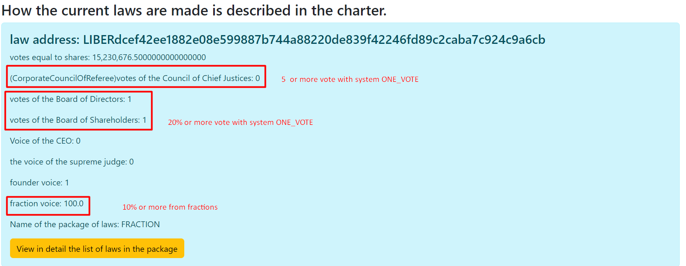

# КАК ИЗБИРАЮТСЯ ЗАКОНЫ. 

## Утверждение закона
_____

## УСТАВ
Ни один закон не имеет обратной силы. Ни один закон не должен нарушать действующий устав или противоречит 
другим действующим законам. Если есть противотечение между несколькими законами из одного пакета законов, 
то действующим является тот который в списке находится выше по индексу. Пример: пакет по продаже алкоголя 
закон под индексом 3 противоречит закону из индекса 17, в данном случае закон под индексом три будет действующим, 
так как он более высокая по статусу. 
В случае противоречия нескольких действующих Законов Судебная Власть должна отдавать приоритет, тем законам,
которые были приняты ранее, но учитывать должны именно с последней даты принятия закона.
Закон является Действующим, пока удовлетворяет условиям принятия закона и как только условие 
нарушено, закон теряет свою силу, до повторного принятия закона.
В голосовании всех законов, учитываются только голоса отданные за последние четыре года.
Все законы делятся на несколько групп.
1. Обычные законы
2. Стратегический План
3. Бюджет
4. Назначаемые должности Законодательной властью
6. Законы, которые создают новые должности. Данные должности утверждаются только Законодательной Властью.
7. Поправки в Устав
8. Сам устав

### ОБЫЧНЫЕ ЗАКОНЫ
Чтобы утвердить обычные законы, 
1. название пакета закона не должно совпадать с выделенными ключевыми словами.
2. Закон должен получить больше 1 голоса по системе подсчета описанной [VOTE_STOCK](../charter/VOTE_STOCK.md)
3. Должен получить 10 или больше голосов Совета Директоров по системе подсчета описанной в [ONE_VOTE](../charter/ONE_VOTE.md)
4. Должен получить 10% голосов от фракций по системе подсчета описанной в [VOTE_FRACTION](../charter/VOTE_FRACTION.md).

Пример кода в LawsController current law:
````
     //законы должны быть одобрены всеми.
        List<CurrentLawVotesEndBalance> notEnoughVotes = current.stream()
                .filter(t -> !directors.contains(t.getPackageName()))
                .filter(t->!Seting.AMENDMENT_TO_THE_CHARTER.equals(t.getPackageName()))
                .filter(t->!directors.isCabinets(t.getPackageName()))
                .filter(t -> !Seting.ORIGINAL_CHARTER_CURRENT_LAW_PACKAGE_NAME.equals(t.getPackageName()))
                .filter(t->!Seting.ORIGINAL_CHARTER_CURRENT_ALL_CODE.equals(t.getPackageName()))
                .filter(t -> 
                 t.getVotesBoardOfDirectors() >= Seting.ORIGINAL_LIMIT_MIN_VOTE_BOARD_OF_DIRECTORS
                && t.getVotes() >= Seting.ALL_STOCK_VOTE
                && t.getFractionVote() >= Seting.ORIGINAL_LIMIT_MIN_VOTE_FRACTIONS)
                .sorted(Comparator.comparing(CurrentLawVotesEndBalance::getVotes).reversed()).collect(Collectors.toList());
   

````

### СТРАТЕГИЧЕСКИЙ ПЛАН.
Стратегический план является общим планом для всей сети и утверждается аналогично обычному закону,
но есть некоторые отличия от обычных законов.
1. Пакет стратегического плана должен называться STRATEGIC_PLAN
2. Все планы которые прошли одобрение, сортируется от наибольшего к наименьшему по количеству голосов,
полученных от Совета Директоров.
3. После Сортировки отбираются только один ПЛАН с наибольшим количеством голосов полученных от Совета Директоров.

````
//план утверждается всеми
        List<CurrentLawVotesEndBalance> planFourYears = current.stream()
                .filter(t->!directors.contains(t.getPackageName()))
                .filter(t->Seting.STRATEGIC_PLAN.equals(t.getPackageName()))
                .filter(t->!directors.isCabinets(t.getPackageName()))
                .filter(t->t.getVotesBoardOfDirectors() >= Seting.ORIGINAL_LIMIT_MIN_VOTE_BOARD_OF_DIRECTORS
                       
                        && t.getFractionVote() >= Seting.ORIGINAL_LIMIT_MIN_VOTE_FRACTIONS
                        && t.getVotes() >= Seting.ALL_STOCK_VOTE)
                .sorted(Comparator.comparing(CurrentLawVotesEndBalance::getVotesBoardOfDirectors).reversed())
                .limit(1)
                .collect(Collectors.toList());
````

### БЮДЖЕТ
Бюджет является общими расходами для системы и утверждается аналогично Стратегическому Плану,
но название пакета Должно быть BUDGET и он тоже в единственном экземпляре.

````
 //бюджет утверждается всеми
        List<CurrentLawVotesEndBalance> budjet = current.stream()
                .filter(t-> !directors.contains(t.getPackageName()))
                .filter(t->Seting.BUDGET.equals(t.getPackageName()))
                .filter(t->!directors.isCabinets(t.getPackageName()))
                .filter(t->
                        t.getVotesBoardOfDirectors() >= Seting.ORIGINAL_LIMIT_MIN_VOTE_BOARD_OF_DIRECTORS
                       
                        && t.getFractionVote() >= Seting.ORIGINAL_LIMIT_MIN_VOTE_FRACTIONS
                        && t.getVotes() >= Seting.ALL_STOCK_VOTE)
                .sorted(Comparator.comparing(CurrentLawVotesEndBalance::getVotesBoardOfDirectors).reversed())
                .limit(1)
                .collect(Collectors.toList());
````

### ДОЛЖНОСТИ КОТОРЫЕ НАЗНАЧАЮТСЯ ТОЛЬКО ЗАКОНОДАТЕЛЬНОЙ ВЛАСТЬЮ
Есть должности которые назначаются только Законодательной властью и таким должностям относиться
Генеральный Исполнительный Директор. Данная должность аналогична премьер-министру и является
Исполнительной Властью в данной системе.
Каждая такая должность может быть ограничена количеством, которое определено в данной системе
для данной должности. Пример: Генеральный Исполнительный Директор есть только одно место.
Избирается аналогично как ***стратегический план*** и ***бюджет***.
Но количество определяется для каждой должности отдельно.
````
  //позиции избираемые только всеми участниками
        List<CurrentLawVotesEndBalance> electedByBoardOfDirectors = current.stream()
                .filter(t -> directors.isElectedByBoardOfDirectors(t.getPackageName()) || directors.isCabinets(t.getPackageName()))
                .filter(t -> t.getVotesBoardOfDirectors() >= Seting.ORIGINAL_LIMIT_MIN_VOTE_BOARD_OF_DIRECTORS
                
                && t.getFractionVote() >= Seting.ORIGINAL_LIMIT_MIN_VOTE_FRACTIONS
                && t.getVotes() >= Seting.ALL_STOCK_VOTE)
                .sorted(Comparator.comparing(CurrentLawVotesEndBalance::getVotesBoardOfDirectors).reversed())
                .collect(Collectors.toList());
                
                  //групируем по списку
        Map<String, List<CurrentLawVotesEndBalance>> group = electedByBoardOfDirectors.stream()
                .collect(Collectors.groupingBy(CurrentLawVotesEndBalance::getPackageName));

        Map<Director, List<CurrentLawVotesEndBalance>> original_group = new HashMap<>();

        //оставляем то количество которое описано в данной должности
        for (Map.Entry<String, List<CurrentLawVotesEndBalance>> stringListEntry : group.entrySet()) {
            List<CurrentLawVotesEndBalance> temporary = stringListEntry.getValue();
            temporary = temporary.stream()
                    .sorted(Comparator.comparing(CurrentLawVotesEndBalance::getVotesBoardOfDirectors))
                    .limit(directors.getDirector(stringListEntry.getKey()).getCount())
                    .collect(Collectors.toList());
            original_group.put(directors.getDirector(stringListEntry.getKey()), temporary);
        }
````

Также есть должности которые создаются с помощью законов, данные должности утверждаются тоже Законодательной властью.
Для каждой такой должности только одно место, для каждого названия. 
Название таких пакетов начинается с ADD_DIRECTOR_.
С обязательным нижним подчеркиванием.

### ПОПРАВКИ В УСТАВ
Чтобы внести поправки в устав, нужно чтобы пакет закона должен называться AMENDMENT_TO_THE_CHARTER.
Для того чтобы поправка считалась действующей
1. Нужно чтобы 20% или больше голосов получила от Совета Акционеров системой подсчета [ONE_VOTE](../charter/ONE_VOTE.md).
2. Нужно, чтобы получить 20% или больше голосов от Совета Директоров системой подсчета [ONE_VOTE](../charter/ONE_VOTE.md).
3. Нужно, чтобы получить 5 или больше голосов от Законодательной Власти Корпоративных Верховных Судей.
4. Нужно, чтобы получить 10% или больше голосов от фракций системой подсчета [VOTE_FRACTION](../charter/VOTE_FRACTION.md).


````
   //внедрение поправок в устав
        List<CurrentLawVotesEndBalance> chapter_amendment = current.stream()
                .filter(t -> !directors.contains(t.getPackageName()))
                .filter(t-> Seting.AMENDMENT_TO_THE_CHARTER.equals(t.getPackageName()))
                .filter(t->!directors.isCabinets(t.getPackageName()))
                .filter(t -> t.getVotesBoardOfShareholders() >= Seting.ORIGINAL_LIMIT_MINT_VOTE_BOARD_OF_SHAREHOLDERS_AMENDMENT
                && t.getVotesBoardOfDirectors() >= Seting.ORIGINAL_LIMIT_MIN_VOTE_BOARD_OF_DIRECTORS_AMENDMENT
                && t.getVotesCorporateCouncilOfReferees() >= Seting.ORIGINAL_LIMIT_MIN_VOTE_CORPORATE_COUNCIL_OF_REFEREES_AMENDMENT
                && t.getFractionVote() >= Seting.ORIGINAL_LIMIT_MIN_VOTE_FRACTIONS)
                .sorted(Comparator.comparing(CurrentLawVotesEndBalance::getVotesBoardOfDirectors).reversed()).collect(Collectors.toList());

````

### САМ УСТАВ.
Первый устав утверждается основателем и он является действующим, голос основателя для утверждения
устава никогда не имеет срока годности.
Название пакета устава начинается с CHARTER_ORIGINAL и название исходного кода CHARTER_ORIGINAL_CODE.
Эти два пакета и являются целостным уставом, но в первую очередь, исходный код не должен противоречить
принципам описанным в CHARTER_ORIGINAL.
````
//устав всегда действующий он подписан основателем
        List<CurrentLawVotesEndBalance> CHARTER_ORIGINAL = current.stream()
                .filter(t -> !directors.contains(t.getPackageName()) && Seting.ORIGINAL_CHARTER_CURRENT_LAW_PACKAGE_NAME.equals(t.getPackageName()))
                .filter(t->!directors.isCabinets(t.getPackageName()))
                .filter(t->t.getFounderVote()>=1)
                .sorted(Comparator.comparing(CurrentLawVotesEndBalance::getVotes).reversed())
                .limit(1)
                .collect(Collectors.toList());

        //ИСХОДНЫЙ КОД СОЗДАННЫЙ ОСНОВАТЕЛЕМ
        List<CurrentLawVotesEndBalance> CHARTER_ORIGINAL_CODE = current.stream()
                .filter(t -> !directors.contains(t.getPackageName()) && Seting.ORIGINAL_CHARTER_CURRENT_ALL_CODE.equals(t.getPackageName()))
                .filter(t->!directors.isCabinets(t.getPackageName()))
                .filter(t->t.getFounderVote()>=1)
                .sorted(Comparator.comparing(CurrentLawVotesEndBalance::getVotes).reversed())
                .limit(1)
                .collect(Collectors.toList());
````
[Возврат на главную](../documentation/documentationRus.md)