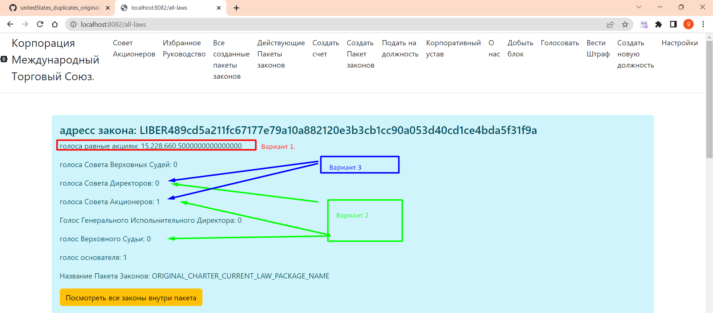

# КАК ИЗБИРАЮТСЯ ЗАКОНЫ. 

## Утверждение закона


### Вариант 1
Если с помощью количества акций проголосовали больше 100000 тысяч голосов(остаток),
То закон является действующим

### Вариант 2
Если закон получил 100 голосов Совета Акционеров(остаток голосов) и
15 голосов Совета Директоров (остаток голосов) и голос Верховного судьи,
Закон утвержден

### Вариант 3
Если закон получил 200 голосов Совета Акционеров(остаток голосов) 
и 30 голосов Совета Директоров (остаток голосов )
Закон утвержден.

Все три способа являются легитимными.
_____

## УСТАВ
Ни один закон не имеет обратной силы. Ни один закон не должен нарушать действующий устав или противоречит 
другим действующим законам. Если есть противотечение между несколькими законами из одного пакета законов, 
то действующим является тот который списке находится выше по индексу. Пример: пакет по продаже алкоголя 
закон под индексом 3 противоречит закону из индекса 17, в даном случае закон под индексом три будет действующим, 
так как он более выше по статусу. 

Если законы противоречат из разных пакетов, то действующим является тот пакет, который получил больше голосов 
от Совета акционеров, если есть паритет, то тот который получил больше голосов Совета Директоров, если и здесь 
есть паритет то данный спор должен решить Верховный Судья, если он также не определил который из двух пакетов 
где законы противоречат друг другу является законы одно из пакетов более действующими, то в приоритете становиться  
тот, который начал действовать раньше, отсчет определяется именно с последнего момента вступления в силу. 

Все обычные законы являются действующими если за них проголосовали таким способом ONE_VOTE Совет Акционеров, Совет Директоров и возможно 
Верховный Судья. Чтобы закон был действующим он должен получить равно или больше 100 остатка голосов Совета Акционеров, 
равно или больше 15 остатка голосов Совета Директоров и Один голос Верховного Судьи, но если Верховный Судья не проголосовал или проголосовал против 
то можно обойти вето верховного судьи получив 200 и более остаток голосов Совета Акционеров и 30 и более остаток голосов Совета Директоров. 

или если закон получил более 100 тысяч голосов остатка как описано VOTE_STOCK также является действующим, и будет
действовать пока сохраняет больше сто тысяч голосов.
Закон является действующим, пока он соответствует количеству голосов как описано выше. Каждый раз как кто-то теряет свою должность 
также теряется все его голоса за все законы которые он проголосовал, но не теряются голоса полученные с помощью акций.

Пример кода в LawsController current law:
````
        //законы которые получили не достаточно голосов которые могут пройти только если верховный судья одобрит
        List<CurrentLawVotesEndBalance> notEnoughVotes = current.stream() 
           .filter(t -> !directors.contains(t.getPackageName()))
           .filter(t->!Seting.AMENDMENT_TO_THE_CHARTER.equals(t.getPackageName()))
           .filter(t->!directors.isCabinets(t.getPackageName()))
           .filter(t -> !Seting.ORIGINAL_CHARTER_CURRENT_LAW_PACKAGE_NAME.equals(t.getPackageName()))
           .filter(t -> t.getVotesBoardOfShareholders() >= Seting.ORIGINAL_LIMIT_MIN_VOTE_BOARD_OF_SHAREHOLDERS)
           .filter(t -> t.getVotesBoardOfDirectors() >= Seting.ORIGINAL_LIMIT_MIN_VOTE_BOARD_OF_DIRECTORS)
           .filter(t -> t.getVoteHightJudge() >= Seting.ORIGINAL_LIMIT_MIN_VOTE_HIGHT_JUDGE)
           .sorted(Comparator.comparing(CurrentLawVotesEndBalance::getVotes).reversed()).collect(Collectors.toList());

        //законы которые получили достаточно голосов и не требуют одобрения верховного судьи
        List<CurrentLawVotesEndBalance> powerfulVotes = current.stream()
                .filter(t -> !directors.contains(t.getPackageName()))
                .filter(t-> !Seting.AMENDMENT_TO_THE_CHARTER.equals(t.getPackageName()))
                .filter(t-> !directors.isCabinets(t.getPackageName()))
                .filter(t -> !Seting.ORIGINAL_CHARTER_CURRENT_LAW_PACKAGE_NAME.equals(t.getPackageName()))
                .filter(t -> t.getVotesBoardOfShareholders() >= (Seting.ORIGINAL_LIMIT_MIN_VOTE_BOARD_OF_SHAREHOLDERS * Seting.POWERFUL_VOTE))
               .filter(t -> t.getVotesBoardOfDirectors() >= (Seting.ORIGINAL_LIMIT_MIN_VOTE_BOARD_OF_DIRECTORS * Seting.POWERFUL_VOTE))
               .sorted(Comparator.comparing(CurrentLawVotesEndBalance::getVotes).reversed()).collect(Collectors.toList()); 
               
                //ЗАКОНЫ КОТОРЫЕ БЫЛИ ОДОБРЕНЫ ЧЕРЕЗ ПРЯМОЕ ГОЛОСОВАНИЕ
        List<CurrentLawVotesEndBalance> allVotes = current.stream()
                .filter(t->!directors.contains(t.getPackageName()))
                .filter(t->!Seting.AMENDMENT_TO_THE_CHARTER.equals(t.getPackageName()))
                .filter(t->!directors.isCabinets(t.getPackageName()))
                .filter(t->!Seting.ORIGINAL_CHARTER_CURRENT_LAW_PACKAGE_NAME.equals(t.getPackageName()))
                .filter(t->!Seting.ORIGINAL_CHARTER_CURRENT_ALL_CODE.equals(t.getPackageName()))
                .filter(t->t.getVotes() > Seting.ALL_STOCK_VOTE)
                .collect(Collectors.toList());

````

[Возврат на главную](../readme.md)