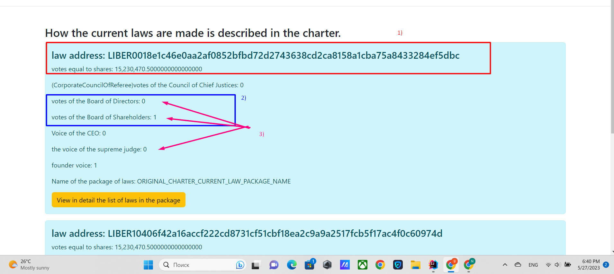

# HOW THE LAWS ARE CHOSEN.

## Approval of the law


### Option 1
If more than 100,000 votes (residue) were voted by the number of shares,
Then the law is valid

### Option 2
If the law received 100 votes of the Board of Shareholders (the remainder of the votes) and
15 votes of the Board of Directors (remainder of votes) and the vote of the Chief Justice,
Law approved

### Option 3
If the law received 200 votes of the Board of Shareholders (balance of votes)
and 30 votes of the Board of Directors (balance of votes)
The law has been approved.

All three methods are legitimate.
_____

## CHARTER
No law is retroactive. No law shall violate the existing statute or be inconsistent with
other applicable laws. If there is a contradiction between several laws from one set of laws,
then the current one is the one that is higher in the index. Example: alcohol sales package
the law under index 3 contradicts the law from index 17, in this case the law under index three will be valid,
because he is higher in status.

If the laws contradict from different packages, then the package that received the most votes is valid.
from the Board of Shareholders, if there is parity, then the one that received more votes from the Board of Directors, if here too
there is parity, then the dispute must be decided by the Chief Justice, if he also did not determine which of the two packages
where the laws contradict each other, if the laws of one of the packages are more effective, then the priority becomes
the one that began to operate earlier, the countdown is determined precisely from the last moment of entry into force.

All ordinary laws are valid if they are voted in this way ONE_VOTE The Board of Shareholders, the Board of Directors and possibly
Supreme Judge. For a law to be valid, it must receive equal to or more than 100 of the remaining votes of the Board of Shareholders,
equal to or greater than 15 remaining votes of the Board of Directors and One vote of the Chief Justice, but if the Chief Justice did not vote or voted against
then it is possible to override the veto of the supreme judge by obtaining 200 or more of the remainder of the votes of the Board of Shareholders and 30 or more of the remainder of the votes of the Board of Directors.

or if the law received more than 100 thousand remainder votes as described by VOTE_STOCK is also in force, and will
act while retaining more than one hundred thousand votes.
A law is valid as long as it matches the number of votes as described above. Every time someone loses their position
all his votes for all the laws he voted are also lost, but the votes received with the help of shares are not lost.

Sample code in LawsController current law:
````
         //laws that don't get enough votes that can only pass if the supreme judge approves
         List<CurrentLawVotesEndBalance> notEnoughVotes = current.stream()
            .filter(t -> !directors.contains(t.getPackageName()))
            .filter(t->!Seting.AMENDMENT_TO_THE_CHARTER.equals(t.getPackageName()))
            .filter(t->!directors.isCabinets(t.getPackageName()))
            .filter(t -> !Seting.ORIGINAL_CHARTER_CURRENT_LAW_PACKAGE_NAME.equals(t.getPackageName()))
            .filter(t -> t.getVotesBoardOfShareholders() >= Seting.ORIGINAL_LIMIT_MIN_VOTE_BOARD_OF_SHAREHOLDERS)
            .filter(t -> t.getVotesBoardOfDirectors() >= Seting.ORIGINAL_LIMIT_MIN_VOTE_BOARD_OF_DIRECTORS)
            .filter(t -> t.getVoteHightJudge() >= Seting.ORIGINAL_LIMIT_MIN_VOTE_HIGHT_JUDGE)
            .sorted(Comparator.comparing(CurrentLawVotesEndBalance::getVotes).reversed()).collect(Collectors.toList());

         // laws that have received enough votes and do not require the approval of the supreme judge
         List<CurrentLawVotesEndBalance> powerfulVotes = current.stream()
                 .filter(t -> !directors.contains(t.getPackageName()))
                 .filter(t-> !Seting.AMENDMENT_TO_THE_CHARTER.equals(t.getPackageName()))
                 .filter(t-> !directors.isCabinets(t.getPackageName()))
                 .filter(t -> !Seting.ORIGINAL_CHARTER_CURRENT_LAW_PACKAGE_NAME.equals(t.getPackageName()))
                 .filter(t -> t.getVotesBoardOfShareholders() >= (Seting.ORIGINAL_LIMIT_MIN_VOTE_BOARD_OF_SHAREHOLDERS * Seting.POWERFUL_VOTE))
                .filter(t -> t.getVotesBoardOfDirectors() >= (Seting.ORIGINAL_LIMIT_MIN_VOTE_BOARD_OF_DIRECTORS * Seting.POWERFUL_VOTE))
                .sorted(Comparator.comparing(CurrentLawVotesEndBalance::getVotes).reversed()).collect(Collectors.toList());
               
                 //LAWS WHICH WERE APPROVED THROUGH DIRECT VOTING
         List<CurrentLawVotesEndBalance> allVotes = current.stream()
                 .filter(t->!directors.contains(t.getPackageName()))
                 .filter(t->!Seting.AMENDMENT_TO_THE_CHARTER.equals(t.getPackageName()))
                 .filter(t->!directors.isCabinets(t.getPackageName()))
                 .filter(t->!Seting.ORIGINAL_CHARTER_CURRENT_LAW_PACKAGE_NAME.equals(t.getPackageName())).filter(t->!Seting.ORIGINAL_CHARTER_CURRENT_ALL_CODE.equals(t.getPackageName()))
                 .filter(t->t.getVotes() > Seting.ALL_STOCK_VOTE)
                 .collect(Collectors.toList());

````

[Return to main page](../documentationEng/documentationEng.md)