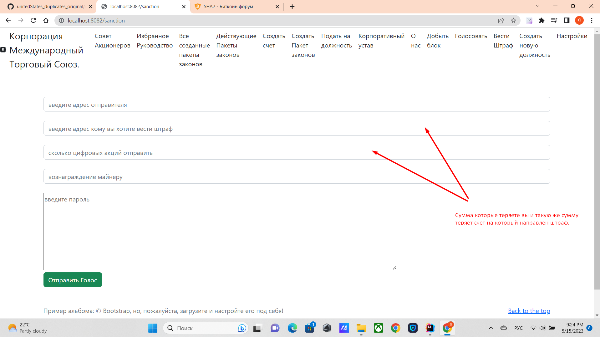

# Механизм штрафов

Вы совершаете транзакцию, при которой, вы теряете данную сумму акций, но 
и счет на который направлен штраф теряет такую сумму акций.

Действует только на цифровые доллары.

______

## MECHANISM_FOR_REDUCING_THE_NUMBER_OF_SHARES  МЕХАНИЗМ СНИЖЕНИЯ КОЛИЧЕСТВА АКЦИЙ. Ввод штрафов. 
Каждый раз когда один счет отправляет на другой счет цифровую акцию, но использует VoteEnum.NO, счет 
цифровых акций получателя снижается на то количество которое отправил отправитель акций. 
Пример счет А отправил на счет Б 100 цифровых акций с VoteEnum.NO, тогда счет А и счет Б оба теряют 100 
цифровых акций. Данная мера нужна чтобы был механизм снять с должности Совета акционеров и также позволяет снижать голоса 
деструктивных счетов, так как количество голосов, равно количеству акций, 
при избрании CORPORATE_COUNCIL_OF_REFEREES, Фракций и других должностей которые избираются акциями. 
Данный механизм действует только на цифровые акции и только в том случае, что отправитель совершил транзакцию с
VoteEnum.NO.

[выход на главную](../documentation/documentationRus.md)