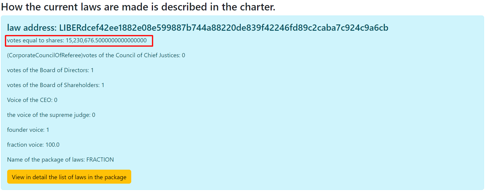

#ЗАКОНОДАТЕЛЬНАЯ ВЛАСТЬ.
Власть состоит из 4 групп в данной системе.
1. Совет Акционеров
2. Совет Директоров
3. Фракции 
4. Независимые участники сети.

Все участники должны участвовать в голосовании чтобы был действителен закон принятый системой
(Исключением является только совет Акционеров, так как совет Акционеров участвует 
только в утверждении поправок в Устав).
Для всех голосов учитываются только голоса отданные за последние четыре года.
Все участники могут занимать несколько должностей из разных групп, но не могут
занимать в одной категории должностей несколько мест.
Пример: Один счет может быть как ***Независимым участником сети*** и ***Членом Совета Директоров***
и ***Членом Совета Акционеров***, но один счет не сможет занять несколько мест в Совете Директоров
или в Совете Акционеров.

Именно данная часть голоса учитывается при избрании Совета Директоров и Фракций.

## Совет Акционеров
Совет Акционеров назначается системой автоматически.
Совет Акционеров состоит из 1500 счетов с наибольшим количеством акций,
но отбираются только те счета, которые за последний год либо занимались добычей,
либо отправляли цифровые доллары или цифровые акции, или участвовали в голосовании.
Член одного Совета акционеров имеет один голос. Один счет равен одному голосу. 
Используется система голосования описанная в [ONE_VOTE](../charter/ONE_VOTE.md)

````
  //определение совета акционеров
    public static List<Account> findBoardOfShareholders(Map<String, Account> balances, List<Block> blocks, int limit) {
        List<Block> minersHaveMoreStock = null;
        if (blocks.size() > limit) {
            minersHaveMoreStock = blocks.subList(blocks.size() - limit, blocks.size());
        } else {
            minersHaveMoreStock = blocks;
        }
        List<Account> boardAccounts = minersHaveMoreStock.stream().map(
                        t -> new Account(t.getMinerAddress(), 0, 0))
                .collect(Collectors.toList());

        for (Block block : minersHaveMoreStock) {
            for (DtoTransaction dtoTransaction : block.getDtoTransactions()) {
                boardAccounts.add(new Account(dtoTransaction.getSender(), 0, 0));
            }

        }
````

## Совет Директоров 
Совет директоров избирается участниками сети.
Совет Директоров состоит из 301 счетов которые получили наибольшее количество голосов
по системе описанной в [VOTE_STOCK](../charter/VOTE_STOCK.md). Каждый счет приравнивается одному голосу, описанному
в [ONE_VOTE](../charter/ONE_VOTE.md).

````
 //минимальное значение количество положительных голосов для того чтобы закон действовал,
        //позиции избираемые акциями совета директоров
        List<CurrentLawVotesEndBalance> electedByStockBoardOfDirectors = current.stream()
                .filter(t -> directors.isElectedByStocks(t.getPackageName()))
                .filter(t -> t.getPackageName().equals(NamePOSITION.BOARD_OF_DIRECTORS.toString()))
                .filter(t -> t.getVotes() >= Seting.ORIGINAL_LIMIT_MIN_VOTE)
                .sorted(Comparator.comparing(CurrentLawVotesEndBalance::getVotes).reversed())
                .limit(directors.getDirector(NamePOSITION.BOARD_OF_DIRECTORS.toString()).getCount())
                .collect(Collectors.toList());
````

### Как подать на должность совета директоров
Сначала нужно зайти во вкладку в ***apply for a position*** Выбрать BOARD_OF_DIRECTORS
и заполнить все строки нужными данными.


## Фракции.
Фракции избираются участниками сети. 
Есть только 100 месть для фракций. Сто с наибольшим количеством голосов полученных по системе
описанной в [VOTE_STOCK](../charter/VOTE_STOCK.md) становиться фракцией. Голос каждой фракции приравнивается доли которую
она получила относительно 99 других фракций. Каждая фракция имеет голос описанный в [VOTE_FRACTION](../charter/VOTE_FRACTION.md).

````
//избранные фракции
        List<CurrentLawVotesEndBalance> electedFraction = current.stream()
                .filter(t -> directors.isElectedByStocks(t.getPackageName()))
                .filter(t -> t.getPackageName().equals(NamePOSITION.FRACTION.toString()))
                .filter(t -> t.getVotes() >= Seting.ORIGINAL_LIMIT_MIN_VOTE)
                .sorted(Comparator.comparing(CurrentLawVotesEndBalance::getVotes).reversed())
                .limit(directors.getDirector(NamePOSITION.FRACTION.toString()).getCount())
                .collect(Collectors.toList());
````

### Как создать новую фракцию
Для создания фракции нужно проделать ту же процедуру действий, что и для подачи на совет директоров.


##  Независимые Участники сети.
Все участники сети которые имеют акции и не входят в первые три выше перечисленные категории,
являются ***независимыми участниками сети***. Голоса каждого такого участника приравнивается
к количеству акций на данный момент и детально описано в [VOTE_STOCK](../charter/VOTE_STOCK.md).


[Выход на главную](../documentation/documentationRus.md)

