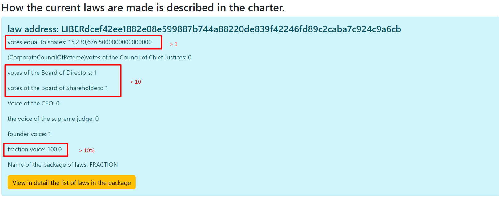

# HOW THE LAWS ARE CHOSEN.

## Approval of the law
_____

## CHARTER
No law is retroactive. No law shall violate the existing statute or be inconsistent with
other applicable laws. If there is a contradiction between several laws from one set of laws,
then the current one is the one that is higher in the index in the list. Example: alcohol sales package
the law under index 3 contradicts the law from index 17, in this case the law under index three will be valid,
because he is higher in status.
In the event of a conflict between several laws in force, the Judiciary shall give priority to those laws
which were adopted earlier, but should be taken into account precisely from the last date of adoption of the law.
The law is in force as long as it satisfies the conditions for the adoption of the law and as soon as the condition
violated, the law loses its force until the law is re-adopted.
In the voting of all laws, only the votes given in the last four years are taken into account.
All laws are divided into several groups.
1. Ordinary laws
2. Strategic Plan
3. Budget
4. Appointed by the Legislature
6. Laws that create new positions. These positions are approved only by the Legislative Power.
7. Amendments to the Charter
8. The charter itself

### REGULAR LAWS
To establish ordinary laws,
1. The name of the package of law should not match the highlighted keywords.
2. The law must receive more than 1 vote according to the scoring system described by [VOTE_STOCK](../charterEng/VOTE_STOCK.md)
3. Must receive 10 or more votes of the Board of Directors according to the scoring system described in [ONE_VOTE](../charterEng/ONE_VOTE.md)
4. Must receive 10 or more votes of the Board of Shareholders according to the scoring system described in [ONE_VOTE](../charterEng/ONE_VOTE.md)
5. Must receive 10% of votes from factions according to the counting system described in [VOTE_FRACTION](../charterEng/VOTE_FRACTION.md).


Sample code in LawsController current law:
````
      //laws must be approved by everyone.
         List<CurrentLawVotesEndBalance> notEnoughVotes = current.stream()
                 .filter(t -> !directors.contains(t.getPackageName()))
                 .filter(t->!Seting.AMENDMENT_TO_THE_CHARTER.equals(t.getPackageName()))
                 .filter(t->!directors.isCabinets(t.getPackageName()))
                 .filter(t -> !Seting.ORIGINAL_CHARTER_CURRENT_LAW_PACKAGE_NAME.equals(t.getPackageName()))
                 .filter(t->!Seting.ORIGINAL_CHARTER_CURRENT_ALL_CODE.equals(t.getPackageName()))
                 .filter(t -> t.getVotesBoardOfShareholders() >= Seting.ORIGINAL_LIMIT_MIN_VOTE_BOARD_OF_SHAREHOLDERS
                 && t.getVotesBoardOfDirectors() >= Seting.ORIGINAL_LIMIT_MIN_VOTE_BOARD_OF_DIRECTORS
                 && t.getVotes() >= Seting.ALL_STOCK_VOTE
                 && t.getFractionVote() >= Seting.ORIGINAL_LIMIT_MIN_VOTE_FRACTIONS)
                 .sorted(Comparator.comparing(CurrentLawVotesEndBalance::getVotes).reversed()).collect(Collectors.toList());
   

````

### STRATEGIC PLAN.
The strategic plan is the general plan for the entire network and is approved in the same way as an ordinary law,
but there are some differences from ordinary laws.
1. The strategic plan package should be called STRATEGIC_PLAN
2. All plans that have been approved are sorted from highest to lowest by the number of votes,
   received from the Board of Directors.
3. After Sorting, only one PLAN with the highest number of votes received from the Board of Directors is selected.

````
//the plan is approved by everyone
         List<CurrentLawVotesEndBalance> planFourYears = current.stream()
                 .filter(t->!directors.contains(t.getPackageName()))
                 .filter(t->Seting.STRATEGIC_PLAN.equals(t.getPackageName()))
                 .filter(t->!directors.isCabinets(t.getPackageName()))
                 .filter(t->t.getVotesBoardOfDirectors() >= Seting.ORIGINAL_LIMIT_MIN_VOTE_BOARD_OF_DIRECTORS
                         && t.getVotesBoardOfShareholders() >= Seting.ORIGINAL_LIMIT_MIN_VOTE_BOARD_OF_SHAREHOLDERS
                         && t.getFractionVote() >= Seting.ORIGINAL_LIMIT_MIN_VOTE_FRACTIONS
                         && t.getVotes() >= Seting.ALL_STOCK_VOTE)
                 .sorted(Comparator.comparing(CurrentLawVotesEndBalance::getVotesBoardOfDirectors).reversed())
                 .limit(1)
                 .collect(Collectors.toList());
````

### BUDGET
The budget is the overall cost for the system and is approved similarly to the Strategic Plan,
but the name of the package should be BUDGET and it is also in a single copy.

````
  //budget approved by everyone
         List<CurrentLawVotesEndBalance> budjet = current.stream()
                 .filter(t-> !directors.contains(t.getPackageName()))
                 .filter(t->Seting.BUDGET.equals(t.getPackageName()))
                 .filter(t->!directors.isCabinets(t.getPackageName()))
                 .filter(t->
                         t.getVotesBoardOfDirectors() >= Seting.ORIGINAL_LIMIT_MIN_VOTE_BOARD_OF_DIRECTORS
                         && t.getVotesBoardOfShareholders() >= Seting.ORIGINAL_LIMIT_MIN_VOTE_BOARD_OF_SHAREHOLDERS
                         && t.getFractionVote() >= Seting.ORIGINAL_LIMIT_MIN_VOTE_FRACTIONS
                         && t.getVotes() >= Seting.ALL_STOCK_VOTE)
                 .sorted(Comparator.comparing(CurrentLawVotesEndBalance::getVotesBoardOfDirectors).reversed())
                 .limit(1)
                 .collect(Collectors.toList());
````

### POSTS THAT ARE APPOINTED ONLY BY THE LEGISLATIVE AUTHORITY
There are positions that are appointed only by the Legislature and such positions include
General Executive Director. This position is similar to the Prime Minister and is
Executive Power in this system.
Each such position can be limited to the number that is defined in this system.
for this position. Example: There is only one CEO position.
Elected in the same way as ***strategic plan*** and ***budget***.
But the number is determined for each position separately.
````
   //positions elected only by all participants
         List<CurrentLawVotesEndBalance> electedByBoardOfDirectors = current.stream()
                 .filter(t -> directors.isElectedByBoardOfDirectors(t.getPackageName()) || directors.isCabinets(t.getPackageName()))
                 .filter(t -> t.getVotesBoardOfDirectors() >= Seting.ORIGINAL_LIMIT_MIN_VOTE_BOARD_OF_DIRECTORS
                 && t.getVotesBoardOfShareholders() >= Seting.ORIGINAL_LIMIT_MIN_VOTE_BOARD_OF_SHAREHOLDERS
                 && t.getFractionVote() >= Seting.ORIGINAL_LIMIT_MIN_VOTE_FRACTIONS
                 && t.getVotes() >= Seting.ALL_STOCK_VOTE)
                 .sorted(Comparator.comparing(CurrentLawVotesEndBalance::getVotesBoardOfDirectors).reversed())
                 .collect(Collectors.toList());
                
                   //group by list
         Map<String, List<CurrentLawVotesEndBalance>> group = electedByBoardOfDirectors.stream()
                 .collect(Collectors.groupingBy(CurrentLawVotesEndBalance::getPackageName));

         Map<Director, List<CurrentLawVotesEndBalance>> original_group = new HashMap<>();

         // leave the amount that is described in this post
         for (Map.Entry<String, List<CurrentLawVotesEndBalance>> stringListEntry : group.entrySet()) {
             List<CurrentLawVotesEndBalance> temporary = stringListEntry.getValue();
             temporary = temporary.stream()
                     .sorted(Comparator.comparing(CurrentLawVotesEndBalance::getVotesBoardOfDirectors))
                     .limit(directors.getDirector(stringListEntry.getKey()).getCount())
                     .collect(Collectors.toList());
             original_group.put(directors.getDirector(stringListEntry.getKey()), temporary);
         }
````

There are also positions that are created with the help of laws, these positions are also approved by the Legislative power.
For each such position, there is only one seat for each title.
The name of such packages starts with ADD_DIRECTOR_.
With the obligatory underscore.

### CHARTER AMENDMENTS
To amend the charter, the law package must be named AMENDMENT_TO_THE_CHARTER.
For an amendment to be valid
1. It is necessary that 20% or more of the votes received from the Council of Shareholders by the counting system [ONE_VOTE](../charterEng/ONE_VOTE.md).
2. Need to get 20% or more votes from the Board of Directors by the [ONE_VOTE](../charterEng/ONE_VOTE.md) counting system .
3. Need to get 5 or more votes from the Legislative Branch of the Corporate Chief Justices.
4. Need to get 10% or more of votes from factions by counting system [VOTE_FRACTION](../charterEng/VOTE_FRACTION.md).


````
    //introduction of amendments to the charter
         List<CurrentLawVotesEndBalance> chapter_amendment = current.stream()
                 .filter(t -> !directors.contains(t.getPackageName()))
                 .filter(t-> Seting.AMENDMENT_TO_THE_CHARTER.equals(t.getPackageName()))
                 .filter(t->!directors.isCabinets(t.getPackageName()))
                 .filter(t -> t.getVotesBoardOfShareholders() >= Seting.ORIGINAL_LIMIT_MINT_VOTE_BOARD_OF_SHAREHOLDERS_AMENDMENT
                 && t.getVotesBoardOfDirectors() >= Seting.ORIGINAL_LIMIT_MIN_VOTE_BOARD_OF_DIRECTORS_AMENDMENT
                 && t.getVotesCorporateCouncilOfReferees() >= Seting.ORIGINAL_LIMIT_MIN_VOTE_CORPORATE_COUNCIL_OF_REFEREES_AMENDMENT
                 && t.getFractionVote() >= Seting.ORIGINAL_LIMIT_MIN_VOTE_FRACTIONS)
                 .sorted(Comparator.comparing(CurrentLawVotesEndBalance::getVotesBoardOfDirectors).reversed()).collect(Collectors.toList());

````

### SAM CHARTER.
The first charter is approved by the founder and it is valid, the vote of the founder for approval
The charter never has an expiration date.
The charter package name starts with CHARTER_ORIGINAL and the name refone CHARTER_ORIGINAL_CODE.
These two packages are a holistic charter, but in the first place, the source code must not contradict
the principles described in CHARTER_ORIGINAL.
````
// the charter is always valid, it is signed by the founder
         List<CurrentLawVotesEndBalance> CHARTER_ORIGINAL = current.stream()
                 .filter(t -> !directors.contains(t.getPackageName()) && Seting.ORIGINAL_CHARTER_CURRENT_LAW_PACKAGE_NAME.equals(t.getPackageName()))
                 .filter(t->!directors.isCabinets(t.getPackageName()))
                 .filter(t->t.getFounderVote()>=1)
                 .sorted(Comparator.comparing(CurrentLawVotesEndBalance::getVotes).reversed())
                 .limit(1)
                 .collect(Collectors.toList());

         // SOURCE CODE CREATED BY THE FOUNDER
         List<CurrentLawVotesEndBalance> CHARTER_ORIGINAL_CODE = current.stream()
                 .filter(t -> !directors.contains(t.getPackageName()) && Seting.ORIGINAL_CHARTER_CURRENT_ALL_CODE.equals(t.getPackageName()))
                 .filter(t->!directors.isCabinets(t.getPackageName()))
                 .filter(t->t.getFounderVote()>=1)
                 .sorted(Comparator.comparing(CurrentLawVotesEndBalance::getVotes).reversed())
                 .limit(1)
                 .collect(Collectors.toList());
````
[Return to main page](../documentationEng/documentationEng.md)