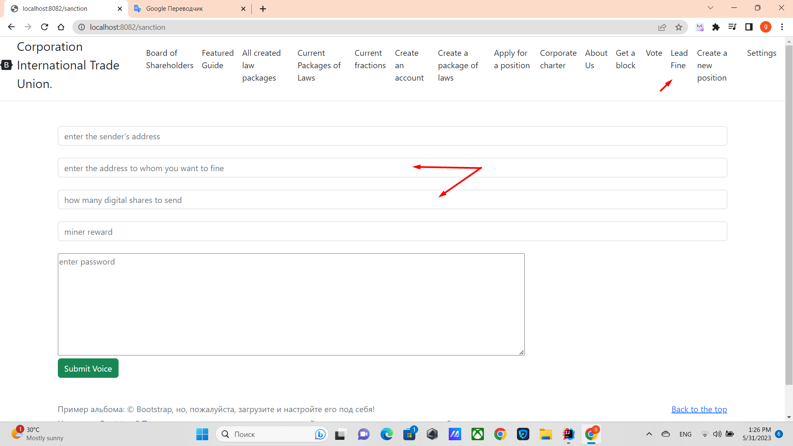

# Penalty mechanism

You make a transaction in which you lose this amount of shares, but
and the account to which the penalty is directed loses such an amount of shares.

Valid for digital dollars only.

______

## MECHANISM_FOR_REDUCING_THE_NUMBER_OF_SHARES MECHANISM FOR REDUCING THE NUMBER OF SHARES. Entering penalties.
Every time one account sends a digital share to another account but uses VoteEnum.NO, the account
recipient's digital shares are reduced by the amount sent by the share sender.
Example account A sent to account B 100 digital shares with VoteEnum.NO, then account A and account B both lose 100
digital shares. This measure is needed so that there is a mechanism to dismiss the Board of Shareholders and also allows you to lower your votes
destructive accounts, since the number of votes is equal to the number of shares,
when electing CORPORATE_COUNCIL_OF_REFEREES, Fractions and other positions that are elected by shares.
This mechanism only works on digital shares and only if the sender has made a transaction with
VoteEnum.NO.
[exit to home](../documentationEng/documentationEng.md)