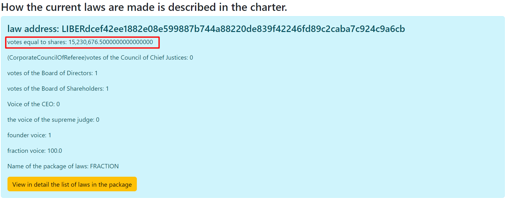

# POWERS_OF_THE_CORPORATE_COUNCIL_OF_JUDGES Judicial Power.
Participates in voting for the implementation of amendments.

The judicial power of the International Trade Union Corporation belongs to
one Supreme Court (CORPORATE_COUNCIL_OF_REFEREES) and such subordinate courts as Corporation International
The Trade Union may from time to time issue and establish.
Judges of both the Supreme and Subordinate Courts hold office upon good behavior and
receive remuneration for their services in a timely manner.
Remuneration must be given from the budget established by law.
Judicial power extends to all matters according to law and equity,
including those initiated by members to challenge the illegal expenditure of funds,
arising in accordance with this Charter, the laws of the International Trade Union Corporation and treaties,
prisoners or who will be concluded in accordance with their authority.
To the controversy,
in which the International Trade Union will be a party to a dispute between two or more network participants.
No trial should be secret, but justice should be administered openly and freely, completely and promptly,
and every person shall have legal protection against injury to life, liberty, or property.
Supreme Court CORPORATE_COUNCIL_OF_REFEREES.

## How the Corporate Council of Judges is elected.
The Corporate Council of Judges consists of 50 accounts and is elected by the Network Participants,
with the counting system described in VOTE_STOCK, similar to the Board of Directors.
The 50 accounts that received the most votes are selected.

````
//minimum value for the number of positive votes for the law to be valid,
         //positions elected by shares CORPORATE_COUNCIL_OF_REFEREES
         List<CurrentLawVotesEndBalance> electedByStockCorporateCouncilOfReferees = current.stream()
                 .filter(t -> directors.isElectedByStocks(t.getPackageName()))
                 .filter(t -> t.getPackageName().equals(NamePOSITION.CORPORATE_COUNCIL_OF_REFEREES.toString()))
                 .filter(t -> t.getVotes() >= Seting.ORIGINAL_LIMIT_MIN_VOTE)
                 .sorted(Comparator.comparing(CurrentLawVotesEndBalance::getVotes).reversed())
                 .limit(directors.getDirector(NamePOSITION.CORPORATE_COUNCIL_OF_REFEREES.toString()).getCount())
                 .collect(Collectors.toList());
````

Each score of such a judge is equal to one vote, similar to [ONE_VOTE](../charterEng/ONE_VOTE.md)

[Exit to home](../documentationEng/documentationEng.md)