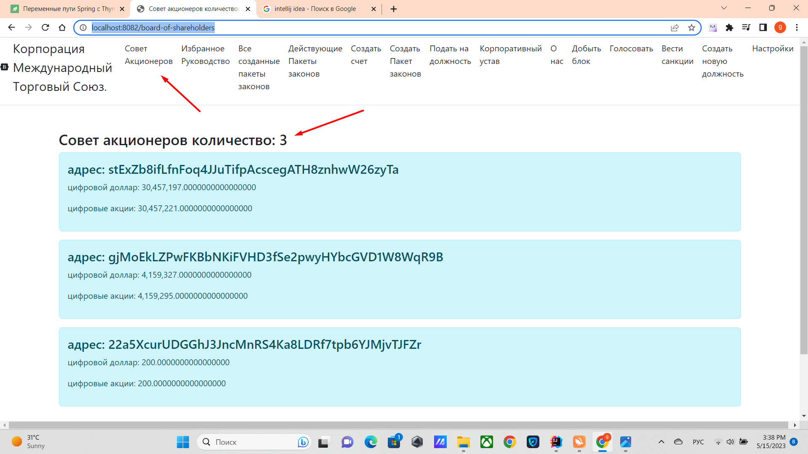

# Совет акционеров.

чтобы увидеть совет акционеров и сколько их сейчас действует войдите по ссылке http://localhost:8082/board-of-shareholders


OriginalCHARTER.POWERS_OF_THE_BOARD_OF_SHAREHOLDERS: Полномочия совета акционеров. 
Совет Акционеров Участвует в утверждении Законов (правил сети, которые должны соблюдать все участники данной Корпорации).
Также Совет Акционеров участвует в утверждении поправок в устав Корпорации Международного Торгового Союза AMENDMENT_TO_THE_CHARTER.
Совет Акционеров также может участвовать в голосовании при избрании кандидатов CORPORATE_COUNCIL_OF_REFEREES и BOARD_OF_DIRECTORS используя
эти правила для голосования за кандидатов VOTE_STOCK.

OriginalCHARTER.HOW_SHAREHOLDERS_BOARD_IS_ELECTED: КАК ИЗБИРАЕТСЯ СОВЕТ АКЦИОНЕРОВ. 
Совет Акционеров состоит из тысячи пятьсот счетов (1500) с наибольшим количеством акций, 
но учитываются только те счета от чьей активности не прошло больше года (Активностью считается майнинг или отправка денег, создание закона, отправка штрафов,
Подача на должность и Создание новой должности).
формула: текущий год - один год, и если счет был активен в этом диапазоне, он учитывается.
Все счета сортируются по убыванию количества цифровых акций, и отбираются 1500 счетов с наибольшим количеством акций. Перерасчет происходит Каждый блок.
Пример участка кода как избирается Совет Акционеров:


## Как определяется совет акционеров, 

---
    class UtilsGovernment method findBoardOfShareholders: //определение совета акционеров 
    public static List<Account> findBoardOfShareholders(Map<String, Account> balances, List<Block> blocks, int limit)
    { 
        List<Block> minersHaveMoreStock = null; 
        if (blocks.size() > limit)
        { minersHaveMoreStock = blocks.subList(blocks.size() - limit, blocks.size()); }
        else { minersHaveMoreStock = blocks; } 
        List<Account> boardAccounts = minersHaveMoreStock.stream().map( t -> new Account(t.getMinerAddress(), 0, 0))
        .collect(Collectors.toList()); 
        
        for (Block block : minersHaveMoreStock) 
        { for (DtoTransaction dtoTransaction : block.getDtoTransactions()) 
        { boardAccounts.add(new Account(dtoTransaction.getSender(), 0, 0)); } } 
        CompareObject compareObject = new CompareObject(); List<Account> boardOfShareholders = balances.entrySet()
        .stream().filter(t -> boardAccounts.contains(t.getValue()))
        .map(t -> t.getValue()).collect(Collectors.toList()); 
        boardOfShareholders = boardOfShareholders .stream()
        .filter(t -> !t.getAccount().startsWith(Seting.NAME_LAW_ADDRESS_START))
        .filter(t -> t.getDigitalStockBalance() > 0)
        .sorted(Comparator.comparing(Account::getDigitalStockBalance)
        .reversed()) .collect(Collectors.toList()); 


        boardOfShareholders = boardOfShareholders.stream() 
        .limit(Seting.BOARD_OF_SHAREHOLDERS)
        .collect(Collectors.toList()); return boardOfShareholders; }
---

класс BoardOfShareholdersController отображает актуальные должности

````
      @GetMapping("board-of-shareholders")
    public String boardOfShareHolders(Model model) throws NoSuchAlgorithmException, InvalidKeySpecException, IOException, SignatureException, NoSuchProviderException, InvalidKeyException {

        Blockchain blockchain = Mining.getBlockchain(
                Seting.ORIGINAL_BLOCKCHAIN_FILE,
                BlockchainFactoryEnum.ORIGINAL);

        //Получение баланса
        Map<String, Account> balances = new HashMap<>();

        balances = SaveBalances.readLineObject(Seting.ORIGINAL_BALANCE_FILE);
        List<Account> boardOfShareholders = new ArrayList<>();

        boardOfShareholders = UtilsGovernment.findBoardOfShareholders(balances, blockchain.getBlockchainList(), Seting.BOARDS_BLOCK);


        model.addAttribute("title", "board of shareholders. total: " + boardOfShareholders.size());
        model.addAttribute("boardOfShareholders", boardOfShareholders);
        return "board-of-shareholders";
    }

````

метод из UtilsGovernment.java находит совет акционеров, 

```
    src/main/java/governments
    
    //определение совета акционеров
    public static List<Account> findBoardOfShareholders(Map<String, Account> balances, List<Block> blocks, int limit) {
        List<Block> minersHaveMoreStock = null;
        if (blocks.size() > limit) {
            minersHaveMoreStock = blocks.subList(blocks.size() - limit, blocks.size());
        } else {
            minersHaveMoreStock = blocks;
        }
        List<Account> boardAccounts = minersHaveMoreStock.stream().map(
                        t -> new Account(t.getMinerAddress(), 0, 0))
                .collect(Collectors.toList());

        for (Block block : minersHaveMoreStock) {
            for (DtoTransaction dtoTransaction : block.getDtoTransactions()) {
                boardAccounts.add(new Account(dtoTransaction.getSender(), 0, 0));
            }

        }
```

[выход на главную](../readme.md)