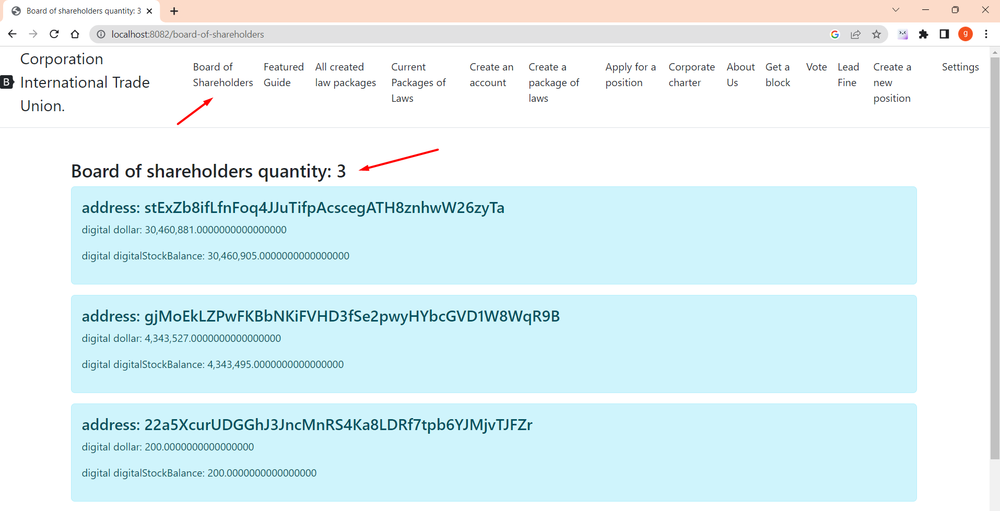

# Совет акционеров.

Чтобы увидеть состав Совета акционеров и узнать, сколько из них сейчас активно, войдите в систему по адресу http://localhost:8082/board-of-shareholders.


OriginalCHARTER.POWERS_OF_THE_BOARD_OF_SHAREHOLDERS: Полномочия совета акционеров.
Совет Акционеров Участвует в утверждении Поправок устав.
Совет акционеров также участвует в утверждении изменений в устав Корпорации Международного профсоюза AMENDMENT_TO_THE_CHARTER.


OriginalCHARTER.HOW_SHAREHOLDERS_BOARD_IS_ELECTED: КАК ИЗБИРАЮТСЯ АКЦИОНЕРЫ.
Совет акционеров состоит из одной тысячи пятисот счетов (1500) с наибольшим количеством акций,
но учитываются только те аккаунты, от деятельности которых не прошло больше года (Активность - майнинг или отправка денег, создание закона, отправка штрафов,
Подача заявки на должность и создание новой должности).
Формула: текущий год равен одному году, и если счет был активен в этом диапазоне, он учитывается.
Все учетные записи сортируются в порядке убывания количества цифровых акций, и выбираются 1500 учетных записей с наибольшим количеством акций. Пересчет происходит каждый блок.
Пример раздела кодекса об избрании Совета акционеров:


## Как формируется Совет акционеров,

---
      class UtilsGovernment method findBoardOfShareholders: // определяем совет акционеров
      public static List<Account> findBoardOfShareholders (балансы Map<String, Account>, блоки List<Block>, лимит int)
      {
          List<Block> minersHaveMoreStock = null;
          если (blocks.size() > лимит)
          { minersHaveMoreStock = blocks.subList(blocks.size() - лимит, blocks.size()); }
          else { minersHaveMoreStock = блоки; }
          List<Account> boardAccounts = minersHaveMoreStock.stream().map( t -> new Account(t.getMinerAddress(), 0, 0))
          .collect(Коллекторы.toList());
        
          for (Блочный блок: minersHaveMoreStock)
          { for (DtoTransaction dtoTransaction: block.getDtoTransactions())
          {boardAccounts.add(новая учетная запись(dtoTransaction.getSender(), 0, 0)); } }
          СравнитьОбъект СравнитьОбъект = новый СравнитьОбъект(); List<Account> boardOfShareholders = balances.entrySet()
          .stream().filter(t -> boardAccounts.contains(t.getValue()))
          .map(t -> t.getValue()).collect(Collectors.toList());
          boardOfShareholders = boardOfShareholders.stream()
          .filter(t -> !t.getAccount().startsWith(Setting.NAME_LAW_ADDRESS_START))
          .filter(t -> t.getDigitalStockBalance() > 0)
          .sorted(Comparator.comparing(Account::getDigitalStockBalance)
          .reversed()) .collect(Collectors.toList());


          boardOfShareholders = boardOfShareholders.stream()
          .limit(Настройка.BOARD_OF_SHAREHOLDERS)
          .collect(Коллекторы.toList()); вернуть совет акционеров; }
---

Класс BoardOfShareholdersController отображает текущие сообщения

````
        @GetMapping("совет акционеров")
      public String boardOfShareHolders (модель модели) выдает NoSuchAlgorithmException, InvalidKeySpecException, IOException, SignatureException, NoSuchProviderException, InvalidKeyException {

          Блокчейн блокчейна = Mining.getBlockchain(
                  Настройка.ORIGINAL_BLOCKCHAIN_FILE,
                  BlockchainFactoryEnum.ORIGINAL);

          //Получить баланс
          Map<String, Account> balances = new HashMap<>();

          балансы = SaveBalances.readLineObject(Setting.ORIGINAL_BALANCE_FILE);
          List<Account> boardOfShareholders = new ArrayList<>();

          boardOfShareholders = UtilsGovernment.findBoardOfShareholders(балансы, blockchain.getBlockchainList(), Setting.BOARDS_BLOCK);


          model.addAttribute("название", "совет акционеров. Всего: " + boardOfShareholders.size());
          model.addAttribute("boardOfShareholders", boardOfShareholders);
          возвращение «совета акционеров»;
      }

````

Метод из UtilsGovernment.java находит совет акционеров,

```
      src/main/java/правительства
    
      //определение совета акционеров
      public static List<Account> findBoardOfShareholders (балансы Map<String, Account>, блоки List<Block>, int limit) {
          List<Block> minersHaveMoreStock = null;
          если (blocks.size() > лимит) {
              minersHaveMoreStock = blocks.subList(blocks.size() - лимит, blocks.size());
          } еще {
              minersHaveMoreStock = блоки;
          }
          List<Account> boardAccounts = minersHaveMoreStock.stream().map(
                          t -> новая учетная запись (t.getMinerAddress(), 0, 0))
                  .collect(Коллекторы.toList());

          для (Блок блокаk : у майнеровHaveMoreStock) {
              for (DtoTransaction dtoTransaction : block.getDtoTransactions()) {
                  boardAccounts.add(новая учетная запись(dtoTransaction.getSender(), 0, 0));
              }

          }
```

[выйти домой](./documentationRus.md)