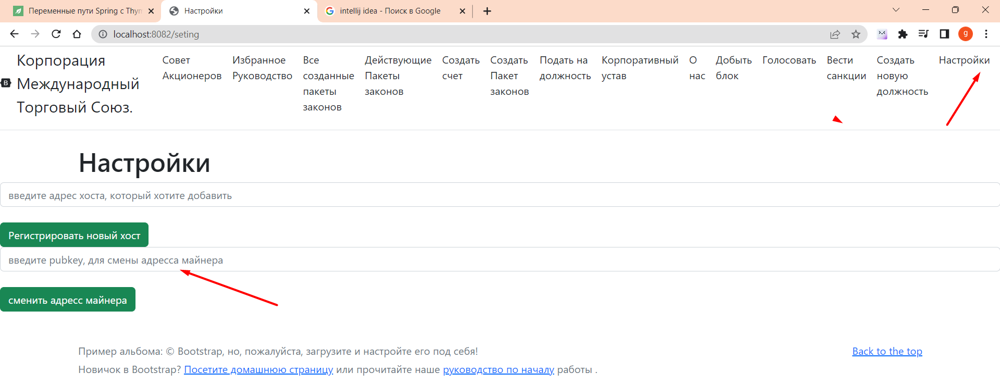

# Как сменить счет для майнинга

запустите локальный сервер и войдите http://localhost:8082/seting
или нажмите кнопку настройки, введите ваш ***адресс (публичный ключ)*** 
в ***ведите pubkey, для смены адреса майнера*** и нажмите кнопку
***сменить адрес майнера***


Код находится в контролере папки 
````
    src/main/java/International_Trade_Union/controllers/MainController.java
````
````
    @PostMapping("/setMinner")
    public ResponseEntity<String> setMinnerAddress(@RequestParam(value = "setMinner") String setMinner, RedirectAttributes redirectAttrs){
    System.out.println("MainController:  " + setMinner);
    UtilsFileSaveRead.save(setMinner, Seting.ORIGINAL_ACCOUNT, false);
    return new ResponseEntity<>("change address: " + setMinner, HttpStatus.OK);
    }
````

UtilsFileSaveRead.save() сохраняет новый публичный счет в файле
в папке
````
    resources/minerAccount/minerAccount.txt
````

[возврат на главную](../readme.md)