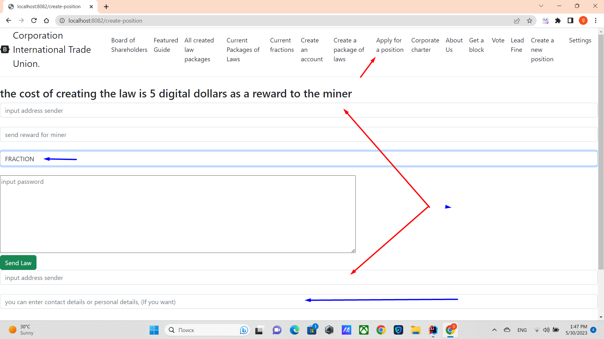

# Создание фракции
## Как создаются фракции
Фракции создаются аналогично другим должностям, таким как Совет Директоров.
Нужно войти во вкладку ***apply for a position***, там выбрать 
из выпадающего списка FRACTION. Дать вознаграждение 5 монет добытчику и
чтобы адреса отправителя и первой строки закона совпадали.
От имени фракций всегда выступают лидеры, таким образом вы всегда голосуете за лидера и
всегда может быть несколько идеологических идентичных фракций, которые возглавляют 
разные лидеры. Вы должны воспринимать палату фракций как палату лидеров.

## В чем тогда отличие фракций.
Отличие фракций заключается в системе голосования, а именно когда отдает свой голос,
член Совета Директоров или член Совета Акционеров, то один счет приравнивается одному голосу.
В то же время голос фракции, равен доле голосов которые он получил.
Для этого суммируется голоса всех 100 фракций, и каждый потом определяется доля каждой фракции.
Пример: если ваша фракция получила, 23% доли, то голос будет равен 23%.
Детально прописано в [VOTE_FRACTION](../charterEng/VOTE_FRACTION.md)

[Выход на главную](../documentation/documentationRus.md)
