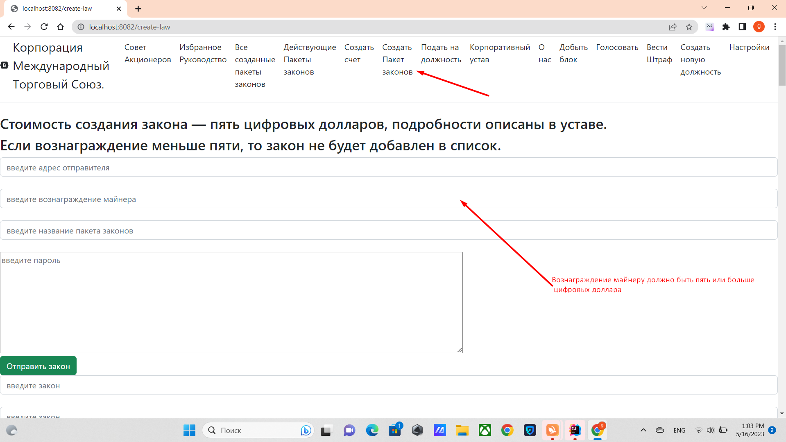

# Как создаются Законы


Как создать закон, http://localhost:8082/create-law 
зайдите по ссылке, ведите нужные там данные нажмите кнопку


1. Войдите по вкладке создать закон
2. Впишите туда адрес отправителя
3. Вознаграждение майнера
4. Название пакета законов,
5. Приватный ключ(Пароль)
6. заполните такое количество строк, сколько вам законов нужно создать
7. Нажмите кнопку. ***Отправить закон***

Для вашего закона будет сгенерирован хэш, который будет всегда начинаться с LIBER.

После того как он будет добавлен в блок, и будет добавлен в блокчейн, за него смогут голосовать.
Пример кода в LawsController current law:

````
     @GetMapping("/current-laws")
    public String currentLaw(Model model) throws IOException, NoSuchAlgorithmException, InvalidKeySpecException, SignatureException, NoSuchProviderException, InvalidKeyException, CloneNotSupportedException {
        Directors directors = new Directors();
        Blockchain blockchain = Mining.getBlockchain(
                Seting.ORIGINAL_BLOCKCHAIN_FILE,
                BlockchainFactoryEnum.ORIGINAL);

        Map<String, Account> balances = new HashMap<>();
        //считывать баланс
        balances = SaveBalances.readLineObject(Seting.ORIGINAL_BALANCE_FILE);

        List<LawEligibleForParliamentaryApproval> lawEligibleForParliamentaryApprovals =
                UtilsLaws.readLineCurrentLaws(Seting.ORIGINAL_ALL_CORPORATION_LAWS_WITH_BALANCE_FILE);

        //получить совет акционеров из файла
        List<Account> boardOfShareholders = UtilsGovernment.findBoardOfShareholders(balances, blockchain.getBlockchainList(), Seting.BOARDS_BLOCK);


        //TODO доработать оптимизацию
        //TODO избавиться от find position в данном методе
        //отфильтровать по типам голосов
        Map<Director, FIndPositonHelperData> fIndPositonHelperDataMap = new HashMap<>();
        for (Director higherSpecialPositions : directors.getDirectors()) {
            if (higherSpecialPositions.isElectedByCEO()) {
                fIndPositonHelperDataMap.put(higherSpecialPositions,
                        new FIndPositonHelperData(higherSpecialPositions, false, false, true, false, false));
            } else if (higherSpecialPositions.isElectedByBoardOfDirectors()) {
                fIndPositonHelperDataMap.put(higherSpecialPositions,
                        new FIndPositonHelperData(higherSpecialPositions, false, false, false, true, false));
            } else if (higherSpecialPositions.isElectedByCorporateCouncilOfReferees()) {
                fIndPositonHelperDataMap.put(higherSpecialPositions,
                        new FIndPositonHelperData(higherSpecialPositions, false, false, false, false, true));
            } else {
                fIndPositonHelperDataMap.put(higherSpecialPositions,
                        new FIndPositonHelperData(higherSpecialPositions, true, true, false, false, false));

            }

        }
        //подсчитать голоса за все проголосованные заканы
        List<CurrentLawVotesEndBalance> current = UtilsGovernment.filtersVotes(
                lawEligibleForParliamentaryApprovals,
                balances,
                boardOfShareholders,
                blockchain.getBlockchainList(),
                Seting.LAW_YEAR_VOTE);


        //минимальное значение количество положительных голосов для того чтобы закон действовал,
        //позиции избираемые акциями совета директоров
        List<CurrentLawVotesEndBalance> electedByStockBoardOfDirectors = current.stream()
                .filter(t -> directors.isElectedByStocks(t.getPackageName()))
                .filter(t -> t.getPackageName().equals(NamePOSITION.BOARD_OF_DIRECTORS.toString()))
                .filter(t -> t.getVotes() >= Seting.ORIGINAL_LIMIT_MIN_VOTE)
                .sorted(Comparator.comparing(CurrentLawVotesEndBalance::getVotes).reversed())
                .limit(directors.getDirector(NamePOSITION.BOARD_OF_DIRECTORS.toString()).getCount())
                .collect(Collectors.toList());


        //минимальное значение количество положительных голосов для того чтобы закон действовал,
        //позиции избираемые акциями CORPORATE_COUNCIL_OF_REFEREES
        List<CurrentLawVotesEndBalance> electedByStockCorporateCouncilOfReferees = current.stream()
                .filter(t -> directors.isElectedByStocks(t.getPackageName()))
                .filter(t -> t.getPackageName().equals(NamePOSITION.CORPORATE_COUNCIL_OF_REFEREES.toString()))
                .filter(t -> t.getVotes() >= Seting.ORIGINAL_LIMIT_MIN_VOTE)
                .sorted(Comparator.comparing(CurrentLawVotesEndBalance::getVotes).reversed())
                .limit(directors.getDirector(NamePOSITION.CORPORATE_COUNCIL_OF_REFEREES.toString()).getCount())
                .collect(Collectors.toList());


        //позиции созданные советом директоров
        List<CurrentLawVotesEndBalance> createdByBoardOfDirectors = current.stream()
                .filter(t->t.getPackageName().startsWith(Seting.ADD_DIRECTOR))
                .filter(t->t.getVotesBoardOfDirectors() >= Seting.ORIGINAL_LIMIT_MIN_VOTE_BOARD_OF_DIRECTORS)
                .collect(Collectors.toList());
        //добавление позиций созданных советом директоров
        for (CurrentLawVotesEndBalance currentLawVotesEndBalance : createdByBoardOfDirectors) {
            directors.addAllByBoardOfDirectors(currentLawVotesEndBalance.getLaws());
        }

        //позиции избираемые только советом директоров
        List<CurrentLawVotesEndBalance> electedByBoardOfDirectors = current.stream()
                .filter(t -> directors.isElectedByBoardOfDirectors(t.getPackageName()) || directors.isCabinets(t.getPackageName()))
                .filter(t -> t.getVotesBoardOfDirectors() >= Seting.ORIGINAL_LIMIT_MIN_VOTE_BOARD_OF_DIRECTORS)
                .sorted(Comparator.comparing(CurrentLawVotesEndBalance::getVotesBoardOfDirectors).reversed())
                .collect(Collectors.toList());


        //групируем по списку
        Map<String, List<CurrentLawVotesEndBalance>> group = electedByBoardOfDirectors.stream()
                .collect(Collectors.groupingBy(CurrentLawVotesEndBalance::getPackageName));

        Map<Director, List<CurrentLawVotesEndBalance>> original_group = new HashMap<>();

        //оставляем то количество которое описано в данной должности
        for (Map.Entry<String, List<CurrentLawVotesEndBalance>> stringListEntry : group.entrySet()) {
            List<CurrentLawVotesEndBalance> temporary = stringListEntry.getValue();
            temporary = temporary.stream()
                    .sorted(Comparator.comparing(CurrentLawVotesEndBalance::getVotesBoardOfDirectors))
                    .limit(directors.getDirector(stringListEntry.getKey()).getCount())
                    .collect(Collectors.toList());
            original_group.put(directors.getDirector(stringListEntry.getKey()), temporary);
        }


        //позиции избираемые советом корпоративных верховных судей
        List<CurrentLawVotesEndBalance> electedByCorporateCouncilOfReferees = current.stream()
                .filter(t -> directors.isElectedBYCorporateCouncilOfReferees(t.getPackageName()))
                .filter(t -> t.getVotesCorporateCouncilOfReferees() >= Seting.ORIGINAL_LIMIT_MIN_VOTE_CORPORATE_COUNCIL_OF_REFEREES)
                .sorted(Comparator.comparing(CurrentLawVotesEndBalance::getVotesCorporateCouncilOfReferees)).collect(Collectors.toList());


        //избираемые GENERAL_EXECUTIVE_DIRECTOR
        List<CurrentLawVotesEndBalance> electedByGeneralExecutiveDirector = electedByBoardOfDirectors.stream()
                .filter(t -> directors.isElectedCEO(t.getPackageName()))
                .filter(t -> NamePOSITION.GENERAL_EXECUTIVE_DIRECTOR.toString().equals(t.getPackageName()))
                .filter(t -> t.getVoteGeneralExecutiveDirector() >= Seting.ORIGINAL_LIMIT_MIN_VOTE_GENERAL_EXECUTIVE_DIRECTOR)
                .sorted(Comparator.comparing(CurrentLawVotesEndBalance::getVoteGeneralExecutiveDirector))
                .collect(Collectors.toList());

        //голос верховного судьи
        List<CurrentLawVotesEndBalance> electedByHightJudge = electedByCorporateCouncilOfReferees.stream()
                .filter(t -> directors.isElectedBYCorporateCouncilOfReferees(t.getPackageName()))
                .filter(t -> t.getVoteHightJudge() >= Seting.ORIGINAL_LIMIT_MIN_VOTE_HIGHT_JUDGE)
                .collect(Collectors.toList());

        //ЗАКОНЫ КОТОРЫЕ БЫЛИ ОДОБРЕНЫ ЧЕРЕЗ ПРЯМОЕ ГОЛОСОВАНИЕ
        List<CurrentLawVotesEndBalance> allVotes = current.stream()
                .filter(t->!directors.contains(t.getPackageName()))
                .filter(t->!Seting.AMENDMENT_TO_THE_CHARTER.equals(t.getPackageName()))
                .filter(t->!directors.isCabinets(t.getPackageName()))
                .filter(t->!Seting.ORIGINAL_CHARTER_CURRENT_LAW_PACKAGE_NAME.equals(t.getPackageName()))
                .filter(t->!Seting.ORIGINAL_CHARTER_CURRENT_ALL_CODE.equals(t.getPackageName()))
                .filter(t->t.getVotes() > Seting.ALL_STOCK_VOTE)
                .collect(Collectors.toList());

        //законы которые получили не достаточно голосов которые могут пройти только если верховный судья одобрет
        List<CurrentLawVotesEndBalance> notEnoughVotes = current.stream()
                .filter(t -> !directors.contains(t.getPackageName()))
                .filter(t->!Seting.AMENDMENT_TO_THE_CHARTER.equals(t.getPackageName()))
                .filter(t->!directors.isCabinets(t.getPackageName()))
                .filter(t -> !Seting.ORIGINAL_CHARTER_CURRENT_LAW_PACKAGE_NAME.equals(t.getPackageName()))
                .filter(t->!Seting.ORIGINAL_CHARTER_CURRENT_ALL_CODE.equals(t.getPackageName()))
                .filter(t -> t.getVotesBoardOfShareholders() >= Seting.ORIGINAL_LIMIT_MIN_VOTE_BOARD_OF_SHAREHOLDERS)
                .filter(t -> t.getVotesBoardOfDirectors() >= Seting.ORIGINAL_LIMIT_MIN_VOTE_BOARD_OF_DIRECTORS)
                .filter(t -> t.getVoteHightJudge() >= Seting.ORIGINAL_LIMIT_MIN_VOTE_HIGHT_JUDGE)
                .sorted(Comparator.comparing(CurrentLawVotesEndBalance::getVotes).reversed()).collect(Collectors.toList());


        //законы которые получили достаточно голосов и не требуют одобрения верховного судьи
        List<CurrentLawVotesEndBalance> powerfulVotes = current.stream()
                .filter(t -> !directors.contains(t.getPackageName()))
                .filter(t-> !Seting.AMENDMENT_TO_THE_CHARTER.equals(t.getPackageName()))
                .filter(t-> !directors.isCabinets(t.getPackageName()))
                .filter(t -> !Seting.ORIGINAL_CHARTER_CURRENT_LAW_PACKAGE_NAME.equals(t.getPackageName()))
                .filter(t->!Seting.ORIGINAL_CHARTER_CURRENT_ALL_CODE.equals(t.getPackageName()))
                .filter(t -> t.getVotesBoardOfShareholders() >= (Seting.ORIGINAL_LIMIT_MIN_VOTE_BOARD_OF_SHAREHOLDERS * Seting.POWERFUL_VOTE))
                .filter(t -> t.getVotesBoardOfDirectors() >= (Seting.ORIGINAL_LIMIT_MIN_VOTE_BOARD_OF_DIRECTORS * Seting.POWERFUL_VOTE))
                .sorted(Comparator.comparing(CurrentLawVotesEndBalance::getVotes).reversed()).collect(Collectors.toList());

        //удаление совпадающих голосов
        notEnoughVotes.addAll(powerfulVotes);
        notEnoughVotes = notEnoughVotes.stream().distinct().collect(Collectors.toList());

        //внедрение поправок в устав
        List<CurrentLawVotesEndBalance> chapter_amendment = current.stream()
                .filter(t -> !directors.contains(t.getPackageName()))
                .filter(t-> Seting.AMENDMENT_TO_THE_CHARTER.equals(t.getPackageName()))
                .filter(t->!directors.isCabinets(t.getPackageName()))
                .filter(t -> t.getVotesBoardOfShareholders() >= Seting.ORIGINAL_LIMIT_MINT_VOTE_BOARD_OF_SHAREHOLDERS_AMENDMENT)
                .filter(t -> t.getVotesBoardOfDirectors() >= Seting.ORIGINAL_LIMIT_MIN_VOTE_BOARD_OF_DIRECTORS_AMENDMENT)
                .filter(t -> t.getVotesCorporateCouncilOfReferees() >= Seting.ORIGINAL_LIMIT_MIN_VOTE_CORPORATE_COUNCIL_OF_REFEREES_AMENDMENT)
                .sorted(Comparator.comparing(CurrentLawVotesEndBalance::getVotesBoardOfDirectors).reversed()).collect(Collectors.toList());

        //бюджет утверждается только советом директоров.
        List<CurrentLawVotesEndBalance> budjet = current.stream()
                .filter(t-> !directors.contains(t.getPackageName()))
                .filter(t->Seting.BUDGET.equals(t.getPackageName()))
                .filter(t->!directors.isCabinets(t.getPackageName()))
                .filter(t-> t.getVotesBoardOfDirectors() >= Seting.ORIGINAL_LIMIT_MIN_VOTE_BOARD_OF_DIRECTORS)
                .sorted(Comparator.comparing(CurrentLawVotesEndBalance::getVotesBoardOfDirectors).reversed())
                .limit(1)
                .collect(Collectors.toList());


        //добавляет законы, которые создают новые должности директоров
        List<CurrentLawVotesEndBalance> addDirectors = current.stream()
                .filter(t->t.getPackageName().startsWith(Seting.ADD_DIRECTOR))
                .filter(t->t.getVotesBoardOfDirectors() >= Seting.ORIGINAL_LIMIT_MIN_VOTE_BOARD_OF_DIRECTORS)
                .collect(Collectors.toList());

        //план утверждается только палатой Советом Директоров
        List<CurrentLawVotesEndBalance> planFourYears = current.stream()
                .filter(t->!directors.contains(t.getPackageName()))
                .filter(t->Seting.STRATEGIC_PLAN.equals(t.getPackageName()))
                .filter(t->!directors.isCabinets(t.getPackageName()))
                .filter(t->t.getVotesBoardOfDirectors() >= Seting.ORIGINAL_LIMIT_MIN_VOTE_BOARD_OF_DIRECTORS)
                .sorted(Comparator.comparing(CurrentLawVotesEndBalance::getVotesBoardOfDirectors).reversed())
                .limit(1)
                .collect(Collectors.toList());


        //устав всегда действующий он подписан основателем
        List<CurrentLawVotesEndBalance> CHARTER_ORIGINAL = current.stream()
                .filter(t -> !directors.contains(t.getPackageName()) && Seting.ORIGINAL_CHARTER_CURRENT_LAW_PACKAGE_NAME.equals(t.getPackageName()))
                .filter(t->!directors.isCabinets(t.getPackageName()))
                .filter(t->t.getFounderVote()>=1)
                .sorted(Comparator.comparing(CurrentLawVotesEndBalance::getVotes).reversed())
                .limit(1)
                .collect(Collectors.toList());

        //ИСХОДНЫЙ КОД СОЗДАННЫЙ ОСНОВАТЕЛЕМ
        List<CurrentLawVotesEndBalance> CHARTER_ORIGINAL_CODE = current.stream()
                .filter(t -> !directors.contains(t.getPackageName()) && Seting.ORIGINAL_CHARTER_CURRENT_ALL_CODE.equals(t.getPackageName()))
                .filter(t->!directors.isCabinets(t.getPackageName()))
                .filter(t->t.getFounderVote()>=1)
                .sorted(Comparator.comparing(CurrentLawVotesEndBalance::getVotes).reversed())
                .limit(1)
                .collect(Collectors.toList());


        int startBlock = 22000;
        int finishBlock = 22300;
        if(blockchain.sizeBlockhain() > finishBlock){
            List<Block> blocksCharter = blockchain.subBlock(startBlock, finishBlock);
            //учитывает отрезок блоков для выяснения подлиности устава
            List<CurrentLawVotesEndBalance> charterBlocks = UtilsGovernment.filtersVotes(
                    lawEligibleForParliamentaryApprovals,
                    balances,
                    boardOfShareholders,
                    blocksCharter,
                    Seting.LAW_YEAR_VOTE
            );
            List<CurrentLawVotesEndBalance> charterCheckBlock = charterBlocks.stream()
                    .filter(t -> !directors.contains(t.getPackageName()) && Seting.ORIGINAL_CHARTER_CURRENT_LAW_PACKAGE_NAME.equals(t.getPackageName()))
                    .filter(t->!directors.isCabinets(t.getPackageName()))
                    .filter(t->t.getFounderVote()>=1)
                    .sorted(Comparator.comparing(CurrentLawVotesEndBalance::getVotes).reversed())
                    .limit(1)
                    .collect(Collectors.toList());

            CHARTER_ORIGINAL.addAll(charterCheckBlock);


            List<CurrentLawVotesEndBalance> charterOriginalCode = charterBlocks.stream()
                    .filter(t -> !directors.contains(t.getPackageName()) && Seting.ORIGINAL_CHARTER_CURRENT_ALL_CODE.equals(t.getPackageName()))
                    .filter(t->!directors.isCabinets(t.getPackageName()))
                    .filter(t->t.getFounderVote()>=1)
                    .sorted(Comparator.comparing(CurrentLawVotesEndBalance::getVotes).reversed())
                    .limit(1)
                    .collect(Collectors.toList());

            CHARTER_ORIGINAL_CODE.addAll(charterOriginalCode);
        }


        for (Map.Entry<Director, List<CurrentLawVotesEndBalance>> higherSpecialPositionsListMap : original_group.entrySet()) {
            current.addAll(higherSpecialPositionsListMap.getValue());
        }


        current = new ArrayList<>();
        current.addAll(addDirectors);
        current.addAll(allVotes);
        current.addAll(budjet);
        current.addAll(planFourYears);
        current.addAll(electedByStockBoardOfDirectors);
        current.addAll(electedByStockCorporateCouncilOfReferees);
        current.addAll(electedByBoardOfDirectors);
        current.addAll(electedByCorporateCouncilOfReferees);
        current.addAll(electedByGeneralExecutiveDirector);
        current.addAll(electedByHightJudge);
        current.addAll(notEnoughVotes);
        current.addAll(CHARTER_ORIGINAL);
        current.addAll(CHARTER_ORIGINAL_CODE);
        current.addAll(chapter_amendment);
        current = current.stream()
                .filter(UtilsUse.distinctByKey(CurrentLawVotesEndBalance::getAddressLaw))
                .collect(Collectors.toList());
        System.out.println("notEnoughVotes: " + notEnoughVotes);

        model.addAttribute("title", "Как принимаются действующие законы, описано в уставе." +
                " ");
        model.addAttribute("currentLaw", current);
        return "current-laws";
    }
        
````

[возврат на главную](./documentationRus.md)