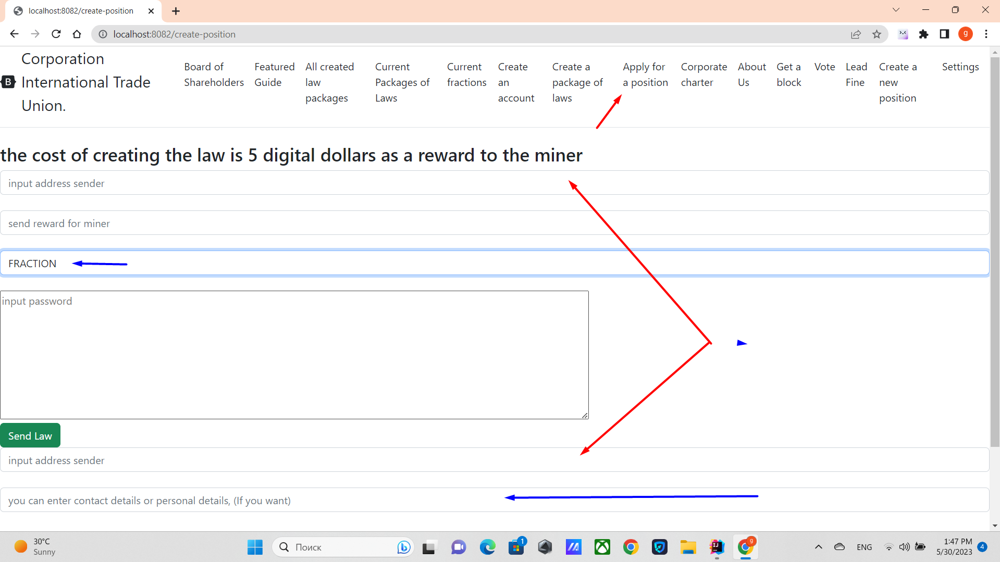

# Создание фракции
## Как создаются фракции
Лидеры создаются аналогично другим должностям, таким как Совет Директоров.
Нужно войти во вкладку ***apply for a position***, там выбрать 
из выпадающего списка FRACTION. Дать вознаграждение 5 монет добытчику и
чтобы адреса отправителя и первой строки закона совпадали.

## В чем тогда отличие фракций.
Отличие Лидеров заключается в системе голосования, а именно когда отдает свой голос,
член Совета Директоров или член Совета Акционеров, то один счет приравнивается одному голосу.
В то же время голос Лидера, равен доле голосов которые он получил.
Для этого суммируется голоса всех 100 избранных Лидеров, и каждый потом определяется доля каждой фракции.
Пример: если ваша фракция получила, 23% доли, то голос будет равен 23%.
Детально прописано в [VOTE_LEADER](../charterEng/VOTE_FRACTION.md)

Лидеры избираются аналогично Совету Директоров

[Выход на главную](../documentation/documentationRus.md)
