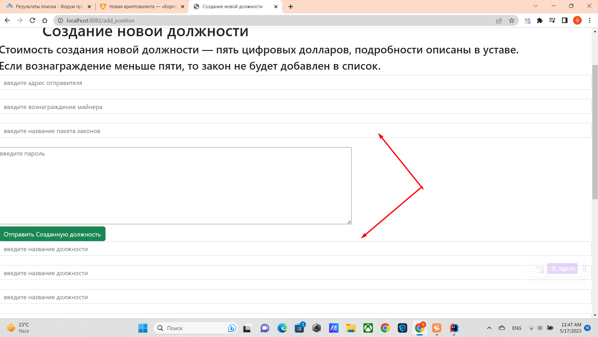

Чтобы создать новую должность, зайдите вкладку ***создать новую должность***

После пишите название пакета и название должности, 
Название пакета и название должностей автоматически будет начинаться с ADD_DIRECTOR.
Дальше нажмите на кнопку ***отправить новую должность***.

Каждая строка может быть заполнена только одной должностью, и должность не должна иметь пробелов.
Если название состоит из нескольких слов, то слова должны быть разделены нижним подчеркиванием.
Также желательно чтобы названия были на английском, чтобы система нормально работала.
Пример: MEDIA_DIRECTOR, тогда это название автоматически будет изменено на ADD_DIRECTOR_MEDIA_DIRECTOR.
Стоимость создания 5 цифровых долларов.

[Возврат на главную ](../readme.md)