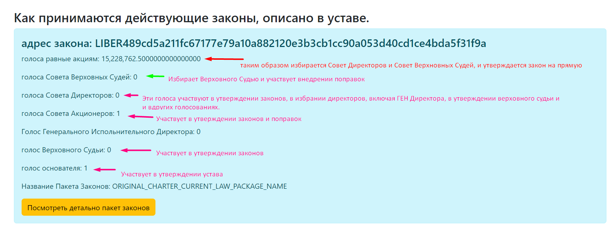
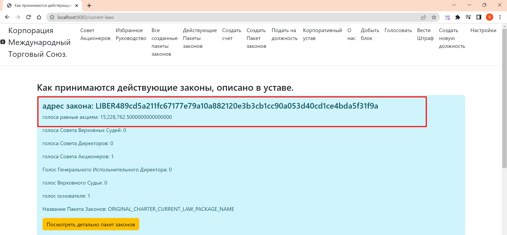

Есть несколько типов законов которые по разному утверждаются.
1. Совет директоров избирается с помощью Акций, сначала все поданные законы сортируется по количеству голосов акций,
   от большего к меньшему, после отбираются 301 счет которые имеют с наибольшим количеством голосов (VOTE_STOCK).
2. Совет Верховных Судей (CORPORATE_COUNCIL_OF_REFEREES) Избирается таким же способом, но отбирается 55 счетов (VOTE_STOCK).
3. Директора, назначаются Советом директоров, нужно набрать 15 голосов остатка (метод ONE_VOTE)
4. Для избрания Верховного Судьи, их избирают Совет Верховных Судей нужно 3 голоса остатка(Метод ONE_VOTE)
5. Обычные Законы избираются тремя способами вариант 1, 2 и 3.
6. Бюджет и стратегический план утверждается Советом Директоров нужно 15 голосов остатка(ONE_VOTE)
7. Внедрение поправок требует 300 голосов Совета Акционеров, 100 Совета Директоров и 5 Совета Верховных Судей. Метод ONE_VOTE

### Вариант 1
Если с помощью количества акций проголосовали больше 100000 тысяч голосов(остаток),
То закон является действующим

### Вариант 2
Если закон получил 100 голосов Совета Акционеров(остаток голосов) и
15 голосов Совета Директоров (остаток голосов) и голос Верховного судьи,
Закон утвержден

### Вариант 3
Если закон получил 200 голосов Совета Акционеров(остаток голосов)
и 30 голосов Совета Директоров (остаток голосов )
Закон утвержден.

Все три способа являются легитимными.

[Возврат на главную](../readme.md)