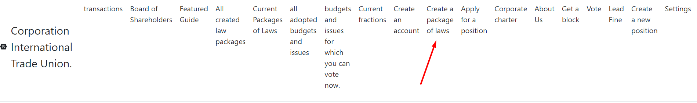
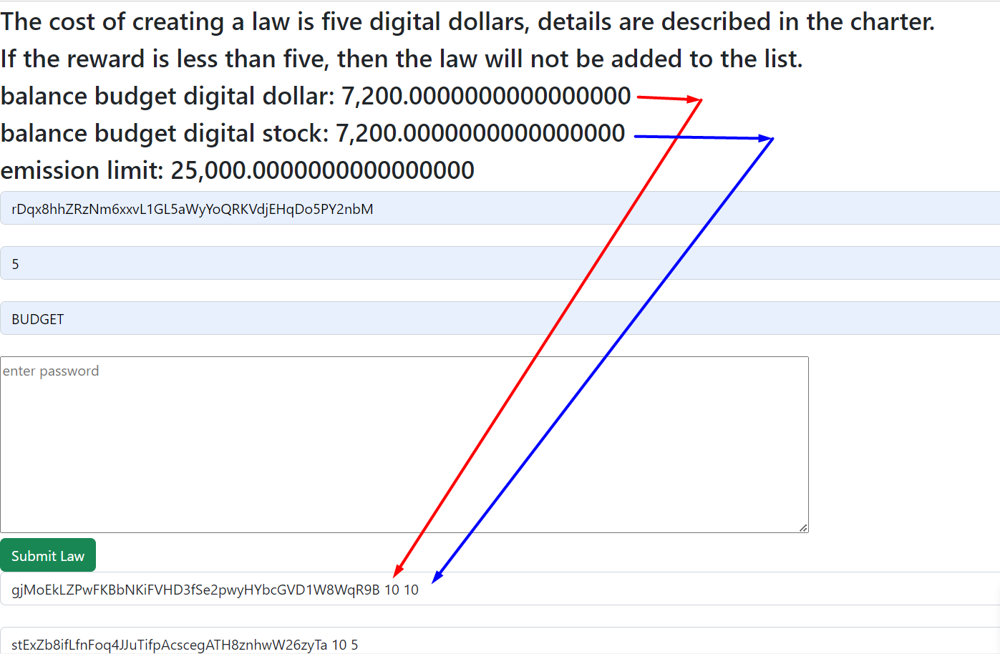
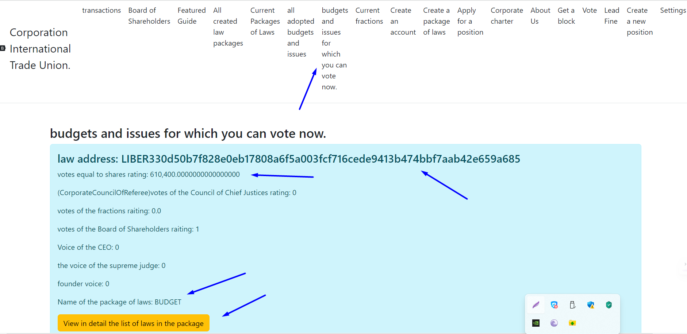
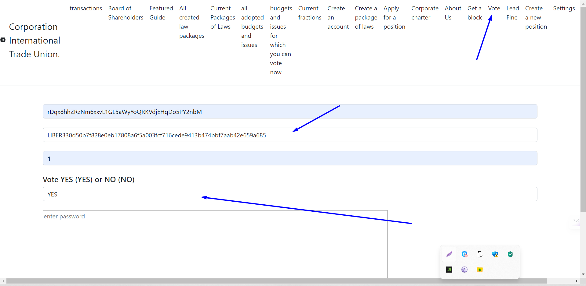
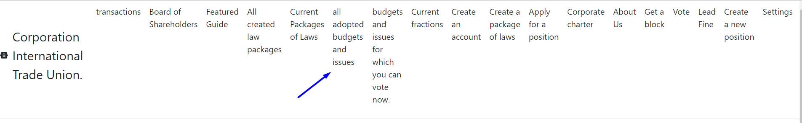

# БЮДЖЕТ И ЭМИССИЯ
## БЮДЖЕТ
### КАК ПОПОЛНЯЕТСЯ БУДЖЕТ
Бюджет можно пополнять таким же образом, как и обычный бюджет.
1. На этот счет можно добывать монеты.
2. Можно просто перевести на него
3. или через эмиссию указать этот счет в качестве одного из получателя.

### КАК СНИМАТЬ С БЮДЖЕТА ДЕНЬГИ.
1. Для снятия из бюджета нужно создать закон с названием пакета BUDGET.
   Внутри пакета список законов внутри пакета должен быть разделен пробелом.
   Сначала идет адрес, потом сумма в цифровых долларах и после в цифровых акциях. 
2. После нужно войти во вкладку ***budgets and issues for which you can vote now***
3. Взять оттуда адрес и этот адрес дать другим участникам, чтобы другие участники могли
   проголосовать которая находиться во вкладке ***vote***
4. Каждые 15 дней будет утвержден только один пакет законов который получил наибольшее количество
   голосов в рейтинге vote stock.
5. В ***budgets and issues for which you can vote now*** отображаются только пакеты законов, от
   момента создания законов не ушло больше 15 дней.
6. Все утвержденные бюджеты отображаются на вкладке ***all adopted budgets and issues***

Но сумма не должна превышать сумму, которая есть в бюджете.

# КАК ДЕЛАТЬ ЭМИССИЮ
Эмиссия аналогична бюджету, вместо BUDGET нужно название пакета EMISSION.
Также эмиссия не должна быть выше 100000 на один пакет. Раз в 15 разрешается тратить до 100000 цифровых долларов.
Таким образом акции создать не возможно только цифровые доллары.
баланс эмиссии каждый 15 день обнуляется из-за этого не надо на него переводить.

[возврат на главную](./documentationRus.md)