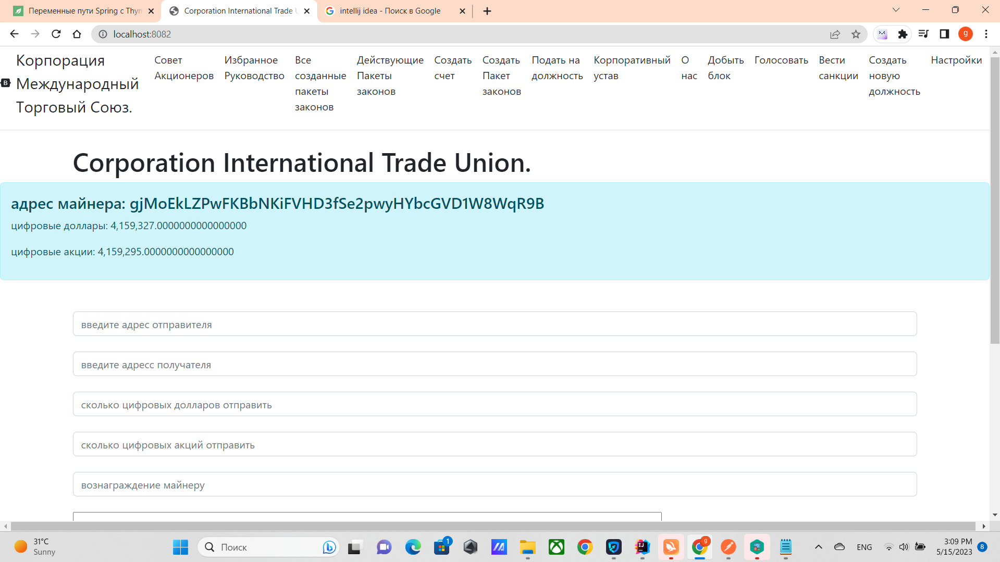

# Установка
Если у вас windows, то вам нужно скачать с папки target unitedStates-0.0.1-SHAPSHOT.jar
в поиск виндовс вести cmd открыть командную строку и туда вести java -jar (где находится файл)/unitedStates-0.0.1-SNAPSHOT.jar
пример: java -jar C://unitedStates-0.0.1-SNAPSHOT.jar.
Но папка ресурсы также необходимо сделать как описано ниже.

Для правильной работы вам нужно скачать и установить jre https://www.java.com/ru/download/manual.jsp
https://www.oracle.com/cis/java/technologies/downloads/,
и jdk 19 или выше

папка resurces находиться в ***src/main/java/resources***
после чего нужно скопировать папку resources в диск С:
там хранятся
- файлы блокчейна в папке ***/blockchain***
- файлы баланс в папке ***/balance***
- файлы правила за которые проголосовали с их голосами ***/allLawsWithBalance***
- файлы все правила без голосов в ***/federalLaws***
- файлы счета, которые были избраны в качестве руководства ***/federalLaws***
- файл хранящий счет майнера ***/minerAccount***
- файлы адреса хостов ***/poolAddress***
- файлы отправленные транзакции ***/sendedTransaction***
- файлы список транзакций для отправки ***/transactions***


## ЕСЛИ ОТСУТСТВУЕТ ДИСК С:
Если у вас отсутствует диск С: или вы хотите изменить расположение файлов где они должны
храниться, то в src/main/java/International_Trade_Union/setings/Seting.java
Вы можете изменить там настройки кода должны быть изменены в соответсвтвии с вашими настройками,
после чего соберите приложение, например с помощью intellij idea, и проделайте то что описано выше,


````
    String ORIGINAL_BLOCKCHAIN_FILE = "C:\\resources\\blockchain\\";
    String ORIGINAL_BALANCE_FILE = "C:\\resources\\balance\\";
    String ORIGINAL_BOARD_0F_SHAREHOLDERS_FILE = "C:\\resources\\federalGovernment\\federalGovernment.txt";
    String ORIGINAL_ALL_CORPORATION_LAWS_FILE = "C:\\resources\\federalLaws\\";
    String ORIGINAL_ACCOUNT = "C:\\resources\\minerAccount\\minerAccount.txt";
    String ORIGINAL_CORPORATE_VOTE_FILE = "C:\\resources\\vote\\";

    String ORIGINAL_ALL_CORPORATION_LAWS_WITH_BALANCE_FILE = "C:\\resources\\allLawsWithBalance\\";
    String ORGINAL_ALL_TRANSACTION_FILE = "C:\\resources\\transactions\\";
    String ORIGINAL_ALL_SENDED_TRANSACTION_FILE = "C:\\resources\\sendedTransaction\\";
    String ORIGINAL_POOL_URL_ADDRESS_FILE = "C:\\resources\\poolAddress\\";
````

## куда подключается Сервер
Запустите jar файл
Локальный Сервер http://localhost:8082/ подключается уже к готовому серверу
https://github.com/CorporateFounder/unitedStates_duplicates_original_storage
который поднять на хосте http://194.87.236.238:80

````
    Set<String> ORIGINAL_ADDRESSES = Set.of("http://194.87.236.238:80");
````

после того как локальный сервер будет поднять, в браузере 
войдите на главную страницу http://localhost:8082 

так выглядит 

[возврат на главную](../readme.md)

