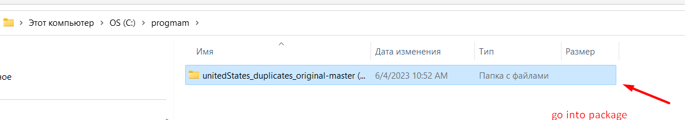
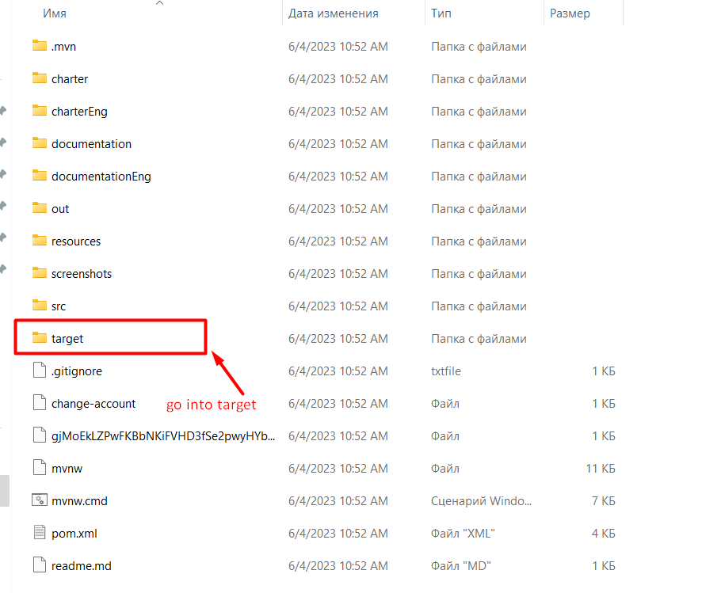
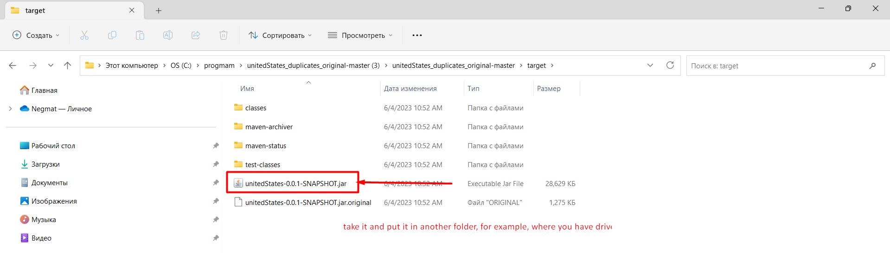
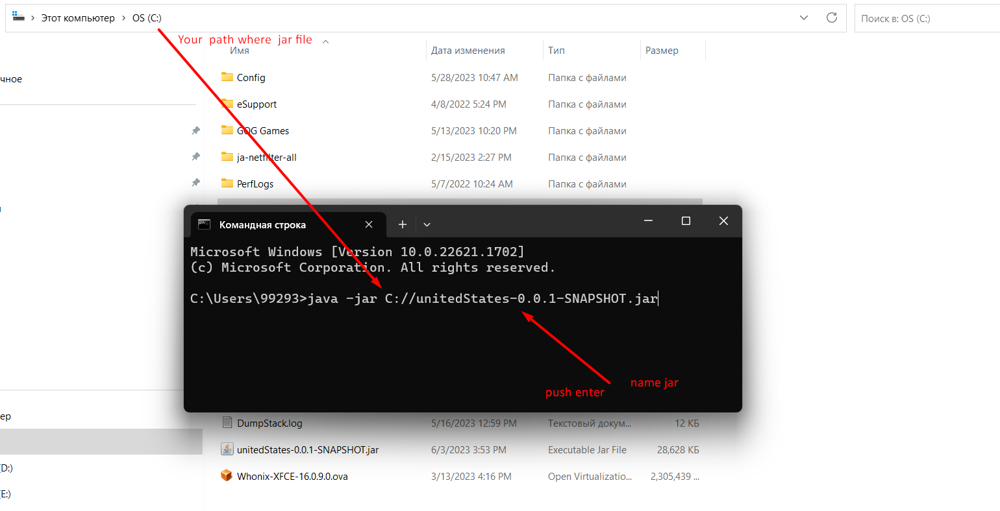
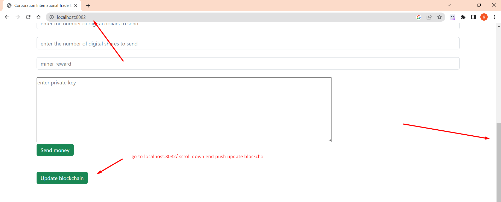

# Монтаж
Если у вас windows, то вам нужно скачать из папки target UnitedStates-0.0.1-SHAPSHOT.jar
в поиске windows введите cmd откройте командную строку и введите туда java -jar (там, где находится файл) /unitedStates-0.0.1-SNAPSHOT.jar
пример: java -jar C://unitedStates-0.0.1-SNAPSHOT.jar.

Для корректной работы необходимо скачать и установить jre https://www.java.com/en/download/manual.jsp
https://www.oracle.com/cis/java/technologies/downloads/,
и jdk 19 или выше

после запуска jar автоматически создастся папка ресурсов где windows, затем
перейти на локальный хост: 8082 перейти вниз кнопка обновить блок-цепочку

папка ресурсов находится в ***src/main/java/resources***
там хранятся
- файлы блокчейна в папке ***/blockchain***
- файлы баланса в папке ***/balance***
- файлы правил, за которые проголосовали их голоса ***/allLawsWithBalance***
- файлы всех правил без голосов в ***/federalLaws***
- файлы учетных записей, которые были выбраны в качестве руководства ***/federalLaws***
- файл для хранения учетной записи майнера ***/minerAccount***
- файлы адресов хостов ***/poolAddress***
- файлы, отправленные транзакцией ***/sentTransaction***
- файлы списка транзакций для отправки ***/транзакций***


## куда сервер подключается
Запустить jar-файл
Локальный сервер http://localhost:8082/ подключен к готовому серверу
https://github.com/CorporateFounder/unitedStates_storage
какой поднять на хосте http://194.87.236.238:80
````
      Set<String> ORIGINAL_ADDRESSES = Set.of("http://194.87.236.238:80");
````

После запуска локального сервера в браузере
войти на главную страницу http://localhost:8082

# ШАГ ЗА ШАГОМ С ФОТО









This is what  looks like

[back to home](./documentationRus.md)