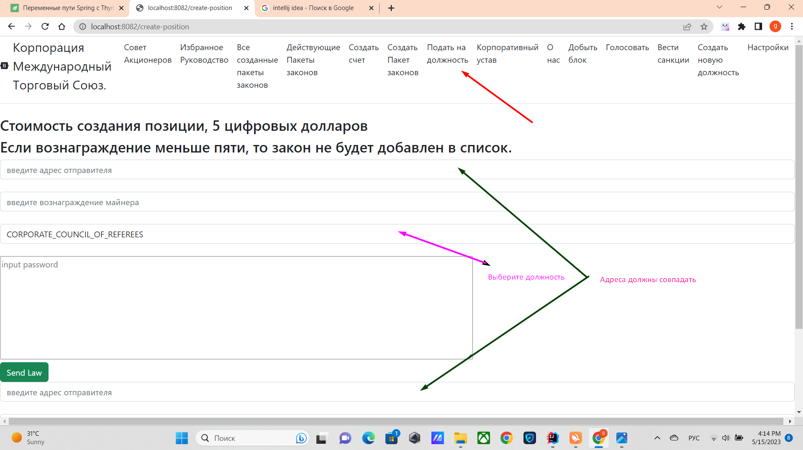

# Как избирается руководство

Как подать на должность, войдите по ссылке http://localhost:8082/create-position
или нажмите на вкладку ***подать на должность***.
Выберите из списка, должность.
Например, ***Корпоративный Верховный Судья (CORPORATE_COUNCIL_OF_REFEREES)***
нажмите на кнопку ***Подать на должность***

В руководство входит должности как избираемые с помощью цифровых акций, так и спо мощью других должностных лиц
детали прописаны в http://localhost:8082/corporate-charter

Для того чтобы могли подать на должность, вы должны войти в
http://localhost:8082/create-position
и должны вести адрес отправителя, вознаграждение майнера 
не меньше 5 монет, и выбрать должность. После чего нажать на кнопку.

[выход на главную](./documentationRus.md)

