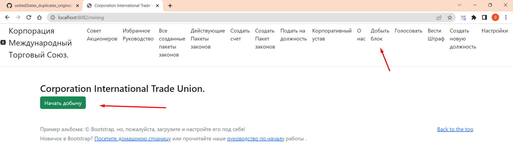

# Добыча блока

## КАК НАЧАТЬ ДОБЫВАТЬ 
Предварительно прежде чем начать добывать блоки, вам 
нужно установить адрес майнера, на который будет добываться блок. 
Как только вы установили свой адрес в качестве майнера, есть два варианта.

### ВАРИАНТ 1.
Чтобы начать добывать, нужно после запуска, зайти на 
на http://localhost:8082/mining там будет кнопка. ***Начать добычу***
нажимая на нее автоматически будет добыча, блока.



### ВАРИАНТ 2. 
вызов http://localhost:8082/mine автоматически начинает добычу.


Сложность блокчейна адаптируется аналогично биткоин, но адаптация происходит 
раз в пол дня.
Каждый блок дает 200 цифровых доллара и 200 цифровых акций

Актуальный блокчейн является не только самым длинным блокчейном, но он еще должен иметь больше количество нулей.

данный метод подсчитывает количество нулей в блокчейне и актуальный блокчейн, не только самый длинный, но и с наибольшим количеством нулей

````
    src/main/java/utils/UtilsUse.java

     //подсчитать количество нулей идущих подряд в hash
    public static long hashCount(String hash) {
        long count = 0;
        for (int i = 0; i < hash.length(); i++) {
            if(hash.charAt(i) == '0') count++;
            else return count;
        }
        return count;
    }
````


За добычу отвечает класс 

````
    src/main/java/International_Trade_Union/controllers/BasisController.java
````

метод нажатие кнопки вызывает кнопку /mine

````
    /**Стартует добычу, начинает майнинг*/
    @GetMapping("/mine")
    public synchronized String mine(Model model) throws NoSuchAlgorithmException, InvalidKeySpecException, IOException, SignatureException, NoSuchProviderException, InvalidKeyException, JSONException, CloneNotSupportedException {
        String text = "";
        //нахождение адрессов
        findAddresses();
        sendAddress();

        //собирает класс список балансов из файла расположенного по пути Seting.ORIGINAL_BALANCE_FILE
        Map<String, Account> balances = SaveBalances.readLineObject(Seting.ORIGINAL_BALANCE_FILE);
        //собирает объект блокчейн из файла
        blockchain = Mining.getBlockchain(
                Seting.ORIGINAL_BLOCKCHAIN_FILE,
                BlockchainFactoryEnum.ORIGINAL);

        //если блокчейн работает то продолжить
        if (!blockchain.validatedBlockchain()) {
            text = "wrong chain: неправильный блокчейн, добыча прекращена";
            model.addAttribute("text", text);
        }

        //Прежде чем добыть новый блок сначала в сети ищет самый длинный блокчейн
        resolve_conflicts();

        //если размер блокчейна меньше или равно единице, сохранить в файл генезис блок
        long index = blockchain.sizeBlockhain();
        if (blockchain.sizeBlockhain() <= 1) {
            //сохранение генезис блока
            if (blockchain.sizeBlockhain() == 1) {
                UtilsBlock.saveBLock(blockchain.getBlock(0), Seting.ORIGINAL_BLOCKCHAIN_FILE);
            }

            //получить список балансов из файла
            balances = Mining.getBalances(Seting.ORIGINAL_BALANCE_FILE, blockchain, balances);
            //удалить старые файлы баланса
            Mining.deleteFiles(Seting.ORIGINAL_BALANCE_FILE);
            //сохранить балансы
            SaveBalances.saveBalances(balances, Seting.ORIGINAL_BALANCE_FILE);

        }
        //скачать список балансов из файла
        balances = SaveBalances.readLineObject(Seting.ORIGINAL_BALANCE_FILE);

        //получить счет майнера
        Account miner = balances.get(User.getUserAddress());
        if (miner == null) {
            //если в блокчейне не было баланса, то баланс равен нулю
            miner = new Account(User.getUserAddress(), 0, 0);
        }

        //транзакции которые мы добавили в блок и теперь нужно удалить из файла, в папке resources/transactions
        List<DtoTransaction> temporaryDtoList = AllTransactions.getInstance();

        //раз в три для очищяет файлы в папке resources/sendedTransaction данная папка
        //хранит уже добавленые в блокчейн транзации, чтобы повторно не добавлять в
        //в блок уже добавленные транзакции
        AllTransactions.clearAllSendedTransaction(index);
        AllTransactions.clearUsedTransaction(AllTransactions.getInsanceSended());
        System.out.println("BasisController: start mine:");

        //Сам процесс Майнинга
        //DIFFICULTY_ADJUSTMENT_INTERVAL как часто происходит коррекция
        //BLOCK_GENERATION_INTERVAL как часто должен находить блок
        //temporaryDtoList добавляет транзакции в блок
        Block block = Mining.miningDay(
                miner,
                blockchain,
                Seting.BLOCK_GENERATION_INTERVAL,
                Seting.DIFFICULTY_ADJUSTMENT_INTERVAL,
                temporaryDtoList,
                balances,
                index
        );
        System.out.println("BasisController: finish mine:");
        //save sended transaction
        AllTransactions.addSendedTransaction(temporaryDtoList);

        int diff = Seting.DIFFICULTY_ADJUSTMENT_INTERVAL;
        //Тестирование блока
        List<Block> testingValidationsBlock = null;

        if (blockchain.sizeBlockhain() > diff) {

            testingValidationsBlock = blockchain.subBlock(blockchain.sizeBlockhain() - diff, blockchain.sizeBlockhain());
        } else {
            testingValidationsBlock = blockchain.clone();
        }
        if (testingValidationsBlock.size() > 1) {
            boolean validationTesting = UtilsBlock.validationOneBlock(
                    blockchain.genesisBlock().getFounderAddress(),
                    testingValidationsBlock.get(testingValidationsBlock.size() - 1),
                    block,
                    Seting.BLOCK_GENERATION_INTERVAL,
                    diff,
                    testingValidationsBlock);

            if (validationTesting == false) {
                System.out.println("wrong validation block: " + validationTesting);
                System.out.println("index block: " + block.getIndex());
                text = "wrong validation";
            }
            testingValidationsBlock.add(block.clone());
        }

        //сохранение блока
        blockchain.addBlock(block);
        UtilsBlock.saveBLock(block, Seting.ORIGINAL_BLOCKCHAIN_FILE);

        //перерасчет после добычи
        balances = Mining.getBalances(Seting.ORIGINAL_BALANCE_FILE, blockchain, balances);
        Mining.deleteFiles(Seting.ORIGINAL_BALANCE_FILE);
        SaveBalances.saveBalances(balances, Seting.ORIGINAL_BALANCE_FILE);

        //получение и отображение законов, а также сохранение новых законов
        //и изменение действующих законов
        Map<String, Laws> allLaws = UtilsLaws.getLaws(blockchain.getBlockchainList(), Seting.ORIGINAL_ALL_CORPORATION_LAWS_FILE);

        //возвращает все законы с балансом
        List<LawEligibleForParliamentaryApproval> allLawsWithBalance = UtilsLaws.getCurrentLaws(allLaws, balances, Seting.ORIGINAL_ALL_CORPORATION_LAWS_WITH_BALANCE_FILE);
        //удаление устаревних законов
        Mining.deleteFiles(Seting.ORIGINAL_ALL_CORPORATION_LAWS_WITH_BALANCE_FILE);
        UtilsLaws.saveCurrentsLaws(allLawsWithBalance, Seting.ORIGINAL_ALL_CORPORATION_LAWS_WITH_BALANCE_FILE);

        //отправить актуальный блокчейн
        sendAllBlocksToStorage(blockchain.getBlockchainList());

        text = "success: блок успешно добыт";
        model.addAttribute("text", text);
        return "redirect:/mining";

    }
````

Здесь код майнинга

````
    src/main/java/International_Trade_Union/model/Mining.java
````

сам метод 

````
    public static Block miningDay(
    Account minner,
    Blockchain blockchain,
    long blockGenerationInterval,
    int DIFFICULTY_ADJUSTMENT_INTERVAL,
    List<DtoTransaction> transactionList,
    Map<String, Account> balances,
    long index
    ) throws IOException, NoSuchAlgorithmException, SignatureException, InvalidKeySpecException, NoSuchProviderException, InvalidKeyException {
    Directors directors = new Directors();
    //получение транзакций с сети
    List<DtoTransaction> listTransactions = transactionList;

        //определение валидных транзакций
        List<DtoTransaction> forAdd = new ArrayList<>();

        //проверяет целостность транзакции, что они подписаны правильно
        cicle:
        for (DtoTransaction transaction : listTransactions) {
            if (transaction.verify()) {
            
                Account account = balances.get(transaction.getSender());
                if (account == null) {
                    System.out.println("minerAccount null");
                    continue cicle;
                }
                //NAME_LAW_ADDRESS_START если адресс  означает правила выбранные сетью
                if(transaction.getCustomer().startsWith(Seting.NAME_LAW_ADDRESS_START) && !balances.containsKey(transaction.getCustomer())){
                    //если в названия закона совпадает с корпоративными должностями, то закон является действительным только когда
                    //отправитель совпадает с законом
    //                    List<Director> enumPosition = directors.getDirectors();
    List<String> corporateSeniorPositions = directors.getDirectors().stream()
    .map(t->t.getName()).collect(Collectors.toList());
    System.out.println("LawsController: create_law: " + transaction.getLaws().getPacketLawName() + "contains: " + corporateSeniorPositions.contains(transaction.getLaws().getPacketLawName()));
    if(corporateSeniorPositions.contains(transaction.getLaws().getPacketLawName())
    && !UtilsGovernment.checkPostionSenderEqualsLaw(transaction.getSender(), transaction.getLaws())){
    System.out.println("if your create special corporate position, you need " +
    "sender to be equals with first law: now its wrong");
    continue cicle;
    }
    }
    if(transaction.getLaws() == null){
    System.out.println("law cannot to be null: ");
    continue cicle;
    }

                if (account != null) {
                    if(transaction.getSender().equals(Seting.BASIS_ADDRESS)){
                        System.out.println("only this miner can input basis adress in this block");
                        continue cicle;
                    }
                    if(transaction.getCustomer().equals(Seting.BASIS_ADDRESS)){
                        System.out.println("basis address canot to be customer(recipient)");
                        continue cicle;
                    }

                    if( account.getDigitalDollarBalance() < transaction.getDigitalDollar() + transaction.getBonusForMiner()){
                        System.out.println("sender don't have digital dollar: " + account.getAccount() + " balance: " + account.getDigitalDollarBalance() );
                        System.out.println("digital dollar for send: " + (transaction.getDigitalDollar() + transaction.getBonusForMiner()));
                        continue cicle;
                    }
                    if (account.getDigitalStockBalance() < transaction.getDigitalStockBalance()){
                        System.out.println("sender don't have digital reputation: " + account.getAccount() + " balance: " + account.getDigitalStockBalance());
                        System.out.println("digital reputation for send: " + (transaction.getDigitalDollar() + transaction.getBonusForMiner()));
                        continue cicle;
                    }
                    if(transaction.getSender().equals(transaction.getCustomer()) ){
                        System.out.println("sender end recipient equals " + transaction.getSender() + " : recipient: " + transaction.getCustomer());
                        continue cicle;
                    }
                    forAdd.add(transaction);
                }

            }
        }


        //доход майнера
        double minerRewards = Seting.DIGITAL_DOLLAR_REWARDS_BEFORE;
        double digitalReputationForMiner = Seting.DIGITAL_STOCK_REWARDS_BEFORE;

        //доход основателя
        double founderReward = Seting.DIGITAL_DOLLAR_FOUNDER_REWARDS_BEFORE;
        double founderDigigtalReputationReward = Seting.DIGITAL_REPUTATION_FOUNDER_REWARDS_BEFORE;

        Base base = new Base58();

        //суммирует все вознаграждения майнеров
        PrivateKey privateKey = UtilsSecurity.privateBytToPrivateKey(base.decode(Seting.BASIS_PASSWORD));
        double sumRewards = forAdd.stream().collect(Collectors.summingDouble(DtoTransaction::getBonusForMiner));

        //вознаграждения майнера
        DtoTransaction minerRew = new DtoTransaction(Seting.BASIS_ADDRESS, minner.getAccount(),
                minerRewards, digitalReputationForMiner, new Laws(), sumRewards, VoteEnum.YES );

        byte[] signGold = UtilsSecurity.sign(privateKey, minerRew.toSign());
        minerRew.setSign(signGold);

        //вознаграждение основателя
        DtoTransaction founderRew = new DtoTransaction(Seting.BASIS_ADDRESS, blockchain.getADDRESS_FOUNDER(),
                founderReward, founderDigigtalReputationReward, new Laws(), 0.0, VoteEnum.YES);
        byte[] signFounder = UtilsSecurity.sign(privateKey, founderRew.toSign());

        founderRew.setSign(signFounder);


        forAdd.add(minerRew);
        forAdd.add(founderRew);


        //определение сложности и создание блока

        int difficulty = UtilsBlock.difficulty(blockchain.getBlockchainList(), blockGenerationInterval, DIFFICULTY_ADJUSTMENT_INTERVAL);

        System.out.println("Mining: miningBlock: difficulty: " + difficulty + " index: " + index);


        //blockchain.getHashBlock(blockchain.sizeBlockhain() - 1)
        Block block = new Block(
                forAdd,
                blockchain.getHashBlock(blockchain.sizeBlockhain() - 1),
                minner.getAccount(),
                blockchain.getADDRESS_FOUNDER(),
                difficulty,
                index);


       return block;
    }
````


подключается к внешним серверам, в поисках длинного блокчейна,
Взяв, если находит более актуальный блокчейн, то скачивает и заменяет собственный блокчейн

````
    @GetMapping("/nodes/resolve")
    public synchronized void resolve_conflicts() throws NoSuchAlgorithmException, InvalidKeySpecException, IOException, SignatureException, NoSuchProviderException, InvalidKeyException, JSONException {
    Blockchain temporaryBlockchain = BLockchainFactory.getBlockchain(BlockchainFactoryEnum.ORIGINAL);
    Blockchain bigBlockchain = BLockchainFactory.getBlockchain(BlockchainFactoryEnum.ORIGINAL);
    blockchain = Mining.getBlockchain(
    Seting.ORIGINAL_BLOCKCHAIN_FILE,
    BlockchainFactoryEnum.ORIGINAL);
    int blocks_current_size = blockchain.sizeBlockhain();
    long hashCountZeroTemporary = 0;
    long hashCountZeroBigBlockchain = 0;
    EntityChain entityChain = null;

        long hashCountZeroAll = 0;
        //count hash start with zero all
        for (Block block : blockchain.getBlockchainList()) {
            hashCountZeroAll += UtilsUse.hashCount(block.getHashBlock());
        }
        //список всех хостов
        Set<String> nodesAll = getNodes();
    //        nodesAll.addAll(Seting.ORIGINAL_ADDRESSES_BLOCKCHAIN_STORAGE);
    System.out.println("BasisController: resolve: size: " + getNodes().size());
    for (String s : nodesAll) {
    System.out.println("BasisController: resove: address: " + s);
    String temporaryjson = null;

            if (BasisController.getExcludedAddresses().contains(s)) {
                System.out.println("its your address or excluded address: " + s);
                continue;
            }
            try {
                //скачивает блокчейн из других адрессов
                String address = s + "/chain";
                System.out.println("BasisController:resolve conflicts: address: " + s + "/size");
                String sizeStr = UtilUrl.readJsonFromUrl(s + "/size");
                Integer size = Integer.valueOf(sizeStr);
                //если размер текущего блокчейна, меньше размера из других хостов
                if (size > blocks_current_size) {
                    System.out.println("size from address: " + s + " upper than: " + size + ":blocks_current_size " + blocks_current_size);
                    //Test start algorithm
                    SubBlockchainEntity subBlockchainEntity = new SubBlockchainEntity(blocks_current_size, size);
                    String subBlockchainJson = UtilsJson.objToStringJson(subBlockchainEntity);

                    List<Block> emptyList = new ArrayList<>();

                    List<Block> subBlocks = UtilsJson.jsonToListBLock(UtilUrl.getObject(subBlockchainJson, s + "/sub-blocks"));
                    emptyList.addAll(subBlocks);
                    emptyList.addAll(blockchain.getBlockchainList());

                    emptyList = emptyList.stream().sorted(Comparator.comparing(Block::getIndex)).collect(Collectors.toList());
                    temporaryBlockchain.setBlockchainList(emptyList);
                    if (!temporaryBlockchain.validatedBlockchain()) {
                        System.out.println("first algorithm not worked");
                        emptyList = new ArrayList<>();
                        emptyList.addAll(subBlocks);
                        for (int i = blockchain.sizeBlockhain() - 1; i > 0; i--) {
                            //скачивает блок по индексу
                            Block block = UtilsJson.jsonToBLock(UtilUrl.getObject(UtilsJson.objToStringJson(i), s + "/block"));
                            if (!blockchain.getBlock(i).getHashBlock().equals(block.getHashBlock())) {
                                emptyList.add(block);
                            } else {
                                emptyList.add(block);
                                emptyList.addAll(blockchain.getBlockchainList().subList(0, i));
                                emptyList = emptyList.stream().sorted(Comparator.comparing(Block::getIndex)).collect(Collectors.toList());
                                temporaryBlockchain.setBlockchainList(emptyList);
                                break;
                            }
                        }
                    }
                    if (!temporaryBlockchain.validatedBlockchain()) {
                        System.out.println("second algorith not worked");
                        temporaryjson = UtilUrl.readJsonFromUrl(address);
                        entityChain = UtilsJson.jsonToEntityChain(temporaryjson);
                        temporaryBlockchain.setBlockchainList(
                                entityChain.getBlocks().stream().sorted(Comparator.comparing(Block::getIndex)).collect(Collectors.toList()));
                    }
                } else {
                    System.out.println("BasisController: resove: size less: " + size + " address: " + address);
                    continue;
                }
            } catch (IOException e) {
                System.out.println("BasisController: resolve_conflicts: Error: " + s);
                continue;
            }

            //если скачаный блокчейн правильный то заменить переменную bigBlockchain
            if (temporaryBlockchain.validatedBlockchain()) {
                for (Block block : temporaryBlockchain.getBlockchainList()) {
                    hashCountZeroTemporary += UtilsUse.hashCount(block.getHashBlock());
                }

                if (blocks_current_size < temporaryBlockchain.sizeBlockhain() && hashCountZeroAll < hashCountZeroTemporary) {
                    blocks_current_size = temporaryBlockchain.sizeBlockhain();
                    bigBlockchain = temporaryBlockchain;
                    hashCountZeroBigBlockchain = hashCountZeroTemporary;
                }
                hashCountZeroTemporary = 0;
            }

        }

        //если саммый длинный блокчейн больше чем блокчейн на локальном 
        //сервере, но заменить в локальном сервере на скачанный

        if (bigBlockchain.sizeBlockhain() > blockchain.sizeBlockhain() && hashCountZeroBigBlockchain > hashCountZeroAll) {

            blockchain = bigBlockchain;
            UtilsBlock.deleteFiles();
            addBlock(bigBlockchain.getBlockchainList(), BLockchainFactory.getBlockchain(BlockchainFactoryEnum.ORIGINAL));
            System.out.println("BasisController: resolve: bigblockchain size: " + bigBlockchain.sizeBlockhain());

        }
    }
````

Поиск хэша присходит в классе BLock

````
    src/main/java/entity/blockchain/block/Block.java
````

Сам поиск хэша, в качестве аргумента отправляется какую сложность должен найти,
сама сложность определяется динамически

````
    public String findHash(int hashCoplexity) throws IOException, NoSuchAlgorithmException, SignatureException, NoSuchProviderException, InvalidKeyException, InvalidKeySpecException {
    if (!verifyesTransSign()){
    throw new NotValidTransactionException();
    }

        this.randomNumberProof = 0;
        String hash = "";
        while (true){
            this.randomNumberProof++;
            BlockForHash block = new BlockForHash(this.dtoTransactions,
                    this.previousHash, this.minerAddress, this.founderAddress,
                    this.randomNumberProof, this.minerRewards, this.hashCompexity, this.timestamp, this.index);
            hash = block.hashForTransaction();
            if(UtilsUse.hashComplexity(hash.substring(0, hashCoplexity), hashCoplexity))
            {
                break;
            }

        }
        return hash;
    }
````

Если количество нулей совпадает с ожидаемым, то поиск прекращается

````
     src/main/java/utils/UtilsUse.java
````

Класс, который метод который проверяет если совпадение в хэше с количеством нулей

````
    public static boolean hashComplexity(String literral, int hashComplexity){

        String regex = "^[0]{" + Integer.toString(hashComplexity) + "}";
        Pattern pattern = Pattern.compile(regex);
        Matcher matcher = pattern.matcher(literral);
        return matcher.find();
    }
````

BASIS_ADDRESS предназначен для отправки вознаграждения майнеру и основателю, каждый раз когда майнер 
хочет добыть блок, он вставляет адрес основателя и майнера,

````
    src/main/java/model/Mining.java method: miningDay()
````

````
    //доход майнера
    double minerRewards = Seting.DIGITAL_DOLLAR_REWARDS_BEFORE;
    double digitalReputationForMiner = Seting.DIGITAL_STOCK_REWARDS_BEFORE;

        //доход основателя
        double founderReward = Seting.DIGITAL_DOLLAR_FOUNDER_REWARDS_BEFORE;
        double founderDigigtalReputationReward = Seting.DIGITAL_REPUTATION_FOUNDER_REWARDS_BEFORE;

        Base base = new Base58();

    Base base = new Base58();

        //суммирует все вознаграждения майнеров
        PrivateKey privateKey = UtilsSecurity.privateBytToPrivateKey(base.decode(Seting.BASIS_PASSWORD));
        double sumRewards = forAdd.stream().collect(Collectors.summingDouble(DtoTransaction::getBonusForMiner));

        //вознаграждения майнера
        DtoTransaction minerRew = new DtoTransaction(Seting.BASIS_ADDRESS, minner.getAccount(),
                minerRewards, digitalReputationForMiner, new Laws(), sumRewards, VoteEnum.YES );

        //подписывает 
        byte[] signGold = UtilsSecurity.sign(privateKey, minerRew.toSign());
        minerRew.setSign(signGold);

        //вознаграждение основателя
        DtoTransaction founderRew = new DtoTransaction(Seting.BASIS_ADDRESS, blockchain.getADDRESS_FOUNDER(),
                founderReward, founderDigigtalReputationReward, new Laws(), 0.0, VoteEnum.YES);
        byte[] signFounder = UtilsSecurity.sign(privateKey, founderRew.toSign());

        founderRew.setSign(signFounder);


        forAdd.add(minerRew);
        forAdd.add(founderRew);
````

[возврат на главную](./documentationRus.md)