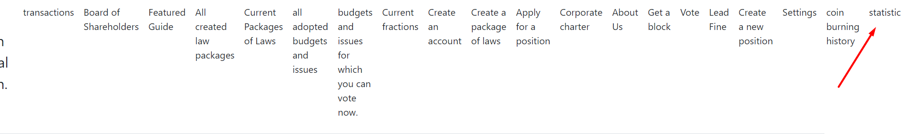
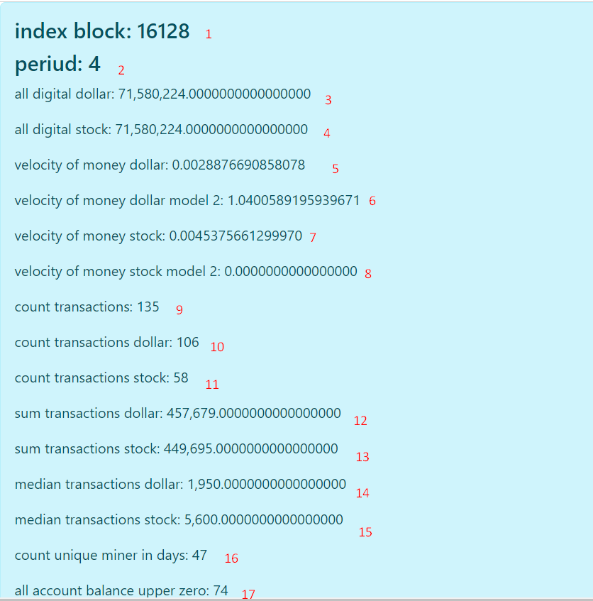

# СТАТИСТИКА И РАСШИФРОВКА ДАННЫХ
Все данные вычисляются на вашем компьютере из-за этого может занять время вычисления,
а также отличаться на разных компьютерах в зависимости от вашего блокчейна, для получения более точных данных
обновляете блокчейн перед входом во вкладку статистика.

## 1. INDEX BLOCK
в каком блоке произошел подсчет статистики.

## 2. PERIOD (период)
1. В сутках 576 блоков. вы можете выбрать ДЕНЬ, НЕДЕЛЯ, МЕСЯЦ И ГОД.
2. НЕДЕЛЯ = 576 * 7
3. МЕСЯЦ = 576 * 30
4. ГОД = 576 * 360
если выбрали один из перегудов, то вы можете увидеть разделение на эти периоды.

## 3-4. all digital dollar end all digital stock
Здесь вы видите все выпушенные деньги на данный период.

## 5, 7. velocity of money dollar end velocity of money stock
Отображает скорость обращения денег. Чем выше скорость, тем выше спрос на данную
монету. Вычисляется по формуле
P = медианная сумма которая определяется от всех транзакций за данный период, на 
данную монету (доллар или акции).
T = Количество транзакций за данный период
M = общая масса долларов или акций за данный период.
(P*T)/M

## 6, 8. velocity of money dollar model 2 end  velocity of money stock model 2
Аналогична 5, 7, но в качестве 
M = Баланс всех отравителей за данный период.
(P*T)/M
Этот показатель также говорит чем он больше, тем выше скорость оборота,
тем выше спрос на него.

## 9. count transactions
Учитывает все транзакции, за данный период, не зависимо это доллар или акции.
Количество всех транзакций включая доллары и акции
они могут совпадать так как в одной транзакциях может включать как доллары,
так и акции.

## 10. count transactions dollar
Учитывает только транзакции за данный период только доллары.
Количество только транзакции только долларов.

## 11. count transactions stock
Учитывает только транзакции за данный период только акции.
Количество только транзакций только акций.

## 12. sum transactions dollar
Сумма всех транзакций за данный период долларов.

## 13. sum transactions stock
Сумма всех транзакций за данный период акций.

## 14. median transactions dollar
Медиана транзакций долларов

## 15. median transactions stock
Медиана транзакций акций

## 16. count unique miner in days
Все адреса которые хотя бы один раз добыли блок за данный период,
но учитываются только адреса если они отличаются друг от друга,
Пример: вы добыли два блока, другой участник добыл один блок,
но вы использовали один адрес, таким образом будет число 2.

## 17. all account balance upper zero
Все адреса за данный период, чей баланс больше нуля (доллар или акций).

[возврат на главную](./documentationRus.md)
