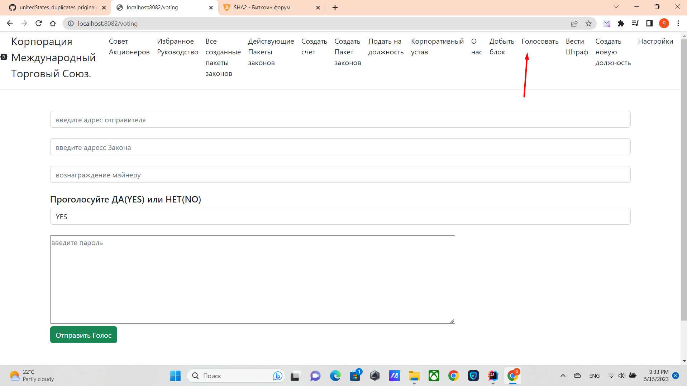

Войдите по ссылке http://localhost:8082/voting

там вы должны ввести адрес отправителя, адрес закона и должность который всегда начинается 
с LIBER. Сумму которую вы хотите дать майнеру и нажмите кнопку ***Отправить голос***
Но везде используется либо ONE_VOTE или VOTE_STOCK.

Каждый тип законов утвержается по своему, детали прочтите в уставе

[возврат на главную](../readme.md)