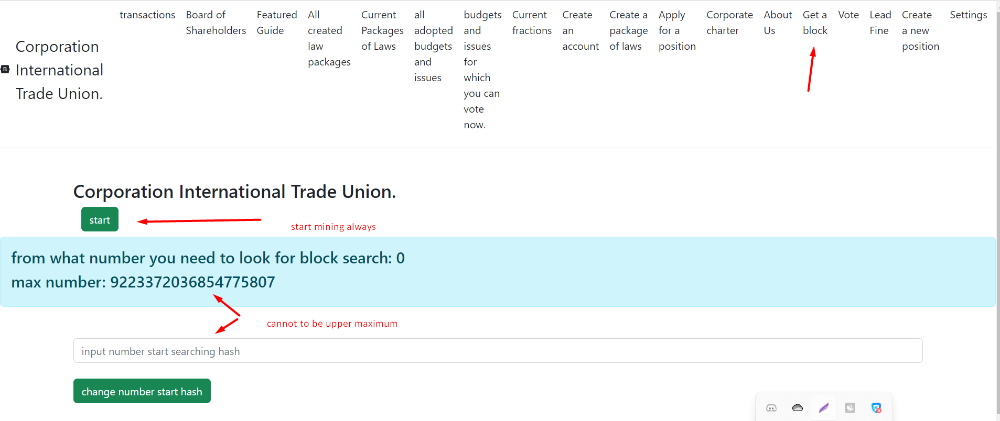

# block mining


### OPTION 1
Press the start button, to stop mining, click on the main page and appear
the page where the stop button will be.



NOTE!!!
THE GENESIS BLOCK HAS INDEX = 1, THE SAME AS THE NEXT ONE FOLLOWING IT.
THUS IN THIS BLOCKCHAIN THERE ARE TWO BLOCKS WITH IDENTICAL INDICES,
BUT WITH DIFFERENT CONTENTS. THIS IS ABSOLUTELY NORMAL AND THIS IS A FEATURE OF THIS
BLOCKCHAIN.


A unique mining system is implemented here, which stimulates a smooth increase in the value of the coin, not allowing it to fall much when winter occurs and is resistant to strong volatility, but at the same time the value increases. To mine you need to go to localhost:8082/ if your address is already displayed on the main page, go to the menu tab and first click settings, then set multithreading and the number of threads (very rarely in some versions of the PC multithreading may not work correctly, then disable her).
Then again enter the menu on the top right and click get a block, click the start button and then click on the Corporation international trade union inscription, you should see “is mining true” in the information window. It also sometimes happens that is updating is also true, which means the system is downloading the blockchain. Nothing will be displayed in the console, since if we output information there, mining would slow down six times for single-threaded mining. If you want to turn off mining, click the stop button twice, then click on the inscription corporation intertation trade union; if everything stopped correctly, the information window will disappear. Do not under any circumstances interrupt the mining process by turning off the command line during mining or updating, as at this moment the blockchain and balance are overwritten. When the information window turns off, mining will stop. A block is valid if the hash satisfies the target according to this formula:
mining algorithm:
a hash is valid if hash is less than or equal to the target. MAX_TARGET = "0000000FFFFFFFFFFFFFFFFFFFFFFFFFFFFFFFFFFFFFFFFFFFFFFFFFFFFFFFFFF"
MAX_TARGET / DIFFICULT = TARGET since version 30, difficulty can change every 144 blocks.
````
    // String MAX_TARGET_v30 = "0000000FFFFFFFFFFFFFFFFFFFFFFFFFFFFFFFFFFFFFFFFFFFFFFFFFFFFFFFF";
      public static BigInteger calculateTargetV30(long difficulty) {
         BigInteger maxTarget = new BigInteger(Setting.MAX_TARGET_v30, 16);
       return maxTarget.divide(BigInteger.valueOf(difficulty));

     }

     public static boolean isValidHashV30(String hash, BigInteger target) {
     BigInteger hashInt = new BigInteger(hash, 16);
     return hashInt.compareTo(target) <= 0;
     }


````
The mining reward is calculated using the formula (5+coefficient) * multiplier. Where the multiplier is 29, but decreases by one each year until it reaches 1.
The coefficient can be 0 or 3; for it to become 3, two conditions must be met. 1. The sum of all transactions for the current block must be greater than in the previous block,
not counting the founder's reward and the miner's reward. 2. The number of different senders in this block must be greater than in the previous block, not counting the base address,
which sends the reward to the founder and miner.

LOAD DISTRIBUTION BETWEEN MANY COMPUTERS.
Let's imagine that you have two computers and want them to mine
blocks, if you just turn them on on two computers, they will
iterate over both from 0 to infinity.

You can start iterating from 0 on one computer, and from 5000 thousand on the second,
this way the second one will check a little earlier. Or 10,000 thousand.
You must choose the optimal numbers yourself.
[back to home](./documentationEng.md)