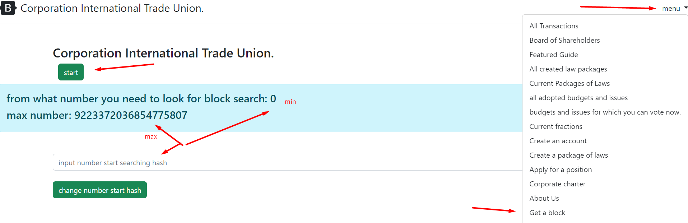

## HOW TO START MINING
Before you start mining blocks, you
you need to set the address of the miner to which the block will be mined.
Once you have set your address as a miner, there are two options.


### OPTION 1
Press the start button, to stop mining, click on the main page and appear
the page where the stop button will be.



### OPTION 2.
calling http://localhost:8082/mine automatically starts mining.


### LOAD SHARING AMONG MULTIPLE COMPUTERS.
Imagine that you have two computers and want them to mine
blocks, if you just enable them on two computers, they will
iterate over both from 0 to infinity.

You can start iterating from 0 on one computer, and from 5000 thousand on the second,
thus the second will check a little earlier. Or 10,000 thousand.
You must choose the optimal numbers yourself.

But the number must not be equal to or greater than the maximum value.

Blockchain Difficulty Adapts Like Bitcoin, But Adaptation Happens
once every 12 hours (approximately) 288 blocks.
Each block gives (difficulty * 30 ) + odd = where odd is 0 if the block index is even and 1 if not even

The current blockchain is not only the longest, but there should be more zeros in it.

This method counts the number of zeros in the blockchain and the current blockchain, not only the longest,
but also the one with the most zeros
````
     src/main/java/utils/UtilsUse.java

      //count the number of consecutive zeros in hash
     public static long hashCount(String hash) {
         long count = 0;
         for (int i = 0; i < hash.length(); i++) {
             if(hash.charAt(i) == '0') count++;
             else return count;
         }
         return count;
     }
````


The class is responsible for the extraction

````
     src/main/java/International_Trade_Union/controllers/BasisController.java
````

the button click method invokes the /mine button

````
     /**Start mining, start mining*/
     @GetMapping("/mine")
     public synchronized String mine(Model model) throws NoSuchAlgorithmException, InvalidKeySpecException, IOException, SignatureException, NoSuchProviderException, InvalidKeyException, JSONException, CloneNotSupportedException {
         String text = "";
         // find addresses
         findAddresses();
         sendAddress();

         //collects a class list of balances from a file located along the path Seting.ORIGINAL_BALANCE_FILE
         Map<String, Account> balances = SaveBalances.readLineObject(Seting.ORIGINAL_BALANCE_FILE);
         //collects a blockchain object from a file
         blockchain = Mining.getBlockchain(
                 Seting.ORIGINAL_BLOCKCHAIN_FILE,
                 BlockchainFactoryEnum.ORIGINAL);

         //if the blockchain is working then continue
         if (!blockchain.validatedBlockchain()) {
             text = "wrong chain: wrong chain, mining stopped";
             model.addAttribute("text", text);
         }

         //Before mining a new block, it first searches the network for the longest blockchain
         resolve_conflicts();

         //if the blockchain size is less than or equal to one, save the genesis block to the file
         long index = blockchain.sizeBlockchain();
         if (blockchain.sizeBlockchain() <= 1) {
             //save block genesis
             if (blockchain.sizeBlockchain() == 1) {
                 UtilsBlock.saveBLock(blockchain.getBlock(0), Seting.ORIGINAL_BLOCKCHAIN_FILE);
             }

             // get a list of balances from a file
             balances = Mining.getBalances(Seting.ORIGINAL_BALANCE_FILE, blockchain, balances);
             //delete old balance files
             Mining.deleteFiles(Seting.ORIGINAL_BALANCE_FILE);
             // save balances
             SaveBalances.saveBalances(balances, Seting.ORIGINAL_BALANCE_FILE);

         }
         //download the list of balances from a file
         balances = SaveBalances.readLineObject(Seting.ORIGINAL_BALANCE_FILE);

         //get the miner's account
         Account miner = balances.get(User.getUserAddress());
         if (miner == null) {
             //if there was no balance in the blockchain, then the balance is zero
             miner = new Account(User.getUserAddress(), 0, 0);
         }

         //transactions that we added to the block and now need to be removed from the file in the resources/transactions folder
         List<DtoTransaction> temporaryDtoList = AllTransactions.getInstance();

         //every three to clear the files in the folder resources/sendedTransaction this folder
         //stores transactions already added to the blockchain, so as not to re-add to
         //transactions already added to the block
         AllTransactions.clearAllSendedTransaction(index);
         AllTransactions.clearUsedTransaction(AllTransactions.getInsanceSended());
         System.out.println("BasisController: start mine:");

         // Mining process itself
         //DIFFICULTY_ADJUSTMENT_INTERVAL how often the correction occurs
         //BLOCK_GENERATION_INTERVAL how often should find a block
         //temporaryDtoList adds transactions to the block
         Block block = Mining.miningDay(
                 miner,
                 blockchain,
                 Seting.BLOCK_GENERATION_INTERVAL,
                 Seting.DIFFICULTY_ADJUSTMENT_INTERVAL,
                 temporaryDtoList,
                 balances,
                 index
         );
         System.out.println("BasisController: finish mine:");
         //save sent transaction
         AllTransactions.addSendedTransaction(temporaryDtoList);

         int diff = Seting.DIFFICULTY_ADJUSTMENT_INTERVAL;
         // Testing the block
         List<Block> testingValidationsBlock = null;

         if (blockchain.sizeBlockchain() > diff) {

             testingValidationsBlock = blockchain.subBlock(blockchain.sizeBlockhain() - diff, blockchain.sizeBlockhain());
         } else {
             testingValidationsBlock = blockchain.clone();
         }
         if (testingValidationsBlock.size() > 1) {
             boolean validationTesting = UtilsBlock.validationOneBlock(
                     blockchain.genesisBlock().getFounderAddress(),
                     testingValidationsBlock.get(testingValidationsBlock.size() - 1),
                     block,
                     Seting.BLOCK_GENERATION_INTERVAL,
                     diff,
                     testingValidationsBlock);

             if (validationTesting == false) {
                 System.out.println("wrong validation block: " + validationTesting);
                 System.out.println("index block: " + block.getIndex());
                 text = "wrong validation";
             }
             testingValidationsBlock.add(block.clone());
         }

         // save the block
         blockchain.addBlock(block);
         UtilsBlock.saveBLock(block, Seting.ORIGINAL_BLOCKCHAIN_FILE);

         // recalculation after extraction
         balances = Mining.getBalances(Seting.ORIGINAL_BALANCE_FILE, blockchain, balances);
         Mining.deleteFiles(Seting.ORIGINAL_BALANCE_FILE);
         SaveBalances.saveBalances(balances, Seting.ORIGINAL_BALANCE_FILE);

         //getting and displaying laws, and saving new laws
         //and changing existing laws
         Map<String, Laws> allLaws = UtilsLaws.getLaws(blockchain.getBlockchainList(), Seting.ORIGINAL_ALL_CORPORATION_LAWS_FILE);

         //returns all laws with balance
         List<LawEligibleForParliamentaryApproval> allLawsWithBalance = UtilsLaws.getCurrentLaws(allLaws, balances, Seting.ORIGINAL_ALL_CORPORATION_LAWS_WITH_BALANCE_FILE);
         //delete obsolete laws
         Mining.deleteFiles(Seting.ORIGINAL_ALL_CORPORATION_LAWS_WITH_BALANCE_FILE);
         UtilsLaws.saveCurrentsLaws(allLawsWithBalance, Seting.ORIGINAL_ALL_CORPORATION_LAWS_WITH_BALANCE_FILE);

         //send the actual blockchain
         sendAllBlocksToStorage(blockchain.getBlockchainList());

         text = "success: the block was successfully mined";
         model.addAttribute("text", text);
         return "redirect:/mining";

     }
````

Here is the mining code

````
     src/main/java/International_Trade_Union/model/Mining.java
````

the method itself

````
     public static Block miningDay(
     account miner,
     blockchain,
     long blockGenerationInterval,
     int DIFFICULTY_ADJUSTMENT_INTERVAL,
     List<DtoTransaction> transactionList,
     Map<String, Account> balances,
     long index
     ) throws IOException, NoSuchAlgorithmException, SignatureException, InvalidKeySpecException, NoSuchProviderException, InvalidKeyException {
     Directors directors = new Directors();
     //receiving transactions from the network
     List<DtoTransaction> listTransactions = transactionList;

         //determine valid transactions
         List<DtoTransaction> forAdd = new ArrayList<>();

         // checks the integrity of the transaction, that they are signed correctly
         cycle:
         for (DtoTransaction transaction : listTransactions) {
             if (transaction.verify()) {
            
                 Account account = balances.get(transaction.getSender());
                 if (account == null) {
                     System.out.println("minerAccount null");
                     continue cycle;
                 }
                 //NAME_LAW_ADDRESS_START if the address means rules chosen by the network
                 if(transaction.getCustomer().startsWith(Seting.NAME_LAW_ADDRESS_START) && !balances.containsKey(transaction.getCustomer())){
                     //if the name of the law matches corporate positions, then the law is valid only when
                     //sender matches the law
     // List<Director> enumPosition = directors.getDirectors();
     List<String> corporateSeniorPositions = directors.getDirectors().stream()
     .map(t->t.getName()).collect(Collectors.toList());
     System.out.println("LawsController: create_law: " + transaction.getLaws().getPacketLawName() + "contains: " + corporateSeniorPositions.contains(transaction.getLaws().getPacketLawName()));
     if(corporateSeniorPositions.contains(transaction.getLaws().getPacketLawName())
     && !UtilsGovernment.checkPostionSenderEqualsLaw(transaction.getSender(), transaction.getLaws())){
     System.out.println("if you create a special corporate position, you need " +
     "sender to be equals with first law: now its wrong");
     continue cycle;
     }
     }
     if(transaction.getLaws() == null){
     System.out.println("law cannot be null: ");
     continue cycle;
     }

                 if (account != nulll) {
                     if(transaction.getSender().equals(Seting.BASIS_ADDRESS)){
                         System.out.println("only this miner can input basis adress in this block");
                         continue cycle;
                     }
                     if(transaction.getCustomer().equals(Seting.BASIS_ADDRESS)){
                         System.out.println("basis address cant be customer(recipient)");
                         continue cycle;
                     }

                     if( account.getDigitalDollarBalance() < transaction.getDigitalDollar() + transaction.getBonusForMiner()){
                         System.out.println("sender don't have digital dollar: " + account.getAccount() + " balance: " + account.getDigitalDollarBalance() );
                         System.out.println("digital dollar for send: " + (transaction.getDigitalDollar() + transaction.getBonusForMiner()));
                         continue cycle;
                     }
                     if (account.getDigitalStockBalance() < transaction.getDigitalStockBalance()){
                         System.out.println("sender don't have digital reputation: " + account.getAccount() + " balance: " + account.getDigitalStockBalance());
                         System.out.println("digital reputation for send: " + (transaction.getDigitalDollar() + transaction.getBonusForMiner()));
                         continue cycle;
                     }
                     if(transaction.getSender().equals(transaction.getCustomer()) ){
                         System.out.println("sender end recipient equals " + transaction.getSender() + " : recipient: " + transaction.getCustomer());
                         continue cycle;
                     }
                     forAdd.add(transaction);
                 }

             }
         }


         //miner income
         double minerRewards = Seting.DIGITAL_DOLLAR_REWARDS_BEFORE;
         double digitalReputationForMiner = Seting.DIGITAL_STOCK_REWARDS_BEFORE;

         // founder income
         double founderReward = Seting.DIGITAL_DOLLAR_FOUNDER_REWARDS_BEFORE;
         double founderDigigtalReputationReward = Seting.DIGITAL_REPUTATION_FOUNDER_REWARDS_BEFORE;

         Base base = new Base58();

         //sums all miner rewards
         PrivateKey privateKey = UtilsSecurity.privateBytToPrivateKey(base.decode(Seting.BASIS_PASSWORD));
         double sumRewards = forAdd.stream().collect(Collectors.summingDouble(DtoTransaction::getBonusForMiner));

         //miner rewards
         DtoTransaction minerRew = new DtoTransaction(Seting.BASIS_ADDRESS, minner.getAccount(),
                 minerRewards, digitalReputationForMiner, new Laws(), sumRewards, VoteEnum.YES );

         byte[] signGold = UtilsSecurity.sign(privateKey, minerRew.toSign());
         minerRew.setSign(signGold);

         // founder reward
         DtoTransaction founderRew = new DtoTransaction(Seting.BASIS_ADDRESS, blockchain.getADDRESS_FOUNDER(),
                 founderReward, founderDigigtalReputationReward, new Laws(), 0.0, VoteEnum.YES);
         byte[] signFounder = UtilsSecurity.sign(privateKey, founderRew.toSign());

         founderRew.setSign(signFounder);


         forAdd.add(minerRew);
         forAdd.add(founderRew);


         //determining complexity and creating a block

         int difficulty = UtilsBlock.difficulty(blockchain.getBlockchainList(), blockGenerationInterval, DIFFICULTY_ADJUSTMENT_INTERVAL);

         System.out.println("Mining: miningBlock: difficulty: " + difficulty + " index: " + index);


         //blockchain.getHashBlock(blockchain.sizeBlockchain() - 1)
         Block block = new Block(
                 forAdd,
                 blockchain.getHashBlock(blockchain.sizeBlockchain() - 1),
                 miner.getAccount(),
                 blockchain.getADDRESS_FOUNDER(),
                 difficulty,
                 index);


        return block;
     }
````


connects to external servers, looking for a long blockchain,
Taking it, if it finds a more up-to-date blockchain, it downloads and replaces its own blockchain

````
     @GetMapping("/nodes/resolve")
     public synchronized void resolve_conflicts() throws NoSuchAlgorithmException, InvalidKeySpecException, IOException, SignatureException, NoSuchProviderException, InvalidKeyException, JSONException {
     Blockchain temporaryBlockchain = BLockchainFactory.getBlockchain(BlockchainFactoryEnum.ORIGINAL);
     Blockchain bigBlockchain = BLockchainFactory.getBlockchain(BlockchainFactoryEnum.ORIGINAL);
     blockchain = Mining.getBlockchain(
     Seting.ORIGINAL_BLOCKCHAIN_FILE,
     BlockchainFactoryEnum.ORIGINAL);
     int blocks_current_size = blockchain.sizeBlockchain();
     long hashCountZeroTemporary = 0;
     long hashCountZeroBigBlockchain = 0;
     EntityChain entityChain = null;

         long hashCountZeroAll = 0;
         //count hash start with zero all
         for (Block block : blockchain.getBlockchainList()) {
             hashCountZeroAll += UtilsUse.hashCount(block.getHashBlock());
         }
         //list of all hosts
         Set<String> nodesAll = getNodes();
     // nodesAll.addAll(Seting.ORIGINAL_ADDRESSES_BLOCKCHAIN_STORAGE);
     System.out.println("BasisController: resolve: size: " + getNodes().size());
     for (String s : nodesAll) {
     System.out.println("BasisController: resove: address: " + s);
     String temporaryjson = null;

             if (BasisController.getExcludedAddresses().contains(s)) {
                 System.out.println("its your address or excluded address: " + s);
                 continue;
             }
             try {
                 //downloads blockchain from other addresses
                 String address = s + "/chain";
                 System.out.println("BasisController:resolve conflicts: address: " + s + "/size");
                 String sizeStr = UtilUrl.readJsonFromUrl(s + "/size");
                 Integer size = Integer valueOf(sizeStr);
                 //if the size of the current blockchain is less than the size of other hosts
                 if (size > blocks_current_size) {
                     System.out.println("size from address: " + s + " upper than: " + size + ":blocks_current_size " + blocks_current_size);
                     //Test start algorithm
                     SubBlockchainEntity subBlockchainEntity = new SubBlockchainEntity(blocks_current_size, size);
                     String subBlockchainJson = UtilsJson.objToStringJson(subBlockchainEntity);

                     List<Block> emptyList = new ArrayList<>();

                     List<Block> subBlocks = UtilsJson.jsonToListBLock(UtilUrl.getObject(subBlockchainJson, s + "/sub-blocks"));
                     emptyList.addAll(subBlocks);
                     emptyList.addAll(blockchain.getBlockchainList());

                     emptyList = emptyList.stream().sorted(Comparator.comparing(Block::getIndex)).collect(Collectors.toList());
                     temporaryBlockchain.setBlockchainList(emptyList);
                     if (!temporaryBlockchain.validatedBlockchain()) {
                         System.out.println("first algorithm not worked");
                         emptyList = new ArrayList<>();
                         emptyList.addAll(subBlocks);
                         for (int i = blockchain.sizeBlockchain() - 1; i > 0; i--) {
                             //downloads the block by index
                             Block block = UtilsJson.jsonToBLock(UtilUrl.getObject(UtilsJson.objToStringJson(i), s + "/block"));
                             if (!blockchain.getBlock(i).getHashBlock().equals(block.getHashBlock())) {
                                 emptyList.add(block);
                             } else {
                                 emptyList.add(block);
                                 emptyList.addAll(blockchain.getBlockchainList().subList(0, i));
                                 emptyList = emptyList.stream().sorted(Comparator.comparing(Block::getIndex)).collect(Collectors.toList());
                                 temporaryBlockchain.setBlockchainList(emptyList);
                                 break;
                             }
                         }
                     }
                     if (!temporaryBlockchain.validatedBlockchain()) {
                         System.out.println("second algorithm didn't work");
                         temporaryjson = UtilUrl.readJsonFromUrl(address);
                         entityChain = UtilsJson.jsonToEntityChain(temporaryjson);
                         temporaryBlockchain.setBlockchainList(
                                 entityChain.getBlocks().stream().sorted(Comparator.comparing(Block::getIndex)).collect(Collectors.toList()));
                     }
                 } else {
                     System.out.println("BasisController: resove: size less: " + size + " address: " + address);
                     continue;
                 }
             } catch (IOException e) {
                 System.out.println("BasisController: resolve_conflicts: Error: " + s);
                 continue;
             }

             //if the downloaded blockchain is correct, then replace the bigBlockchain variable
             if (temporaryBlockchain.validatedBlockchain()) {
                 for (Block block : temporaryBlockchain.getBlockchainList()) {
                     hashCountZeroTemporary += UtilsUse.hashCount(block.getHashBlock());
                 }

                 if (blocks_current_size < temporaryBlockchain.sizeBlockhain() && hashCountZeroAll < hashCountZeroTemporary) {
                     blocks_current_size = temporaryBlockchain.sizeBlockchain();
                     bigBlockchain = temporaryBlockchain;
                     hashCountZeroBigBlockchain = hashCountZeroTemporary;
                 }
                 hashCountZeroTemporary = 0;
             }

         }

         //if the longest blockchain is greater than the local blockchain
         //server, but replace in the local server with the downloaded one

         if (bigBlockchain.sizeBlockhain() > blockchain.sizeBlockhain() && hashCountZeroBigBlockchain > hashCountZeroAll) {

             blockchain = bigBlockchain;
             UtilsBlock.deleteFiles();
             addBlock(bigBlockchain.getBlockchainList(), BLockchainFactory.getBlockchain(BlockchainFactoryEnum.ORIGINAL));
             System.out.println("BasisController: resolve: bigblockchain size: " + bigBlockchain.sizeBlockchain());

         }
     }
````

The hash lookup comes from the BLock class

````
     src/main/java/entity/blockchain/block/Block.java
````

The hash search itself, as an argument, what complexity should be found,
the complexity itself is determined dynamically

````
     public String findHash(int hashCoplexity) throws IOException, NoSuchAlgorithmException, SignatureException, NoSuchProviderException, InvalidKeyException, InvalidKeySpecException {
     if (!verifyesTransSign()){
     throw new NotValidTransactionException();
     }

         this.randomNumberProof = 0;
         String hash = "";
         while (true){
             this.randomNumberProof++;
             BlockForHash block = new BlockForHash(this.dtoTransactions,
                     this.previousHash, this.minerAddress, this.founderAddress,
                     this.randomNumberProof, this.minerRewards, this.hashCompexity, this.timestamp, this.index);
             hash = block.hashForTransaction();
             if(UtilsUse.hashComplexity(hash.substring(0, hashCoplexity), hashCoplexity))
             {
                 break;
             }

         }
         return hash;
     }
````

If the number of zeros is the same as expected, then the search is terminated.

````
      src/main/java/utils/UtilsUse.java
````

Class that method that checks if the hash matches with a number of zeros

````
     public static boolean hashComplexity(String literal, int hashComplexity){

         String regex = "^[0]{" + Integer.toString(hashComplexity) + "}";
         Pattern pattern = Pattern.compile(regex);
         Matcher matcher = pattern.matcher(literal);
         return matcher.find();
     }
````

BASIS_ADDRESS is designed to send a reward to the miner and founder, every time the miner
wants to mine a block, he inserts the address of the founder and miner,

````
     src/main/java/model/Mining.java method: miningDay()
````

````
     //miner income
     double minerRewards = Seting.DIGITAL_DOLLAR_REWARDS_BEFORE;
     double digitalReputationForMiner = Seting.DIGITAL_STOCK_REWARDS_BEFORE;

         // founder income
         double founderReward = Seting.DIGITAL_DOLLAR_FOUNDER_REWARDS_BEFORE;
         double founderDigigtalReputationReward = Seting.DIGITAL_REPUTATION_FOUNDER_REWARDS_BEFORE;

         Base base = new Base58();

     Base base = new Base58();

         //sums all miner rewards
         PrivateKey privateKey = UtilsSecurity.privateBytToPrivateKey(base.decode(Seting.BASIS_PASSWORD));
         double sumRewards = forAdd.stream().collect(Collectors.summingDouble(DtoTransaction::getBonusForMiner));

         //miner rewards
         DtoTransaction minerRew = new DtoTransaction(Seting.BASIS_ADDRESS, minner.getAccount(),
                 minerRewards, digitalReputationForMiner, new Laws(), sumRewards, VoteEnum.YES );

         //signs
         byte[] signGold = UtilsSecurity.sign(privateKey, minerRew.toSign());
         minerRew.setSign(signGold);

         // founder reward
         DtoTransaction founderRew = new DtoTransaction(Seting.BASIS_ADDRESS, blockchain.getADDRESS_FOUNDER(),
                 founderReward, founderDigigtalReputationReward, new Laws(), 0.0, VoteEnum.YES);
         byte[] signFounder = UtilsSecurity.sign(privateKey, founderRew.toSign());

         founderRew.setSign(signFounder);


         forAdd.add(minerRew);
         forAdd.add(founderRew);
````

[back to home](./documentationEng.md)