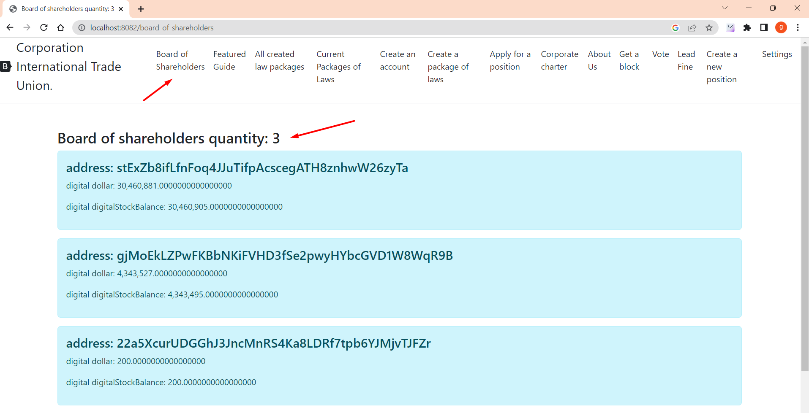

# Council of Shareholders.

To see the Board of Shareholders and how many are currently active, please login at http://localhost:8082/board-of-shareholders


OriginalCHARTER.POWERS_OF_THE_BOARD_OF_SHAREHOLDERS: Powers of the board of shareholders.
Council of Shareholders Participates in the approval of Laws (Amendments to the Articles of Association).
The Board of Shareholders also participates in the approval of amendments to the Charter of the International Trade Union Corporation AMENDMENT_TO_THE_CHARTER.
The Board of Shareholders can also participate in voting when electing CORPORATE_COUNCIL_OF_REFEREES and FRACTIONS candidates using
real voting rules for VOTE_STOCK candidates.

OriginalCHARTER.HOW_SHAREHOLDERS_BOARD_IS_ELECTED: HOW SHAREHOLDERS ARE ELECTED.
The Board of Shareholders consists of one thousand five hundred accounts (1500) with the largest number of shares,
but only those accounts are taken into account, from the activity of which more than a year has not passed (Activity - mining or sending money, creating a law, sending fines,
Applying for a position and creating a new position).
Formula: The current year is equal to one year, and if the account was active in this range, it is taken into account.
All accounts are sorted in descending order of the number of digital shares, and the 1500 accounts with the most shares are selected. Recalculation occurs every block.
An example of a section of the code on the election of the Board of Shareholders:

## How the Board of Shareholders is determined,

---
     class UtilsGovernment method findBoardOfShareholders: //define the board of shareholders
     public static List<Account> findBoardOfShareholders(Map<String, Account> balances, List<Block> blocks, int limit)
     {
         List<Block> minersHaveMoreStock = null;
         if (blocks.size() > limit)
         { minersHaveMoreStock = blocks.subList(blocks.size() - limit, blocks.size()); }
         else { minersHaveMoreStock = blocks; }
         List<Account> boardAccounts = minersHaveMoreStock.stream().map( t -> new Account(t.getMinerAddress(), 0, 0))
         .collect(Collectors.toList());
        
         for (Block block : minersHaveMoreStock)
         { for (DtoTransaction dtoTransaction : block.getDtoTransactions())
         { boardAccounts.add(new Account(dtoTransaction.getSender(), 0, 0)); } }
         CompareObject compareObject = new CompareObject(); List<Account> boardOfShareholders = balances.entrySet()
         .stream().filter(t -> boardAccounts.contains(t.getValue()))
         .map(t -> t.getValue()).collect(Collectors.toList());
         boardOfShareholders = boardOfShareholders.stream()
         .filter(t -> !t.getAccount().startsWith(Seting.NAME_LAW_ADDRESS_START))
         .filter(t -> t.getDigitalStockBalance() > 0)
         .sorted(Comparator.comparing(Account::getDigitalStockBalance)
         .reversed()) .collect(Collectors.toList());


         boardOfShareholders = boardOfShareholders.stream()
         .limit(Setting.BOARD_OF_SHAREHOLDERS)
         .collect(Collectors.toList()); return boardOfShareholders; }
---

The BoardOfShareholdersController class displays current posts

````
       @GetMapping("board-of-shareholders")
     public String boardOfShareHolders(Model model) throws NoSuchAlgorithmException, InvalidKeySpecException, IOException, SignatureException, NoSuchProviderException, InvalidKeyException {

         Blockchain blockchain = Mining.getBlockchain(
                 Seting.ORIGINAL_BLOCKCHAIN_FILE,
                 BlockchainFactoryEnum.ORIGINAL);

         //Get balance
         Map<String, Account> balances = new HashMap<>();

         balances = SaveBalances.readLineObject(Seting.ORIGINAL_BALANCE_FILE);
         List<Account> boardOfShareholders = new ArrayList<>();

         boardOfShareholders = UtilsGovernment.findBoardOfShareholders(balances, blockchain.getBlockchainList(), Seting.BOARDS_BLOCK);


         model.addAttribute("title", "board of shareholders. total: " + boardOfShareholders.size());
         model.addAttribute("boardOfShareholders", boardOfShareholders);
         return "board-of-shareholders";
     }

````

The method from UtilsGovernment.java finds the board of shareholders,

```
     src/main/java/governments
    
     //determining the board of shareholders
     public static List<Account> findBoardOfShareholders(Map<String, Account> balances, List<Block> blocks, int limit) {
         List<Block> minersHaveMoreStock = null;
         if (blocks.size() > limit) {
             minersHaveMoreStock = blocks.subList(blocks.size() - limit, blocks.size());
         } else {
             minersHaveMoreStock = blocks;
         }
         List<Account> boardAccounts = minersHaveMoreStock.stream().map(
                         t -> new Account(t.getMinerAddress(), 0, 0))
                 .collect(Collectors.toList());

         for (Block block : minersHaveMoreStock) {
             for (DtoTransaction dtoTransaction : block.getDtoTransactions()) {
                 boardAccounts.add(new Account(dtoTransaction.getSender(), 0, 0));
             }

         }
```

[exit tohome](./documentationEng.md)