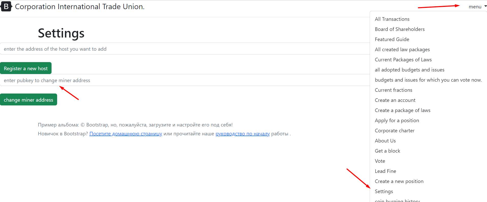

# How to change mining account

Start local server and login http://localhost:8082/seting
or click the settings button, enter your ***address (public key)***
***enter pubkey to change miner address*** and press the button
***change miner address***


The code is in the folder controller
````
     src/main/java/International_Trade_Union/controllers/MainController.java
````
````
     @PostMapping("/setMinner")
     public ResponseEntity<String> setMinnerAddress(@RequestParam(value = "setMinner") String setMinner, RedirectAttributes redirectAttrs){
     System.out.println("MainController: " + setMinner);
     UtilsFileSaveRead.save(setMinner, Seting.ORIGINAL_ACCOUNT, false);
     return new ResponseEntity<>("change address: " + setMinner, HttpStatus.OK);
     }
````

UtilsFileSaveRead.save() saves the new public account to a file
in folder
````
     resources/minerAccount/minerAccount.txt
````

[back to home](./documentationEng.md)