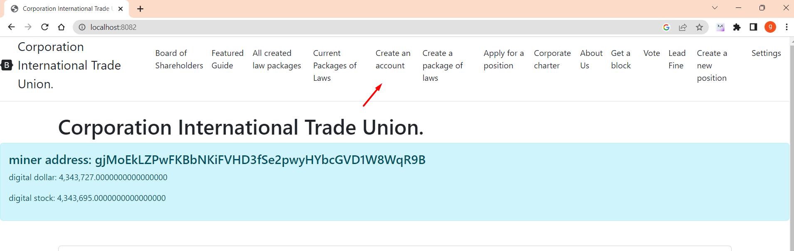
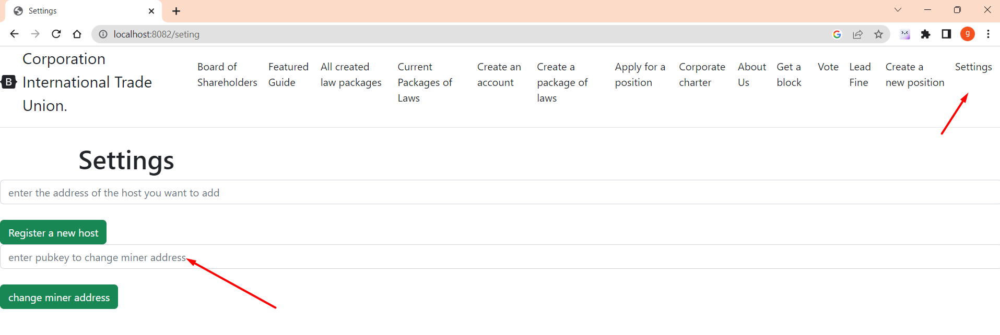

# Open an account

Once the server has been properly started, go to http://localhost:8082/create-account
There you need to copy NEW ADDRESS this is your LOGIN and PUBLIC KEY.
You also need to copy PASSWORD this is your PRIVATE KEY.
Copy your username and password and keep it in a safe place.
http://citucorp.com/how_to_open_an_account


After you need to change the address of the miner, enter the settings http://localhost:8082/seting

enter your pub-key login there, and click the button CHANGE MINER ADDRESS

____

code
````
     src/main/java/International_Trade_Union/controllers/CreateAccountController.java
````
````
     @GetMapping("create account")
     public String createAccount(Model model) throws InvalidAlgorithmParameterException, NoSuchAlgorithmException, InvalidKeySpecException, NoSuchProviderException {
     model.addAttribute("title", "create minerAccount");
     Map<String, String> newAccount = CreateAccount.create();

             model.addAttribute("login", newAccount.get("pubKey"));
             model.addAttribute("password", newAccount.get("privKey"));
             return "create-account";
         }
     @PostMapping("create account")
     public String createNewAccount(RedirectAttributes redirectAttrs) throws InvalidAlgorithmParameterException, NoSuchAlgorithmException, InvalidKeySpecException, NoSuchProviderException {
         redirectAttrs.addFlashAttribute("title", "create minerAccount");
         Map<String, String> newAccount = CreateAccount.create();

         redirectAttrs.addFlashAttribute("login", newAccount.get("pubKey"));
         redirectAttrs.addFlashAttribute("password", newAccount.get("privKey"));

         return "redirect:/create-account";
     }
````

The class is responsible for creating
````
     src/main/java/International_Trade_Union/model/CreateAccount.java
````

````
     public class CreateAccount {
     public static Map<String, String> create() throws InvalidAlgorithmParameterException, NoSuchAlgorithmException, InvalidKeySpecException, NoSuchProviderException {
     Map<String, String> create = new HashMap<>();
     Base base = new Base58();
     Keys keyPair = UtilsSecurity.generateKeyPair();
     String pubkey = keyPair.getPubkey();
     String privKey = keyPair.getPrivkey();
     System.out.println("pubkey: " + pubkey);
     System.out.println("privKey: " + privKey);
     create.put("pubKey", pubkey);
     create.put("privKey", privKey);
     return create;
     }
     }
````

This class generates pub and priv key

````
     src/main/java/utils/UtilsSecurity.java
````

pub and private key generation

````
     public static Keys generateKeyPair() throws NoSuchAlgorithmException, InvalidAlgorithmParameterException, NoSuchProviderException, InvalidKeySpecException {
     Base base = new Base58();
     Security.addProvider(new org.bouncycastle.jce.provider.BouncyCastleProvider());
     ECGenParameterSpec ecSpec = new ECGenParameterSpec(SPEC);
     KeyPairGenerator g = KeyPairGenerator.getInstance(ALGO_ECDSA, PROVIDER);
     g.initialize(ecSpec, new SecureRandom());
     KeyPair keyPair = g.generateKeyPair();
     String pub = base.encode(UtilsSecurity.compressed(keyPair.getPublic().getEncoded()));
     String priv = base.encode(keyPair.getPrivate().getEncoded());
     Keys keys = new Keys(pub, priv);
     return keys;
     }
````

[back to home](./documentationEng.md)