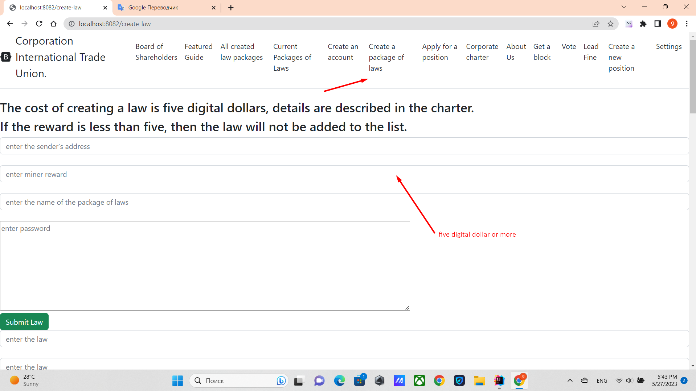

# How Laws Are Created


How to create a law, http://localhost:8082/create-law
follow the link, enter the data you need there, click the button


1. Enter on the create law tab
2. Enter the sender's address there
3. Miner reward
4. The name of the package of laws,
5. Private key(Password)
6. fill in as many lines as you need to create laws
7. Press the button. ***Submit law***

A hash will be generated for your law that will always start with LIBER.

Once it is added to the block and added to the blockchain, it will be able to be voted on.
Sample code in LawsController current law:

````
      @GetMapping("/current-laws")
     public String currentLaw(Model model) throws IOException, NoSuchAlgorithmException, InvalidKeySpecException, SignatureException, NoSuchProviderException, InvalidKeyException, CloneNotSupportedException {
         Directors directors = new Directors();
         Blockchain blockchain = Mining.getBlockchain(
                 Seting.ORIGINAL_BLOCKCHAIN_FILE,
                 BlockchainFactoryEnum.ORIGINAL);

         Map<String, Account> balances = new HashMap<>();
         //read balance
         balances = SaveBalances.readLineObject(Seting.ORIGINAL_BALANCE_FILE);

         List<LawEligibleForParliamentaryApproval> lawEligibleForParliamentaryApprovals =
                 UtilsLaws.readLineCurrentLaws(Seting.ORIGINAL_ALL_CORPORATION_LAWS_WITH_BALANCE_FILE);

         //get shareholder advice from file
         List<Account> boardOfShareholders = UtilsGovernment.findBoardOfShareholders(balances, blockchain.getBlockchainList(), Seting.BOARDS_BLOCK);


         //TODO finalize optimization
         //TODO get rid of find position in this method
         // filter by voice types
         Map<Director, FIndPositonHelperData> fIndPositonHelperDataMap = new HashMap<>();
         for (Director higherSpecialPositions : directors.getDirectors()) {
             if (higherSpecialPositions.isElectedByCEO()) {
                 fIndPositonHelperDataMap.put(higherSpecialPositions,
                         new FIndPositonHelperData(higherSpecialPositions, false, false, true, false, false));
             } else if (higherSpecialPositions.isElectedByBoardOfDirectors()) {
                 fIndPositonHelperDataMap.put(higherSpecialPositions,
                         new FIndPositonHelperData(higherSpecialPositions, false, false, false, true, false));
             } else if (higherSpecialPositions.isElectedByCorporateCouncilOfReferees()) {
                 fIndPositonHelperDataMap.put(higherSpecialPositions,
                         new FIndPositonHelperData(higherSpecialPositions, false, false, false, false, true));
             } else {
                 fIndPositonHelperDataMap.put(higherSpecialPositions,
                         new FIndPositonHelperData(higherSpecialPositions, true, true, false, false, false));

             }

         }
         //count votes for all voted zakans
         List<CurrentLawVotesEndBalance> current = UtilsGovernment.filtersVotes(
                 lawEligibleForParliamentaryApprovals,
                 balances,
                 boardOfShareholders,
                 blockchain.getBlockchainList(),
                 seting.LAW_YEAR_VOTE);


         //minimum value for the number of positive votes for the law to be valid,
         //positions elected by shares of the board of directors
         List<CurrentLawVotesEndBalance> electedByStockBoardOfDirectors = current.stream()
                 .filter(t -> directors.isElectedByStocks(t.getPackageName()))
                 .filter(t -> t.getPackageName().equals(NamePOSITION.BOARD_OF_DIRECTORS.toString()))
                 .filter(t -> t.getVotes() >= Seting.ORIGINAL_LIMIT_MIN_VOTE)
                 .sorted(Comparator.comparing(CurrentLawVotesEndBalance::getVotes).reversed())
                 .limit(directors.getDirector(NamePOSITION.BOARD_OF_DIRECTORS.toString()).getCount())
                 .collect(Collectors.toList());


         //minimum value for the number of positive votes for the law to be valid,
         //positions elected by shares CORPORATE_COUNCIL_OF_REFEREES
         List<CurrentLawVotesEndBalance> electedByStockCorporateCouncilOfReferees = current.stream()
                 .filter(t -> directors.isElectedByStocks(t.getPackageName()))
                 .filter(t -> t.getPackageName().equals(NamePOSITION.CORPORATE_COUNCIL_OF_REFEREES.toString()))
                 .filter(t -> t.getVotes() >= Seting.ORIGINAL_LIMIT_MIN_VOTE)
                 .sorted(Comparator.comparing(CurrentLawVotesEndBalance::getVotes).reversed())
                 .limit(directors.getDirector(NamePOSITION.CORPORATE_COUNCIL_OF_REFEREES.toString()).getCount())
                 .collect(Collectors.toList());


         //positions created by the board of directors
         List<CurrentLawVotesEndBalance> createdByBoardOfDirectors = current.stream()
                 .filter(t->t.getPackageName().startsWith(Seting.ADD_DIRECTOR))
                 .filter(t->t.getVotesBoardOfDirectors() >= Seting.ORIGINAL_LIMIT_MIN_VOTE_BOARD_OF_DIRECTORS)
                 .collect(Collectors.toList());
         //adding positions created by the board of directors
         for (CurrentLawVotesEndBalance currentLawVotesEndBalance : createdByBoardOfDirectors) {
             directors.addAllByBoardOfDirectors(currentLawVotesEndBalance.getLaws());
         }

         //positions elected only by the board of directors
         List<CurrentLawVotesEndBalance> electedByBoardOfDirectors = current.stream()
                 .filter(t -> directors.isElectedByBoardOfDirectors(t.getPackageName()) || directors.isCabinets(t.getPackageName()))
                 .filter(t -> t.getVotesBoardOfDirectors() >= Seting.ORIGINAL_LIMIT_MIN_VOTE_BOARD_OF_DIRECTORS)
                 .sorted(Comparator.comparing(CurrentLawVotesEndBalance::getVotesBoardOfDirectors).reversed())
                 .collect(Collectors.toList());


         //group by list
         Map<String, List<CurrentLawVotesEndBalance>> group = electedByBoardOfDirectors.stream()
                 .collect(Collectors.groupingBy(CurrentLawVotesEndBalance::getPackageName));

         Map<Director, List<CurrentLawVotesEndBalance>> original_group = new HashMap<>();

         // leave the amount that is described in this post
         for (Map.Entry<String, List<CurrentLawVotesEndBalance>> stringListEntry : group.entrySet()) {
             List<CurrentLawVotesEndBalance> temporary = stringListEntry.getValue();
             temporary = temporary.stream()
                     .sorted(Comparator.comparing(CurrentLawVotesEndBalance::getVotesBoardOfDirectors))
                     .limit(directors.getDirector(stringListEntry.getKey()).getCount())
                     .collect(Collectors.toList());
             original_group.put(directors.getDirector(stringListEntry.getKey()), temporary);
         }


         //positions elected by the board of corporate chief judges
         List<CurrentLawVotesEndBalance> electedByCorporateCouncilOfReferees = current.stream()
                 .filter(t -> directors.isElectedBYCorporateCouncilOfReferees(t.getPackageName()))
                 .filter(t -> t.getVotesCorporateCouncilOfReferees() >= Seting.ORIGINAL_LIMIT_MIN_VOTE_CORPORATE_COUNCIL_OF_REFEREES)
                 .sorted(Comparator.comparing(CurrentLawVotesEndBalance::getVotesCorporateCouncilOfReferees)).collect(Collectors.toList());


         //elected GENERAL_EXECUTIVE_DIRECTOR
         List<CurrentLawVotesEndBalance> electedByGeneralExecutiveDirector = electedByBoardOfDirectors.stream()
                 .filter(t -> directors.isElectedCEO(t.getPackageName()))
                 .filter(t -> NamePOSITION.GENERAL_EXECUTIVE_DIRECTOR.toString().equals(t.getPackageName()))
                 .filter(t -> t.getVoteGeneralExecutiveDirector() >= Seting.ORIGINAL_LIMIT_MIN_VOTE_GENERAL_EXECUTIVE_DIRECTOR)
                 .sorted(Comparator.comparing(CurrentLawVotesEndBalance::getVoteGeneralExecutiveDirector))
                 .collect(Collectors.toList());

         //voice of the supreme judge
         List<CurrentLawVotesEndBalance> electedByHightJudge = electedByCorporateCouncilOfReferees.stream()
                 .filter(t -> directors.isElectedBYCorporateCouncilOfReferees(t.getPackageName()))
                 .filter(t -> t.getVoteHightJudge() >= Seting.ORIGINAL_LIMIT_MIN_VOTE_HIGHT_JUDGE)
                 .collect(Collectors.toList());

         //LAWS WHICH WERE APPROVED THROUGH DIRECT VOTING
         List<CurrentLawVotesEndBalance> allVotes = current.stream()
                 .filter(t->!directors.contains(t.getPackageName()))
                 .filter(t->!Seting.AMENDMENT_TO_THE_CHARTER.equals(t.getPackageName()))
                 .filter(t->!directors.isCabinets(t.getPackageName()))
                 .filter(t->!Seting.ORIGINAL_CHARTER_CURRENT_LAW_PACKAGE_NAME.equals(t.getPackageName()))
                 .filter(t->!Seting.ORIGINAL_CHARTER_CURRENT_ALL_CODE.equals(t.getPackageName()))
                 .filter(t->t.getVotes() > Seting.ALL_STOCK_VOTE)
                 .collect(Collectors.toList());

         //laws that don't get enough votes that can only pass if the supreme judge approves
         List<CurrentLawVotesEndBalance> notEnoughVotes = current.stream()
                 .filter(t -> !directors.contains(t.getPackageName()))
                 .filter(t->!Seting.AMENDMENT_TO_THE_CHARTER.equals(t.getPackageName()))
                 .filter(t->!directors.isCabinets(t.getPackageName()))
                 .filter(t -> !Seting.ORIGINAL_CHARTER_CURRENT_LAW_PACKAGE_NAME.equals(t.getPackageName()))
                 .filter(t->!Seting.ORIGINAL_CHARTER_CURRENT_ALL_CODE.equals(t.getPackageName()))
                 .filter(t -> t.getVotesBoardOfShareholders() >= Seting.ORIGINAL_LIMIT_MIN_VOTE_BOARD_OF_SHAREHOLDERS)
                 .filter(t -> t.getVotesBoardOfDirectors() >= Seting.ORIGINAL_LIMIT_MIN_VOTE_BOARD_OF_Ddirectors)
                 .filter(t -> t.getVoteHightJudge() >= Seting.ORIGINAL_LIMIT_MIN_VOTE_HIGHT_JUDGE)
                 .sorted(Comparator.comparing(CurrentLawVotesEndBalance::getVotes).reversed()).collect(Collectors.toList());


         // laws that have received enough votes and do not require the approval of the supreme judge
         List<CurrentLawVotesEndBalance> powerfulVotes = current.stream()
                 .filter(t -> !directors.contains(t.getPackageName()))
                 .filter(t-> !Seting.AMENDMENT_TO_THE_CHARTER.equals(t.getPackageName()))
                 .filter(t-> !directors.isCabinets(t.getPackageName()))
                 .filter(t -> !Seting.ORIGINAL_CHARTER_CURRENT_LAW_PACKAGE_NAME.equals(t.getPackageName()))
                 .filter(t->!Seting.ORIGINAL_CHARTER_CURRENT_ALL_CODE.equals(t.getPackageName()))
                 .filter(t -> t.getVotesBoardOfShareholders() >= (Seting.ORIGINAL_LIMIT_MIN_VOTE_BOARD_OF_SHAREHOLDERS * Seting.POWERFUL_VOTE))
                 .filter(t -> t.getVotesBoardOfDirectors() >= (Seting.ORIGINAL_LIMIT_MIN_VOTE_BOARD_OF_DIRECTORS * Seting.POWERFUL_VOTE))
                 .sorted(Comparator.comparing(CurrentLawVotesEndBalance::getVotes).reversed()).collect(Collectors.toList());

         //remove matching votes
         notEnoughVotes.addAll(powerfulVotes);
         notEnoughVotes = notEnoughVotes.stream().distinct().collect(Collectors.toList());

         //introduction of amendments to the charter
         List<CurrentLawVotesEndBalance> chapter_amendment = current.stream()
                 .filter(t -> !directors.contains(t.getPackageName()))
                 .filter(t-> Seting.AMENDMENT_TO_THE_CHARTER.equals(t.getPackageName()))
                 .filter(t->!directors.isCabinets(t.getPackageName()))
                 .filter(t -> t.getVotesBoardOfShareholders() >= Seting.ORIGINAL_LIMIT_MINT_VOTE_BOARD_OF_SHAREHOLDERS_AMENDMENT)
                 .filter(t -> t.getVotesBoardOfDirectors() >= Seting.ORIGINAL_LIMIT_MIN_VOTE_BOARD_OF_DIRECTORS_AMENDMENT)
                 .filter(t -> t.getVotesCorporateCouncilOfReferees() >= Seting.ORIGINAL_LIMIT_MIN_VOTE_CORPORATE_COUNCIL_OF_REFEREES_AMENDMENT)
                 .sorted(Comparator.comparing(CurrentLawVotesEndBalance::getVotesBoardOfDirectors).reversed()).collect(Collectors.toList());

         //the budget is approved only by the board of directors.
         List<CurrentLawVotesEndBalance> budjet = current.stream()
                 .filter(t-> !directors.contains(t.getPackageName()))
                 .filter(t->Seting.BUDGET.equals(t.getPackageName()))
                 .filter(t->!directors.isCabinets(t.getPackageName()))
                 .filter(t-> t.getVotesBoardOfDirectors() >= Seting.ORIGINAL_LIMIT_MIN_VOTE_BOARD_OF_DIRECTORS)
                 .sorted(Comparator.comparing(CurrentLawVotesEndBalance::getVotesBoardOfDirectors).reversed())
                 .limit(1)
                 .collect(Collectors.toList());


         //adds laws that create new director positions
         List<CurrentLawVotesEndBalance> addDirectors = current.stream()
                 .filter(t->t.getPackageName().startsWith(Seting.ADD_DIRECTOR))
                 .filter(t->t.getVotesBoardOfDirectors() >= Seting.ORIGINAL_LIMIT_MIN_VOTE_BOARD_OF_DIRECTORS)
                 .collect(Collectors.toList());

         //the plan is approved only by the chamber Board of Directors
         List<CurrentLawVotesEndBalance> planFourYears = current.stream()
                 .filter(t->!directors.contains(t.getPackageName()))
                 .filter(t->Seting.STRATEGIC_PLAN.equals(t.getPackageName()))
                 .filter(t->!directors.isCabinets(t.getPackageName()))
                 .filter(t->t.getVotesBoardOfDirectors() >= Seting.ORIGINAL_LIMIT_MIN_VOTE_BOARD_OF_DIRECTORS)
                 .sorted(Comparator.comparing(CurrentLawVotesEndBalance::getVotesBoardOfDirectors).reversed())
                 .limit(1)
                 .collect(Collectors.toList());


         // the charter is always valid, it is signed by the founder
         List<CurrentLawVotesEndBalance> CHARTER_ORIGINAL = current.stream()
                 .filter(t -> !directors.contains(t.getPackageName()) && Seting.ORIGINAL_CHARTER_CURRENT_LAW_PACKAGE_NAME.equals(t.getPackageName()))
                 .filter(t->!directors.isCabinets(t.getPackageName()))
                 .filter(t->t.getFounderVote()>=1)
                 .sorted(Comparator.comparing(CurrentLawVotesEndBalance::getVotes).reversed())
                 .limit(1)
                 .collect(Collectors.toList());

         // SOURCE CODE CREATED BY THE FOUNDER
         List<CurrentLawVotesEndBalance> CHARTER_ORIGINAL_CODE = current.stream()
                 .filter(t -> !directors.contains(t.getPackageName()) && Seting.ORIGINAL_CHARTER_CURRENT_ALL_CODE.equals(t.getPackageName()))
                 .filter(t->!directors.isCabinets(t.getPackageName()))
                 .filter(t->t.getFounderVote()>=1)
                 .sorted(Comparator.comparing(CurrentLawVotesEndBalance::getVotes).reversed()).limit(1)
                 .collect(Collectors.toList());


         int startBlock = 22000;
         int finishBlock = 22300;
         if(blockchain.sizeBlockchain() > finishBlock){
             List<Block> blocksCharter = blockchain.subBlock(startBlock, finishBlock);
             //takes into account the segment of blocks to determine the authenticity of the charter
             List<CurrentLawVotesEndBalance> charterBlocks = UtilsGovernment.filtersVotes(
                     lawEligibleForParliamentaryApprovals,
                     balances,
                     boardOfShareholders,
                     blocksCharter,
                     Setting.LAW_YEAR_VOTE
             );
             List<CurrentLawVotesEndBalance> charterCheckBlock = charterBlocks.stream()
                     .filter(t -> !directors.contains(t.getPackageName()) && Seting.ORIGINAL_CHARTER_CURRENT_LAW_PACKAGE_NAME.equals(t.getPackageName()))
                     .filter(t->!directors.isCabinets(t.getPackageName()))
                     .filter(t->t.getFounderVote()>=1)
                     .sorted(Comparator.comparing(CurrentLawVotesEndBalance::getVotes).reversed())
                     .limit(1)
                     .collect(Collectors.toList());

             CHARTER_ORIGINAL.addAll(charterCheckBlock);


             List<CurrentLawVotesEndBalance> charterOriginalCode = charterBlocks.stream()
                     .filter(t -> !directors.contains(t.getPackageName()) && Seting.ORIGINAL_CHARTER_CURRENT_ALL_CODE.equals(t.getPackageName()))
                     .filter(t->!directors.isCabinets(t.getPackageName()))
                     .filter(t->t.getFounderVote()>=1)
                     .sorted(Comparator.comparing(CurrentLawVotesEndBalance::getVotes).reversed())
                     .limit(1)
                     .collect(Collectors.toList());

             CHARTER_ORIGINAL_CODE.addAll(charterOriginalCode);
         }


         for (Map.Entry<Director, List<CurrentLawVotesEndBalance>> higherSpecialPositionsListMap : original_group.entrySet()) {
             current.addAll(higherSpecialPositionsListMap.getValue());
         }


         current = new ArrayList<>();
         current.addAll(addDirectors);
         current.addAll(allVotes);
         current.addAll(budjet);
         current.addAll(planFourYears);
         current.addAll(electedByStockBoardOfDirectors);
         current.addAll(electedByStockCorporateCouncilOfReferees);
         current.addAll(electedByBoardOfDirectors);
         current.addAll(electedByCorporateCouncilOfReferees);
         current.addAll(electedByGeneralExecutiveDirector);
         current.addAll(electedByHightJudge);
         current.addAll(notEnoughVotes);
         current.addAll(CHARTER_ORIGINAL);
         current.addAll(CHARTER_ORIGINAL_CODE);
         current.addAll(chapter_amendment);
         current = current.stream()
                 .filter(UtilsUse.distinctByKey(CurrentLawVotesEndBalance::getAddressLaw))
                 .collect(Collectors.toList());
         System.out.println("notEnoughVotes: " + notEnoughVotes);

         model.addAttribute("title", "How the current laws are made is described in the bylaws." +
                 "");
         model.addAttribute("currentLaw", current);
         return "current-laws";
     }
        
````

[back to home](./documentationEng.md)