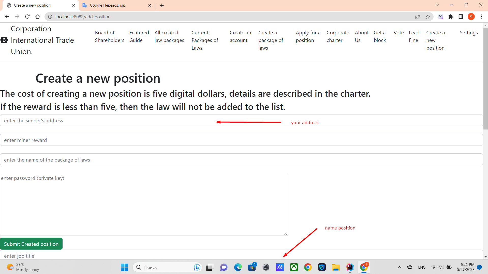

To create a new position, go to the tab ***create a new position***

Then write the name of the package and the name of the position,
The name of the package and the name of the posts will automatically begin with ADD_DIRECTOR.
Then click on the button ***send new post***.

Each line can only be filled with one position, and the position must not have spaces.
If the name consists of several words, then the words must be separated by an underscore.
It is also desirable that the names be in English so that the system works properly.
Example: MEDIA_DIRECTOR, then this name will be automatically changed to ADD_DIRECTOR_MEDIA_DIRECTOR.
The cost of creating 5 digital dollars.

[Return to main page](./documentationEng.md)