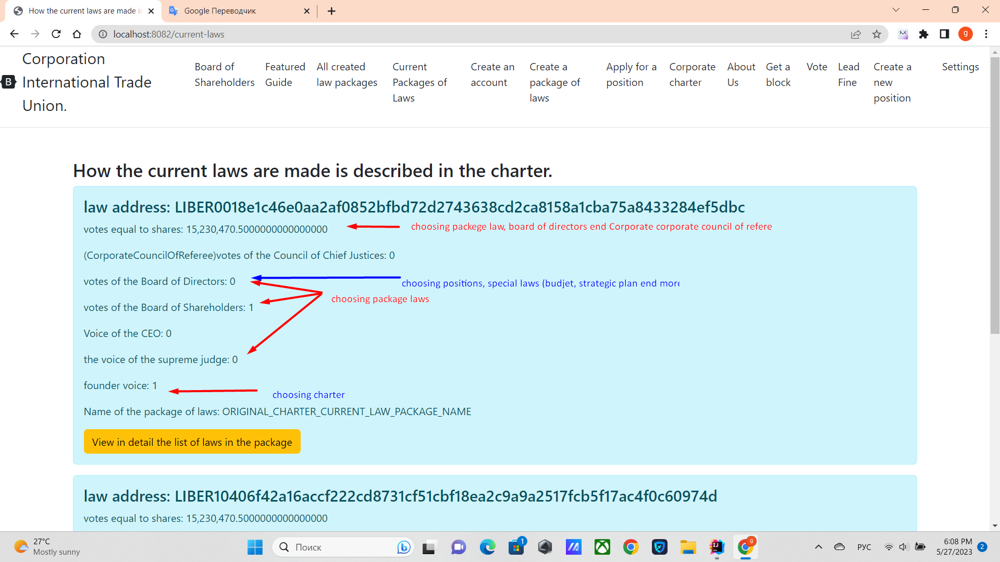
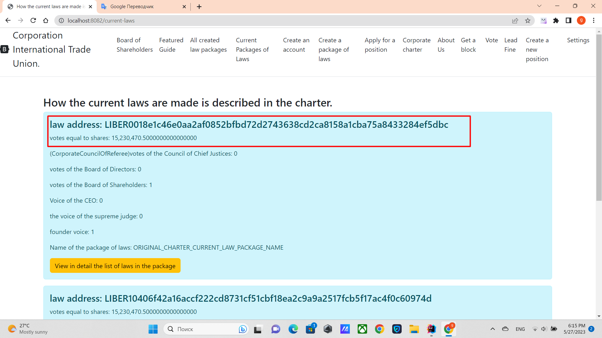

There are several types of laws that are approved in different ways.
1. The board of directors is elected by Shares, first all laws filed are sorted by the number of votes of the shares,
   from highest to lowest, after that the 301 accounts that have the most votes (VOTE_STOCK) are selected.
2. Council of Chief Justices (CORPORATE_COUNCIL_OF_REFEREES) Elected in the same way, but 55 accounts are selected (VOTE_STOCK).
3. Directors are appointed by the Board of Directors, you need to get 15 votes of the rest (ONE_VOTE method)
4. To elect the Chief Justice, they are elected by the Council of Chief Justices need 3 votes of the remainder (ONE_VOTE method)
5. Ordinary Laws are elected in three ways option 1, 2 and 3.
6. Budget and strategic plan approved by the Board of Directors 15 remaining votes required (ONE_VOTE)
7. Implementation of the amendments requires 300 votes of the Board of Shareholders, 100 of the Board of Directors and 5 of the Board of Chief Justices. ONE_VOTE Method

### Option 1
If more than 100,000 votes (residue) were voted by the number of shares,
Then the law is valid

### Option 2
If the law received 100 votes of the Board of Shareholders (the remainder of the votes) and
15 votes of the Board of Directors (remainder of votes) and the vote of the Chief Justice,
Law approved

### Option 3
If the law received 200 votes of the Board of Shareholders (balance of votes)
and 30 votes of the Board of Directors (balance of votes)
The law has been approved.

All three methods are legitimate.

[Return to Home](./documentationEng.md)