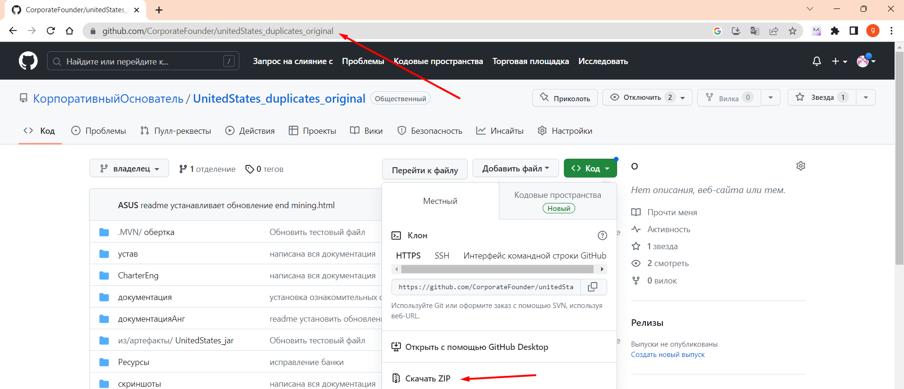
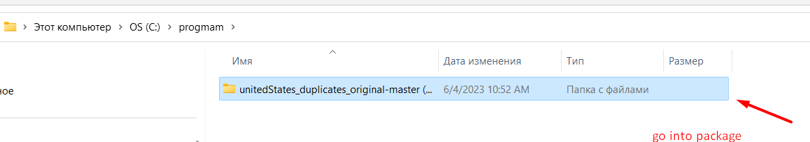
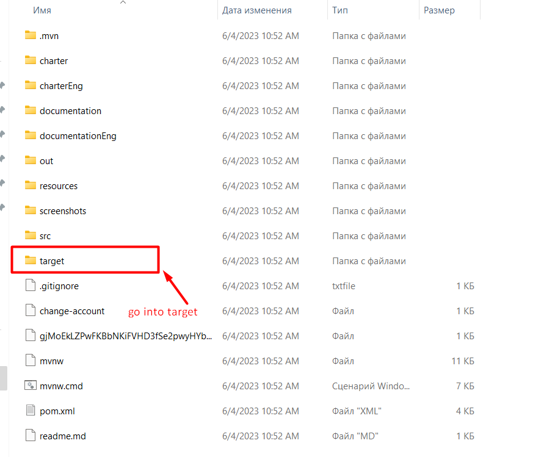
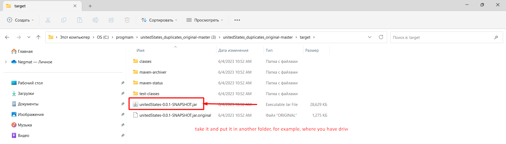
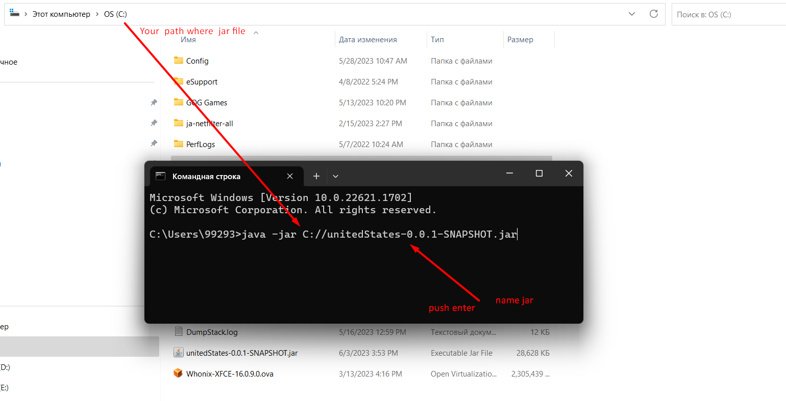
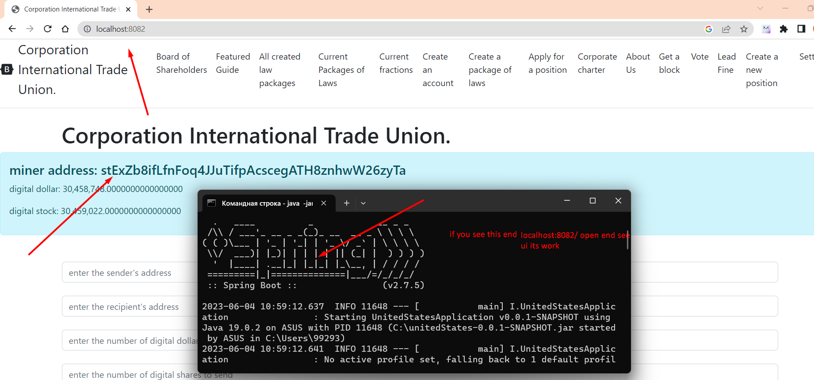
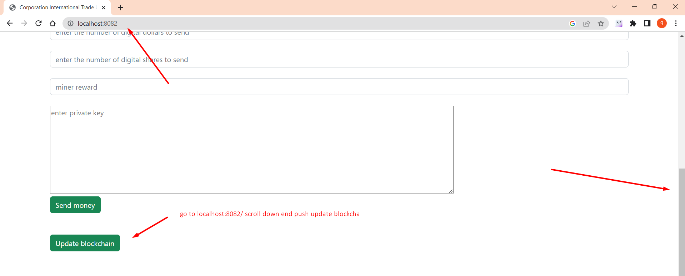
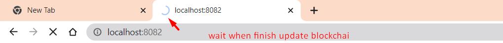

# Installation
If you have windows, then you need to download from the folder target unitedStates-0.0.1-SHAPSHOT.jar
in the search for windows, enter cmd open the command line and enter java -jar there (where the file is located) / unitedStates-0.0.1-SNAPSHOT.jar
example: java -jar C://unitedStates-0.0.1-SNAPSHOT.jar.

To work properly you need to download and install jre https://www.java.com/en/download/manual.jsp
https://www.oracle.com/cis/java/technologies/downloads/,
and jdk 19 or higher

after launch jar, the resources folder will be automatically created where windows, then 
go to localhost:8082 go down push button update blockchain

the resources folder is in ***src/main/java/resources***
there are stored
- blockchain files in the ***/blockchain*** folder
- balance files in the folder ***/balance***
- rules files voted for with their votes ***/allLawsWithBalance***
- files all rules without votes in ***/federalLaws***
- account files that have been elected as guide ***/federalLaws***
- file storing miner account ***/minerAccount***
- host address files ***/poolAddress***
- files sent by transaction ***/sentTransaction***
- transaction list files to send ***/transactions***


## where the Server connects to
Run jar file
Local Server http://localhost:8082/ is connected to a ready server
https://github.com/CorporateFounder/unitedStates_storage
which to raise on the host http://194.87.236.238:80
````
     Set<String> ORIGINAL_ADDRESSES = Set.of("http://194.87.236.238:80");
````

After the local server is up, in the browser
login to main page http://localhost:8082

# STEP BY STEP WITH PHOTO











This is what  looks like

[back to home](./documentationEng.md)