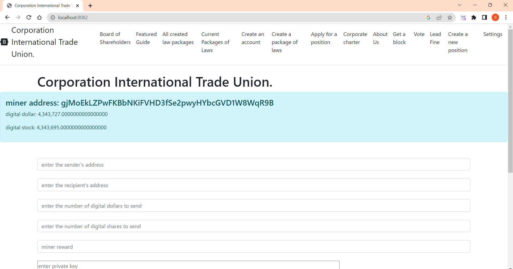

# Installation
If you have windows, then you need to download from the folder target unitedStates-0.0.1-SHAPSHOT.jar
in the search for windows, enter cmd open the command line and enter java -jar there (where the file is located) / unitedStates-0.0.1-SNAPSHOT.jar
example: java -jar C://unitedStates-0.0.1-SNAPSHOT.jar.
But the resources folder also needs to be copied as described below.

To work properly you need to download and install jre https://www.java.com/ru/download/manual.jsp
https://www.oracle.com/cis/java/technologies/downloads/,
and jdk 19 or higher

the resources folder is in ***src/main/java/resources***
after which you need to copy the resources folder to drive C:
there are stored
- blockchain files in the ***/blockchain*** folder
- balance files in the folder ***/balance***
- rules files voted for with their votes ***/allLawsWithBalance***
- files all rules without votes in ***/federalLaws***
- account files that have been elected as guide ***/federalLaws***
- file storing miner account ***/minerAccount***
- host address files ***/poolAddress***
- files sent by transaction ***/sentTransaction***
- transaction list files to send ***/transactions***


## IF NO DISK C:
If you do not have a C: drive or want to change the location of the files where they should
be stored then in src/main/java/International_Trade_Union/setings/Seting.java
You can change there code settings should be changed according to your settings,
then build the application, for example, using intellij idea, and rebuild the jar file.

````
     String ORIGINAL_BLOCKCHAIN_FILE = "C:\\resources\\blockchain\\";
     String ORIGINAL_BALANCE_FILE = "C:\\resources\\balance\\";
     String ORIGINAL_BOARD_0F_SHAREHOLDERS_FILE = "C:\\resources\\federalGovernment\\federalGovernment.txt";
     String ORIGINAL_ALL_CORPORATION_LAWS_FILE = "C:\\resources\\federalLaws\\";
     String ORIGINAL_ACCOUNT = "C:\\resources\\minerAccount\\minerAccount.txt";
     String ORIGINAL_CORPORATE_VOTE_FILE = "C:\\resources\\vote\\";

     String ORIGINAL_ALL_CORPORATION_LAWS_WITH_BALANCE_FILE = "C:\\resources\\allLawsWithBalance\\";
     String ORGINAL_ALL_TRANSACTION_FILE = "C:\\resources\\transactions\\";
     String ORIGINAL_ALL_SENDED_TRANSACTION_FILE = "C:\\resources\\sendedTransaction\\";
     String ORIGINAL_POOL_URL_ADDRESS_FILE = "C:\\resources\\poolAddress\\";
````

## where the Server connects to
Run jar file
Local Server http://localhost:8082/ is connected to a ready server
https://github.com/CorporateFounder/unitedStates_duplicates_original_storage
which to raise on the host http://194.87.236.238:80

````
     Set<String> ORIGINAL_ADDRESSES = Set.of("http://194.87.236.238:80");
````

After the local server is up, in the browser
login to main page http://localhost:8082

This is what  looks like

[back to home](./documentationEng.md)