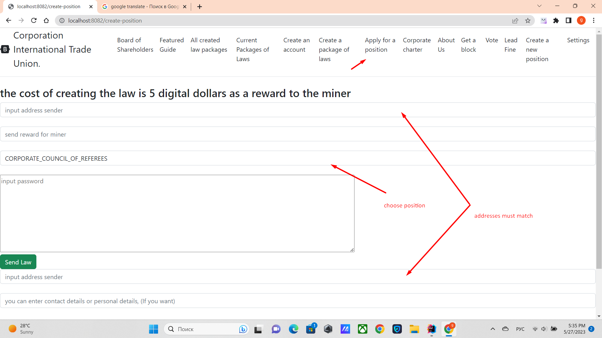

# How leadership is elected

How to apply for a position, login at http://localhost:8082/create-position
or click on the ***apply for a position*** tab.
Select a position from the list.
For example, ***Corporate Chief Justice (CORPORATE_COUNCIL_OF_REFEREES)***
click on the button ***Apply for a position***

The leadership includes positions both elected through digital shares and through other officials.
details are in http://localhost:8082/corporate-charter

In order to apply for a position, you must be logged in.
http://localhost:8082/create-position
and must keep the sender's address, the miner's reward
at least 5 coins, and choose a position. Then press the button.

[exit to home](./documentationEng.md)