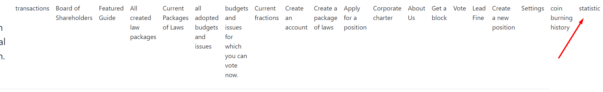
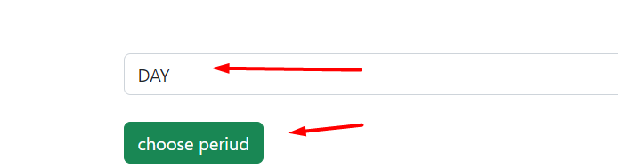
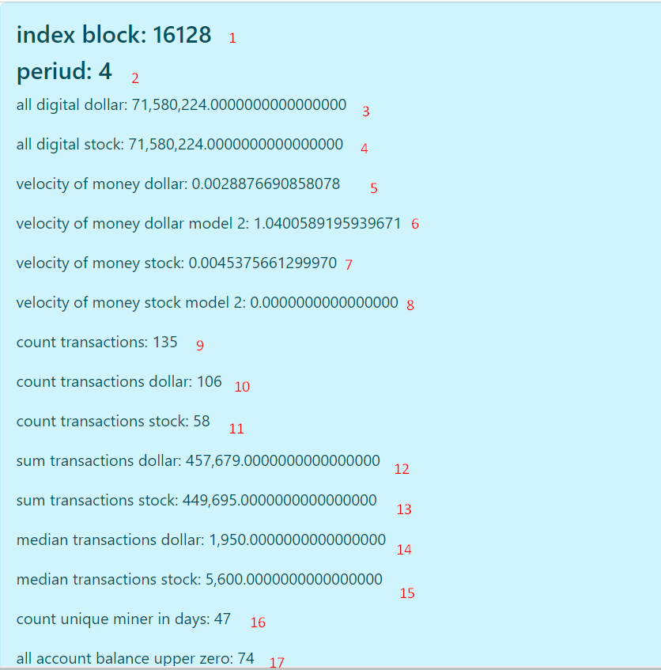

# STATISTICS AND INTERPRETATION OF DATA
All data is calculated on your computer, because of this, it may take time to calculate,
and also differ on different computers depending on your blockchain, for more accurate data
update the blockchain before entering the statistics tab.

## 1. INDEX BLOCK
in which block the statistics were calculated.

## 2.PERIOD (period)
1. There are 576 blocks per day. you can select DAY, WEEK, MONTH and YEAR.
2. WEEK = 576 * 7
3. MONTH = 576 * 30
4. YEAR = 576 * 360
   if you have chosen one of the overshoots, then you can see the division into these periods.

## 3-4. all digital dollar end all digital stock
Here you can see all issued money for this period.

## 5, 7. velocity of money dollar end velocity of money stock
Displays the speed of circulation of money. The higher the speed, the higher the demand for this
coin. Calculated according to the formula
P = median amount which is determined from all transactions for a given period, per
a given coin (dollar or shares).
T = Number of transactions in a given period
M = the total mass of dollars or shares for a given period.
(P*T)/M

## 6, 8. velocity of money dollar model 2 end velocity of money stock model 2
Similar to 5, 7, but as
M = Balance of all poisoners for the given period.
(P*T)/M
This indicator also says the larger it is, the higher the turnover rate,
the higher the demand for it.

## 9. count transactions
It takes into account all transactions for a given period, regardless of whether it is a dollar or shares.
The number of all transactions including dollars and stocks
they can match because in one transaction it can include both dollars,
so are the shares.

## 10. count transactions dollars
It takes into account only transactions for a given period only dollars.
The amount of only transactions is only dollars.

## 11. count transactions stock
Takes into account only transactions for a given period only stocks.
The number of transactions only shares only.

## 12. sum transactions dollars
The sum of all transactions for a given period in dollars.

## 13. sum transactions stock
The sum of all transactions for a given promotion period.

## 14. median transactions dollars
Median dollar transactions

## 15. median transactions stock
Median share transactions

## 16. count unique miner in days
All addresses that have mined a block at least once in a given period,
but only addresses are taken into account if they differ from each other,
Example: you have mined two blocks, another participant has mined one block,
but you used one address, so the number will be 2.

## 17. all account balance upper zero
All addresses for a given period whose balance is greater than zero (dollar or shares).

[back to home](./documentationEng.md)