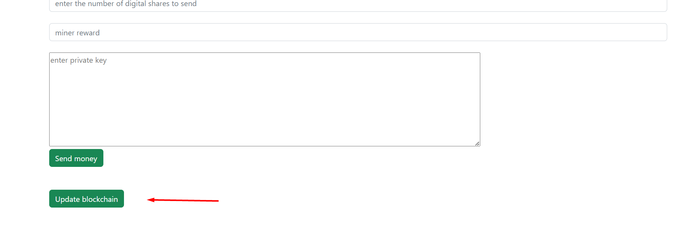
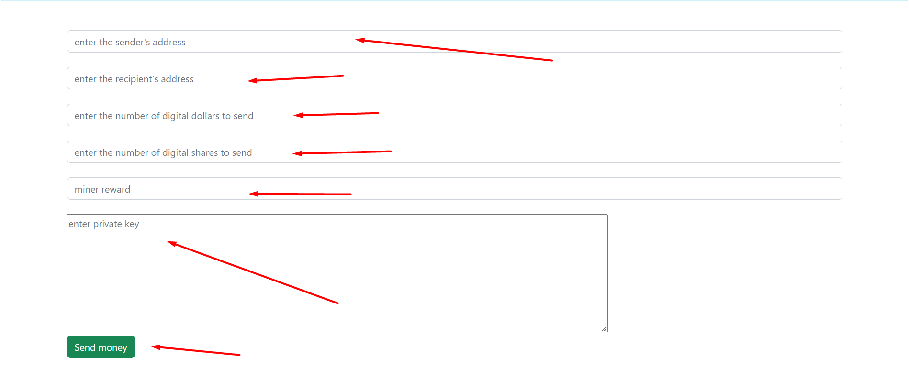

# Transaction

## How to send a transaction
How to send money

login to http://localhost:8082/
Enter the sender's address, recipient's address, how many digital
dollars you want to send, how many digital shares you want to send,
miner reward

Before sending, update the local blockchain, but up-to-date.
Before voting, and other actions, you can update the blockchain,
but before the vote is not necessary, since no amount is sent.
Also, in order to see current positions, it is worth updating the blockchain.
Before mining happens automatically.
To do this, you need to press the button ***update blockchain*** on the main menu and at the very bottom


And enter the password, then click the send money button


at localhost:8082/
need to keep data in
- input address sender public key of the sender
- input address recipient public key of the recipient
- input digital dollar to send amount of digital dollars to send
- input digital stock to send amount of digital stock to send
- send reward for miner

- input password keep private key
- and click send money

## What the transaction class consists of

````
     src/main/java/entity/blockchain/DtoTransaction/DtoTransaction.java
````

Transaction constructor.
- sender (sender)
- customer (recipient)
- digitalDollar (digital dollar)
- digitalStock (digital stocks)
- laws (Package of laws)
- bonusMiner (miner reward)
- VoteEnum (sender's vote, which can be YES or NO)
- sign (sender's signature)


checks the integrity of the transaction that the transaction was signed correctly
The method is in the DtoTransaction.java class
````
     public boolean verify() throws IOException, NoSuchAlgorithmException, SignatureException, NoSuchProviderException, InvalidKeyException, InvalidKeySpecException {
     Base base = new Base58();
     byte[]pub = base.decode(sender);
     BCECPublicKey publicKey = (BCECPublicKey) UtilsSecurity.decodeKey(pub);
     // PublicKey publicKey = UtilsSecurity.publicByteToPublicKey(pub);
     String sha = sender + customer + digitalDollar + digitalStockBalance + laws + bonusForMiner;
     sha = UtilsUse.sha256hash(sha);
     if(sender.isBlank() || customer.isBlank() || digitalDollar < 0 || digitalStockBalance < 0 || bonusForMiner < 0 || laws == null){
     System.out.println("wrong dto transaction sender or customer blank? or dollar, reputation or reward less then 0");
     return false;
     }
     if(Seting.BASIS_ADDRESS.equals(publicKey))
     return true;
     return UtilsSecurity.verify(sha, sign, publicKey);
     }
````

creates sha256 for signature

````
     public String toSign(){
     String sha = sender + customer + digitalDollar + digitalStockBalance + laws + bonusForMiner;
     return UtilsUse.sha256hash(sha);
     }
````

makes a json string from an object

````
     public String jsonString() throws IOException {
     return UtilsJson.objToStringJson(this);
     }
````


## HOW DELIVERY HAPPENS
After you have pressed the send button
the method in the controller of the MainController.java class will work

````
     located at src/main/java/controllers/MainController.java
````

method

````
     @PostMapping("/")
     public String new_transaction(
     @RequestParam String sender,
     @RequestParam String recipient,
     double dollar,
     double stock,
     double reward,
     @RequestParam String password,
     redirectAttributes redirectAttrs)
````

first, it checks that the transaction is signed correctly

````
     if(dtoTransaction.verify())
````

if the check is properly signed
then first it is checked whether this transaction is the creation of a law,
if it is and is at the same time the creation of a law that creates an office
then, it checks if the sender's address matches the first line of the law packet,
if the verification passes, then the transaction is sent to the network
````
       //if the name of the law matches corporate positions, then the law is valid only when
             //sender matches the law
             List<String> corporateSeniorPositions = directors.getDirectors().stream()
                     .map(t->t.getName()).collect(Collectors.toList());
             System.out.println("LawsController: create_law: " + laws.getPacketLawName() + "contains: " + corporateSeniorPositions.contains(laws.getPacketLawName()));
             if(corporateSeniorPositions.contains(laws.getPacketLawName()) && !UtilsGovernment.checkPostionSenderEqualsLaw(sender, laws)){
                 redirectAttrs.addFlashAttribute("sending", "wrong transaction: Position to be equals whith send");
                 return "redirect:/result-sending";
             }
             redirectAttrs.addFlashAttribute("sending", "success");
             System.out.println("dto MainController: " + dtoTransaction);
````


if it's just a transaction, then the transaction is just sent to the network

````

              AllTransactions.addTransaction(dtoTraction);
             String jsonDto = UtilsJson.objToStringJson(dtoTransaction);
             for (String s : Seting.ORIGINAL_ADDRESSES) {

                 String original = s;
                 String url = s +"/addTransaction";
                 //if the address matches the internal host, then do not send to itself
                 if(BasisController.getExcludedAddresses().contains(url)){
                     System.out.println("MainController: its your address or excluded address: " + url);
                     continue;
                 }
                 try {
                     //sending to the network
                     UtilUrl.sendPost(jsonDto, url);

                 }catch (Exception e){
                     System.out.println("exception discover: " + original);

                 }
             }

````

The AllTransaction.java class stores in files as transactions already added to the block,
and transactions that have not yet been mined by this local server.

The class is split into

````
     src/main/java/network/AllTransaction.java
````

Method that adds a transaction to a file

````
       public static synchronized void addTransaction(DtoTransaction transaction) throws IOException, NoSuchAlgorithmException, SignatureException, InvalidKeySpecException, NoSuchProviderException, InvalidKeyException {

         instance = getInstance();
         instance.add(transaction);
         Mining.deleteFiles(Seting.ORGINAL_ALL_TRANSACTION_FILE);
         //takes only unique transactions
         instance = instance.stream().filter(UtilsUse.distinctByKey(DtoTransaction::toSign)).collect(Collectors.toList());
         for (DtoTransaction dtoTransaction : instance) {
             UtilsTransaction.saveAllTransaction(dtoTransaction, Seting.ORGINAL_ALL_TRANSACTION_FILE);
         }


     }
````

The UtilUrl.java class is responsible for sending
located

````
     src/main/java/utils/UtilUrl.java
````

Send method

````
     public static int sendPost(String jsonObject, String requestStr) throws IOException {
         int response;
         URL url = new URL(requestStr);
         HttpURLConnection conn = (HttpURLConnection) url.openConnection();
     // conn.connect();
     conn.setReadTimeout(10000);
     conn.setConnectTimeout(15000);
     conn.setRequestMethod("POST");
     conn.setRequestProperty("Content-Type", "application/json; utf-8");
     conn.setRequestProperty("Accept", "application/json");
     conn.setDoOutput(true);


         try(OutputStream outputStream = conn.getOutputStream()) {
             byte[] input = jsonObject.getBytes("utf-8");
             outputStream.write(input, 0, input.length);
              response = conn.getResponseCode();

         }


         connect();
         return response;
     }
````

[Return to main page](./documentationEng.md)