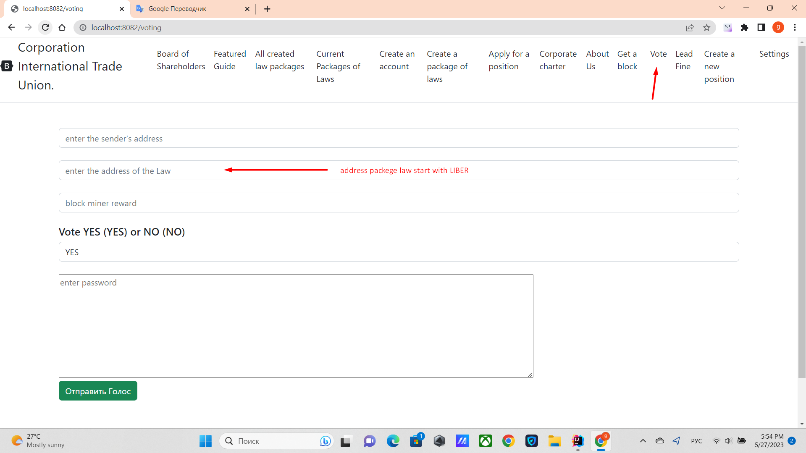

Sign in at http://localhost:8082/voting

There you must enter the sender's address, legal address and position which always begins
with LIBER. The amount you want to give to the miner and press the button. ***Submit vote***
But everywhere one of two types of voting is used, depending on whether
what you vote for ONE_VOTE or VOTE_STOCK.

Law addresses can be taken from http://localhost:8082/current-laws or http://localhost:8082/all-laws

Each type of law is approved in its own way, read the details in the charter

if you want to vote for some law, please indicate the address of the law which
available at http://localhost:8082/all-laws or http://localhost:8082/current-laws
example address LIBER489cd5a211fc67177e79a10a882120e3b3cb1cc90a053d40cd1ce4bda5f31f9a

Sign in
http://localhost:8082/voting
Enter your ***password***
click send button ***money***

Now you can see http://localhost:8082/corporate-charter

[Return to main page](./documentationEng.md)